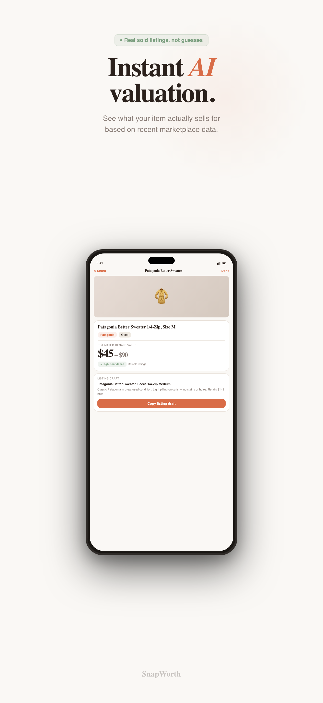
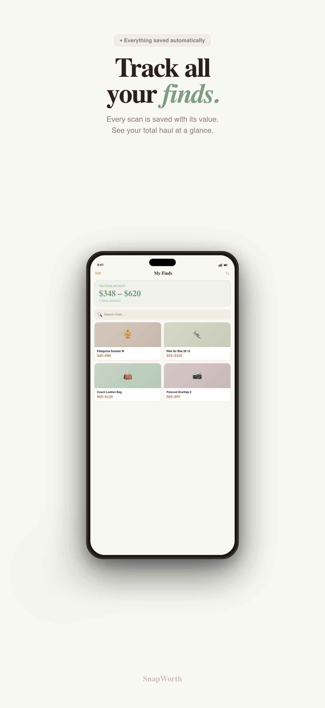
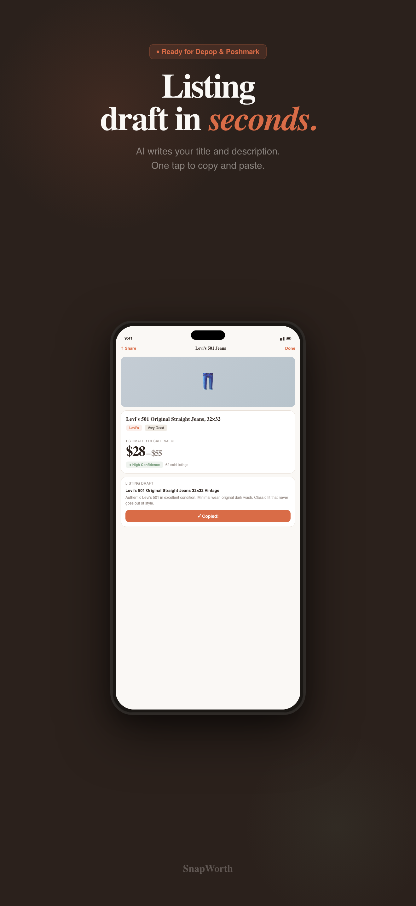
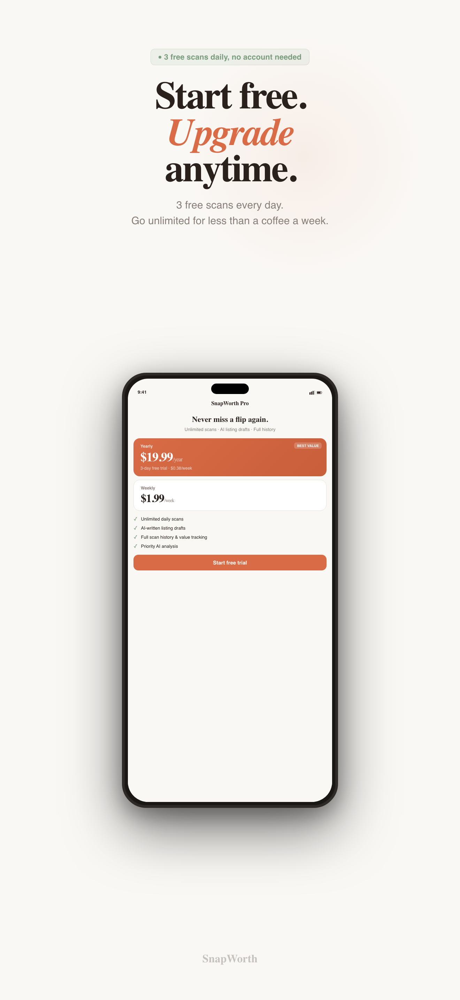

# SnapWorth

**Photograph secondhand items — get AI-powered identification and resale value estimates.**

Built for thrifting resellers: snap a photo of a clothing item, get the brand, category, condition assessment, and an estimated resale price range in seconds.

<!-- Once live, replace with your real App Store link:
[](https://apps.apple.com/app/idXXXXXXXXX)
-->

<p align="center">
  
  
  
  
  
</p>

---

## Features

- **Instant valuation** — photograph an item or pick from your library; the backend identifies it and returns a resale price estimate
- **My Finds** — scan history persisted locally with SwiftData
- **Listing drafts** — generates a ready-to-paste resale listing for each scanned item
- **Share cards** — exportable valuation card with QR code, saved straight to Photos
- **Home Screen widgets** — quick-scan widget, haul summary widget, Control Center control, and a Live Activity (WidgetKit)
- **SnapWorth Pro** — freemium model: 3 free scans, then an auto-renewable subscription via StoreKit 2

## Architecture

```
┌─────────────────────────────┐          ┌──────────────────────────────┐
│  iOS app (SwiftUI)          │  HTTPS   │  Backend (FastAPI, Python)   │
│                             │ ───────► │                              │
│  MVVM · iOS 17 @Observable  │  POST    │  /scan → Gemini vision API   │
│  SwiftData persistence      │  /scan   │  /health → liveness check    │
│  AVFoundation camera        │          │  Rate limiting · image       │
│  StoreKit 2 subscriptions   │ ◄─────── │  validation · Docker         │
│  WidgetKit extension        │  JSON    │                              │
└─────────────────────────────┘          └──────────────────────────────┘
```

**iOS.** SwiftUI throughout, MVVM with iOS 17 Observation (`@Observable` view models), SwiftData for scan history, AVFoundation for the custom camera, StoreKit 2 for subscriptions (a `PurchaseService` protocol with a mock implementation keeps the paywall testable without the network). A separate `SnapWorthWidgets` target ships the widgets, Control Center control, and Live Activity.

**Backend.** FastAPI service that accepts an image upload, calls the Google Gemini vision API for identification and price estimation, and returns structured JSON. Includes request rate limiting, input validation, a pytest suite (`backend/tests/`), and a Dockerfile for deployment.

**CI.** GitHub Actions build the iOS app and run backend tests on every push (`.github/workflows/`). Dependabot keeps dependencies current.

## Project structure

```
SnapWorth/
├── ios/
│   ├── SnapWorth/               # Main app target
│   │   ├── SnapWorthApp.swift   # Entry point + SwiftData container
│   │   ├── Config.swift         # API URL, mock flag, product IDs
│   │   ├── Camera/              # AVFoundation camera manager
│   │   ├── DesignSystem/        # Colors, typography, shared components
│   │   ├── Models/              # ScanResult (@Model), AppError
│   │   ├── Services/            # API client, repository, StoreKit 2 purchases
│   │   ├── ViewModels/          # @Observable view models
│   │   └── Views/               # SwiftUI screens
│   ├── SnapWorthWidgets/        # Widgets, Control Center control, Live Activity
│   └── SnapWorthTests/
├── backend/                     # FastAPI + Gemini vision
│   ├── main.py
│   ├── tests/
│   └── Dockerfile
├── marketing/                   # App Store screenshots & listing copy
├── website/                     # Landing page + support page (Vercel)
└── .github/workflows/           # CI for iOS build + backend tests
```

## Running locally

**Backend**

```bash
cd backend
python -m venv .venv && source .venv/bin/activate
pip install -r requirements.txt
cp .env.example .env        # add your GEMINI_API_KEY (free at aistudio.google.com/apikey)
uvicorn main:app --reload
```

**iOS**

```bash
open ios/SnapWorth.xcodeproj
```

- Set your development team in Signing & Capabilities.
- Point `Config.baseURL` at your local backend (`http://localhost:8000`) or set `Config.mockMode = true` to run the full UI with canned responses — no backend or API key needed.
- Build & run (⌘R). Subscriptions can be tested against the included `SnapWorth.storekit` configuration file.

## Deployment notes

- **Backend:** container deploys anywhere Docker runs (Railway, Fly.io). Required env var: `GEMINI_API_KEY`. Production instance: `api.snapworth.eu`.
- **In-app purchases:** two auto-renewable subscriptions in the "SnapWorth Premium" group — `com.snapworth.monthly` and `com.snapworth.yearly` — matching `Config.swift`.
- **Privacy:** camera, photo library, and photo-add usage strings are declared in `Info.plist`; the privacy manifest lives at `ios/SnapWorth/PrivacyInfo.xcprivacy`. Photos are sent to the backend for analysis and are not stored server-side.
- **Website:** `website/` deploys to Vercel (`vercel.json`), serving the landing page and the App Store–required support URL.

## License

Source-available for portfolio and review purposes. **All rights reserved** — you may read the code, but you may not redistribute it or publish derivative apps.

---

Built by [Silviu H.](https://github.com/hsilviu05) — iOS · SwiftUI · FastAPI
