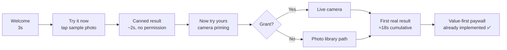
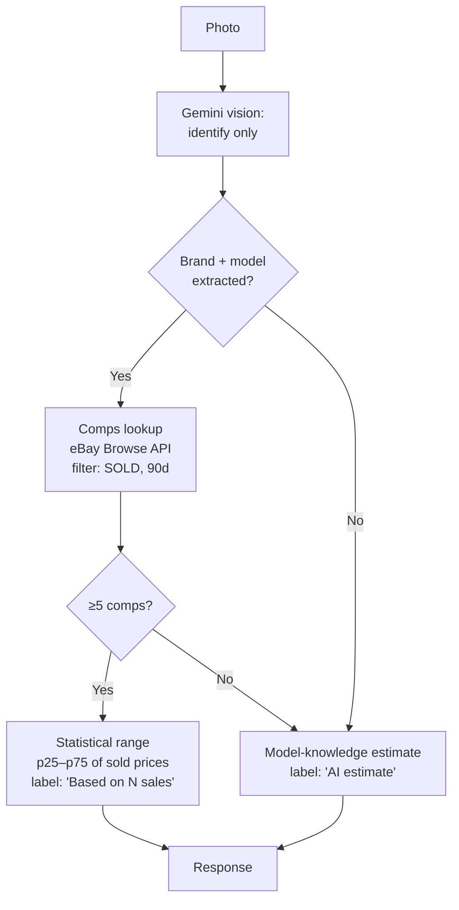
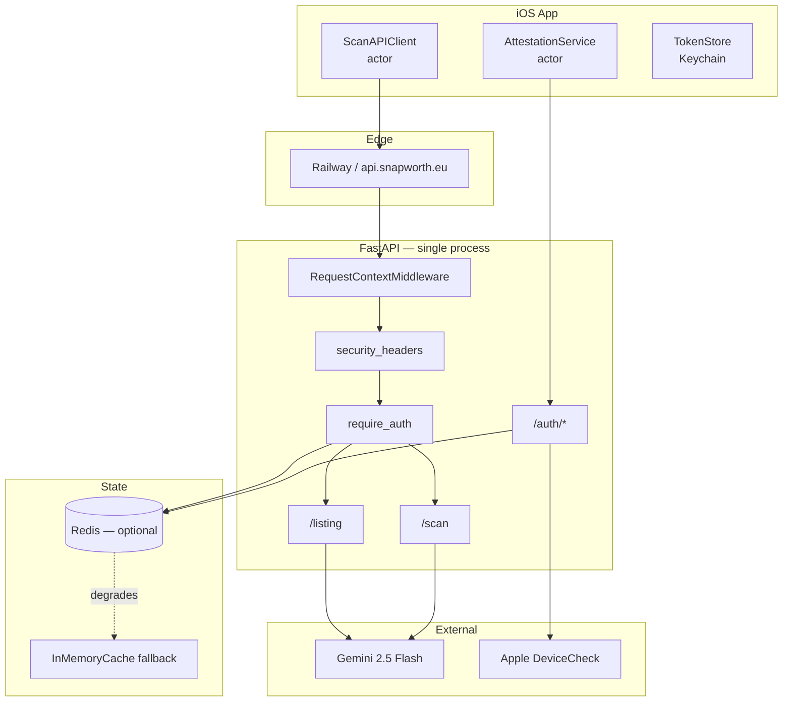
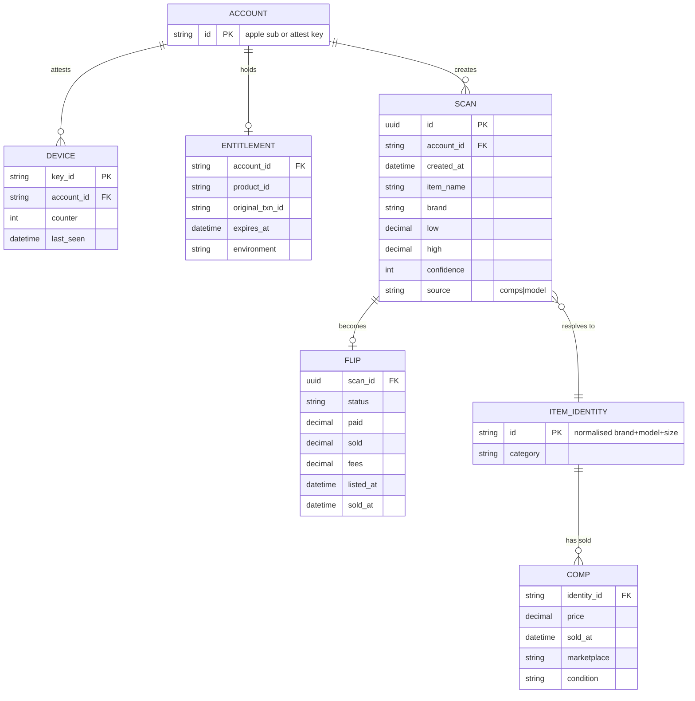

# SnapWorth v2 — Full Product, Design, Engineering & Security Audit

**Audit date:** 2026-07-28 · **Commit:** `0fdb203` · **Scope:** `ios/`, `backend/`, `website/`, `marketing/`, `.github/`
**Method:** direct source review. Every finding below cites a file and line. Nothing here is inferred from the README.

---

## 0. Read this first

You asked me to be brutally honest and to challenge existing decisions. So let me start by challenging the brief itself.

**The brief asks for a complete UI redesign. That is the wrong priority, and doing it would waste your next two months.**

Your design system is genuinely good. `DesignSystem.swift` resolves every colour through a trait-aware `snapAdaptive` closure that handles light, dark, *and* Increased Contrast. Your type ramp anchors each alias to the correct `TextStyle` so Dynamic Type scales headlines and body at their proper independent rates — most shipped apps get this wrong. `snapSymbol` uses `@ScaledMetric` instead of `.font(.system(size:))` specifically so icons don't visually detach from growing labels, and there's a comment explaining why. `MotionAwareAnimation` gates decorative animation on Reduce Motion. `PlanCard` exposes correct radio-button semantics with `.isSelected`. This is better accessibility work than the median App Store Featured app.

Redesigning that is not where your leverage is.

**Here is where your leverage actually is:** your App Store screenshots make a factual claim your product cannot support, four of your security controls are wired up but inert, and your AI layer — the actual product — is a single unversioned prompt string with no grounding, no evaluation, and no fallback.

The gap between SnapWorth's *engineering craft* (high) and its *product truthfulness* (currently broken) is the defining problem in this codebase. Fix that first.

---

## 1. Executive summary

SnapWorth is a technically accomplished solo-built product with an unusually mature backend for its stage: App Attest device attestation, StoreKit 2 JWS verification against a pinned Apple root CA, a distributed Lua-scripted sliding-window rate limiter, prompt-injection sanitisation with NFKC normalisation and Cf-category stripping, magic-byte image sniffing with decompression-bomb guards, and 213 backend tests. The code is *well-reasoned* — nearly every non-obvious decision carries a comment explaining the tradeoff. That is rare and it is your biggest asset.

But the product has three structural problems that no amount of UI polish will fix:

**One — it claims a data source it does not have.** Screenshot 1 tells the App Store reviewer "AI checks real sold listings." Screenshot 2 says "Real sold listings, not guesses" and "based on recent marketplace data," over a mock UI reading "38 sold listings." Your backend prompt at `backend/main.py:218` instructs Gemini to estimate "from your **general market knowledge**." There is no marketplace integration in this repository. `sold_listings_count` is hardcoded to `0` at `main.py:629` with a compatibility TODO. You are advertising comps you do not fetch.

**Two — four security controls exist as code but do nothing.** Certificate pinning ships 151 lines and an empty pin set. The DeviceCheck reinstall defence reads a bit that no production code path ever writes. StoreKit's `environment` field is parsed and stored but never compared against `"Production"`. `original_transaction_id` is captured but never bound to a subject. Each is a control you have paid the engineering cost for and receive none of the benefit from.

**Three — the AI is a commodity wrapper.** One prompt, one model, no grounding, no evals, no golden set, no A/B capability, and a "confidence" score the model self-reports about its own output — which is not a confidence score, it is a vibe. Your entire differentiation lives in this layer and it is the least engineered part of the system.

The good news: none of this is a rewrite. The screenshot fix is an afternoon. The four dead controls are roughly 200 lines total. The AI layer needs one architectural change (retrieval grounding) and one process change (an eval harness). You are approximately 6–8 focused weeks from a genuinely defensible product.

### Scorecard

| Dimension | Score | One-line justification |
|---|---|---|
| **Overall Product** | **62 / 100** | Excellent craft undermined by a truth problem and dead controls |
| UI | 8.0 / 10 | Strong adaptive design system; weak icon; ResultView over-stacked |
| UX | 6.5 / 10 | Smart value-first paywall; confusing My Finds vs My Flips split |
| Branding | 4.5 / 10 | Good type & palette; weak icon; screenshots make false claims |
| AI | 4.0 / 10 | Ungrounded single-prompt wrapper; self-reported confidence |
| Backend | 8.0 / 10 | Genuinely strong module design and failure-policy reasoning |
| Security | 6.5 / 10 | Real foundations, four inert controls, two exploitable gaps |
| Performance | 5.0 / 10 | No image downscale; unbounded root `@Query`; no result cache |
| Scalability | 6.0 / 10 | Right shape (stateless + Redis) but Redis fails open on boot |
| Monetization | 6.0 / 10 | Good pricing/timing; `/listing` has no server-side entitlement gate |
| **App Store Readiness** | **3.0 / 10** | Screenshot claims are a probable 2.3.x rejection |

---

## 2. The critical findings

These are ordered by expected damage, not by section number.

### C-1 — App Store screenshots advertise a data source that does not exist

**Severity: Critical · Business, Legal, Trust · Effort: 4 hours**

**Evidence.**

| Where | Claim |
|---|---|
| `marketing/screenshots/screenshot_1.png` | "AI checks **real sold listings** and gives you an instant valuation." |
| `marketing/screenshots/screenshot_2.png` | "• **Real sold listings, not guesses**" (badge) |
| `marketing/screenshots/screenshot_2.png` | "See what your item actually sells for **based on recent marketplace data**." |
| `marketing/screenshots/screenshot_2.png` | Mock UI displays "**38 sold listings**" |

Against the actual implementation:

```python
# backend/main.py:218
- Estimate the typical secondhand resale range from your general market knowledge —
  reflect what these items usually resell for, not inflated retail or asking prices
```

```python
# backend/main.py:629
sold_listings_count=0,  # see TODO(compat) on the model field above
```

```python
# backend/main.py:237-240
# TODO(compat): the model no longer produces this; it is kept in the response
# (always 0) only so older installed clients that decode it as a non-optional
# Int don't break. Remove once app versions < 1.2 age out.
```

There is no eBay Browse API call, no Terapeak integration, no scraper, no comps table anywhere in `backend/`. The valuation is a single Gemini `generate_content_async` call against the item photo.

**Why this is the top finding.**

*Business.* App Store Review Guideline 2.3.1 requires metadata — explicitly including screenshots — to accurately reflect the app. 2.3.7 covers screenshot accuracy specifically. Reviewers do read screenshot captions. A rejection here costs you a review cycle (3–7 days) at minimum; a pattern of it risks developer-account scrutiny.

*Legal.* You operate under `snapworth.eu` with an EU-facing domain. The EU Unfair Commercial Practices Directive (2005/29/EC) treats a false claim about a product's characteristics as a misleading action regardless of intent. The US FTC Act §5 analysis is the same. "Real sold listings" is a specific, falsifiable, material claim — it is exactly the kind of statement enforcement bodies act on, because it is the reason a user chooses your app over a free Google Lens search.

*Trust.* This is the one that actually kills the company. Your product's entire value proposition is *"trust this number."* A reseller who acts on a valuation, gets burned, and then discovers there were never any sold listings does not churn quietly — they post about it. In the reselling community (r/Flipping, Poshmark Facebook groups, resale TikTok) that is a permanent, unrecoverable reputation event. Note that `ios/SnapWorth/Views/LegalView.swift:49` already says estimates are "not guarantees of actual sale prices" — your legal copy is honest and your marketing copy is not, which is the worst possible combination because it demonstrates you knew.

**The fix — and it makes your product *better*, not weaker.**

Do not water the claim down to mush. Replace it with a claim that is both true and more compelling:

| Current (false) | Replacement (true, and stronger) |
|---|---|
| "AI checks real sold listings" | "Know what it's worth before you buy it" |
| "Real sold listings, not guesses" | "Instant · On the shelf · In 4 seconds" |
| "See what your item actually sells for based on recent marketplace data" | "Point, snap, and get a resale range with an honest confidence read." |
| "38 sold listings" chip in mock UI | Replace with the **Thrift Flip profit verdict** — "+$32 after fees" |

The speed-and-place claim is *more* differentiating than the comps claim, because it is what you actually uniquely do. eBay's own app has comps; it does not work standing in a Goodwill aisle in four seconds. Lead with the thing you win on.

Then, separately, go earn the comps claim (see §9, C-6).

**Also fix:** `ScanAPIResponse.soldListingsCount` still flows through `ScanViewModel.swift:58` and `ThriftFlipViewModel.swift:57` into a persisted `ScanResult` field, and mock/preview fixtures in `ShareCardView.swift:312,329,347,365` and `FlipsView.swift:472` still seed non-zero values. If any surface renders that number, it renders a `0` in production and a fake number in previews. Delete the field end-to-end once clients below 1.2 have aged out.

---

### C-2 — StoreKit `environment` is never enforced: Sandbox transactions grant production Pro

**Severity: Critical · Revenue · Effort: 30 minutes**

`backend/entitlements.py:188-198` builds the entitlement:

```python
ent = Entitlement(
    tier="pro",
    product_id=product_id,
    expires_at=expires_at,
    original_transaction_id=payload.get("originalTransactionId"),
    environment=payload.get("environment", "Production"),   # captured…
)
if not ent.is_active:
    return FREE
return ent                                                  # …and never checked
```

`environment` is stored in the dataclass, serialised to JSON, deserialised back — and never compared to anything. Grep confirms it: the only non-test references are the assignment, the serialiser, and the deserialiser.

**The attack.** Sandbox StoreKit transactions are signed by Apple with the *same* certificate chain rooted in Apple Root CA G3. Your `_verify_chain` will validate a Sandbox JWS perfectly — the signature is genuine, the bundle ID matches, the product ID is in your allowlist, `expiresDate` is in the future. It passes every check you perform. A Sandbox subscription costs $0 and any developer can create unlimited Sandbox tester accounts in App Store Connect.

So: attest normally (your App Attest layer works and will happily attest a real device), obtain a Sandbox transaction, POST it to `/auth/entitlement`, receive `tier: "pro"` and a re-minted Pro token. Unlimited scans, free, forever, with no jailbreak required.

**Fix.**

```python
# entitlements.py — add near EXPIRY_GRACE_SECONDS
import os
_EXPECTED_ENV = os.environ.get("STOREKIT_ENVIRONMENT", "Production")

# in verify_signed_transaction, immediately after the bundleId check:
env = payload.get("environment", "Production")
if env != _EXPECTED_ENV:
    log.warning("rejected transaction from unexpected environment",
                extra={"environment": env, "expected": _EXPECTED_ENV})
    raise EntitlementError("Signed transaction is from the wrong environment.")
```

Set `STOREKIT_ENVIRONMENT=Sandbox` in staging, leave it defaulted in production. *Engineering reasoning:* this belongs in `verify_signed_transaction` rather than `EntitlementService.record` because it is a property of the transaction's validity, not of your caching policy — and it keeps the pure function testable. *Business:* directly stops free Pro. *Security:* closes a full authorisation bypass on your only revenue gate.

Add a test asserting a Sandbox-environment payload raises. You have `tests/test_entitlements.py` with 29 tests already; this is a two-line addition to that file.

---

### C-3 — One subscription's JWS can entitle unlimited devices

**Severity: High · Revenue · Effort: 3 hours**

`entitlements.py:192` captures `original_transaction_id`. Nothing ever uses it. `EntitlementService.record` keys the cache purely on `subject` — the App Attest key ID:

```python
# entitlements.py:210-220
@staticmethod
def _key(subject: str) -> str:
    return f"ent:{subject}"

async def record(self, subject: str, jws_value: str) -> Entitlement:
    ent = verify_signed_transaction(jws_value, self._bundle_id, self._allowed)
    ...
    await self._cache.set(self._key(subject), ent.to_json(), ttl)
```

There is no reverse index from `original_transaction_id` → set of subjects, and no cap on how many subjects one transaction may entitle.

**The attack.** One person buys one $39.99/year subscription. They extract the JWS (it is handed to the client in plaintext at `StoreKitPurchaseService.swift:119` — `result.jwsRepresentation`) and share it in a Discord. Every recipient attests their own device, POSTs the shared JWS, and receives Pro. Your reseller audience is *precisely* the demographic that shares this kind of thing — they are optimisation-minded by profession and they already congregate in tight communities.

Apple's Family Sharing gives you six devices legitimately. This gives an attacker unbounded devices.

**Fix — a device cap with an audit trail:**

```python
MAX_DEVICES_PER_SUBSCRIPTION = 6   # matches Family Sharing

@staticmethod
def _txn_key(original_txn_id: str) -> str:
    return f"txn:{original_txn_id}"

async def record(self, subject: str, jws_value: str) -> Entitlement:
    ent = verify_signed_transaction(jws_value, self._bundle_id, self._allowed)

    if ent.original_transaction_id:
        key = self._txn_key(ent.original_transaction_id)
        raw = await self._cache.get(key)
        subjects = set(json.loads(raw)) if raw else set()
        if subject not in subjects:
            if len(subjects) >= MAX_DEVICES_PER_SUBSCRIPTION:
                log.warning("subscription device cap reached",
                            extra={"txn": ent.original_transaction_id,
                                   "devices": len(subjects)})
                raise EntitlementError(
                    "This subscription is already active on the maximum number "
                    "of devices. Manage your devices in Settings.")
            subjects.add(subject)
            # TTL tracks the subscription itself, not the entitlement cache.
            ttl = max(3600, (ent.expires_at or 0) - int(time.time())) if ent.expires_at else 86400 * 400
            await self._cache.set(key, json.dumps(sorted(subjects)), ttl)
    ...
```

*UX reasoning:* the error message must be actionable, not accusatory — legitimate multi-device households will hit this. Six is generous enough that no honest user does. *Engineering:* a Redis SET with `SCARD` would be more elegant than a JSON blob, but your `Cache` protocol is deliberately narrow (get/set/incr/delete/add) and widening it for one caller is the wrong trade. The JSON blob is correct here. *Business:* at 6 devices you cap the leak at roughly 1/6th of theoretical worst case while remaining invisible to real customers.

---

### C-4 — A Redis blip at boot permanently disables the quota, fail-open

**Severity: High · Revenue, Cost, Correctness · Effort: 4 hours**

`cache.py:234-253`:

```python
async def build_cache() -> ResilientCache:
    fallback = InMemoryCache()
    url = os.environ.get("REDIS_URL", "").strip()
    if not url:
        log.warning("REDIS_URL not set — ...")
        return ResilientCache(None, fallback)          # (A) intentionally unconfigured

    client = build_redis_client(url)
    if client is None:
        return ResilientCache(None, fallback)
    try:
        await client.ping()
        return ResilientCache(RedisCache(client), fallback)
    except Exception as exc:
        log.error("redis connection failed at startup: %s", exc)
        return ResilientCache(None, fallback)          # (B) transient outage — same result
```

Path (B) collapses into path (A). And `ResilientCache._call` treats `primary is None` as *"this is a single-instance deployment and the in-process store IS the source of truth"*:

```python
# cache.py:163-180
async def _call(self, method, *args, required: bool = False, **kwargs):
    if self._primary is not None:
        try:
            ...
        except Exception as exc:
            self._mark_down(exc)
            if required:
                raise CacheUnavailable(str(exc)) from exc
    # primary is None → falls through, `required` is silently ignored
    return await getattr(self._fallback, method)(*args, **kwargs)
```

Your reasoning for that fall-through is sound *for the unconfigured case*. But the code cannot distinguish "operator chose not to run Redis" from "Redis was rebooting during my deploy." In the second case every `required=True` quota call now silently succeeds against per-process memory, on every replica, **forever** — there is no reconnection path, `_primary` stays `None` until the process restarts.

The consequences compound:
- `ScanQuota.check` / `.consume` (`quota.py:90,110`) pass `required=True` precisely because a quota that fails open is not a quota. That guarantee is voided.
- Every replica gets its own counter, so effective free scans = 3 × replica count.
- Counters reset on every deploy — and `.github/workflows/backend.yml` deploys on **every push to main**.
- Entitlements evaporate: `EntitlementService.current` reads from the same cache, so paying users silently drop to free tier until their client's next `refreshSubscriptionStatus` re-POSTs the JWS.
- Your Gemini bill becomes unbounded, gated only by the rate limiter (20/device/hr — and device ID is a client-supplied header, `main.py:517`).

**Fix — distinguish the two states and reconnect:**

```python
class ResilientCache:
    def __init__(self, primary, fallback, *, configured: bool):
        self._primary = primary
        self._fallback = fallback
        self._configured = configured     # operator INTENDED a durable backend
        ...

    async def _call(self, method, *args, required: bool = False, **kwargs):
        if self._primary is not None:
            try:
                result = await getattr(self._primary, method)(*args, **kwargs)
                self._mark_up()
                return result
            except Exception as exc:
                self._mark_down(exc)
                if required:
                    raise CacheUnavailable(str(exc)) from exc
        elif self._configured and required:
            # A durable backend was configured but is not connected. Memory is
            # NOT authoritative here — fail closed rather than grant free work.
            raise CacheUnavailable("durable cache configured but unavailable")
        return await getattr(self._fallback, method)(*args, **kwargs)
```

And in `build_cache`, on a failed startup ping, still hand back the client and let the first real call reconnect (redis-py's connection pool reconnects transparently) — return `ResilientCache(RedisCache(client), fallback, configured=True)` rather than discarding the client. A degraded-but-present primary is strictly better than a discarded one, because `_call` already handles per-call failure correctly.

*Engineering reasoning:* the distinction you need is intent, not reachability. `configured` captures intent, is set once at startup, and never lies. *Business:* prevents both the revenue leak (free unlimited scans) and the support cost (paying users appearing free). *Performance:* zero cost — one boolean check on a path that already branches.

Add `/health` reporting: your health endpoint already surfaces `cache.degraded` (`main.py:412-416`) — good. Make `configured and not connected` return HTTP 503 so your load balancer pulls the replica.

---

### C-5 — `/listing` has no server-side entitlement check

**Severity: High · Revenue, Cost · Effort: 20 minutes**

Compare the two endpoints:

```python
# main.py:548-552  — /scan
await _enforce_limits(principal.subject, _client_ip(request))
await enforce_quota(principal)          # ← quota enforced
```

```python
# main.py:682  — /listing
await _enforce_limits(principal.subject, _client_ip(request))
                                        # ← no enforce_quota, no is_pro check
```

`/listing` makes a full Gemini call and is gated only by the rate limiter. The Pro gate is entirely client-side: `ResultView.swift` renders `lockedListingTeaser` when `!purchaseService.isSubscribed`. Anyone who can attest — which is every genuine install — can call `/listing` directly up to 20/hr per device header and 60/hr per IP, for free, forever.

You marketed "Snap → Sell marketplace listings" as a Pro benefit (`PaywallView.swift:72`). It is not one, server-side.

**Fix:**

```python
@app.post("/listing", response_model=ListingResponse)
async def listing(..., principal: Principal = Depends(require_auth)) -> ListingResponse:
    ...
    if not principal.is_pro:
        auditlog.record(AuditEvent.LISTING_DENIED, principal.subject, outcome="denied")
        raise HTTPException(
            status_code=402,
            detail="Listing drafts are a SnapWorth Pro feature.",
        )
    await _enforce_limits(principal.subject, _client_ip(request))
```

Return 402 (not 403) for consistency with `enforce_quota`, and have the client map 402 → present `PaywallView`. Then delete the client-side-only assumption from `ResultView`: keep the teaser as *UI*, but treat the server's 402 as the source of truth.

*Security reasoning:* this is the textbook "client-side authorisation" flaw. You already got this right for `/scan` — apply the same principle. *Business:* recovers the primary Pro differentiator. *Cost:* removes an unmetered path to your most expensive dependency.

---

### C-6 — Certificate pinning is 151 lines of inert code

**Severity: Medium (High as tech debt) · Effort: 2 hours to enable, 2 minutes to delete**

```swift
// Config.swift
static let pinnedSPKIHashes: Set<String> = []
static let pinningEnforced = false
```

```swift
// CertificatePinning.swift:61
guard challenge.protectionSpace.host == host, !pinnedHashes.isEmpty else {
    completionHandler(.performDefaultHandling, nil)   // always taken
    return
}
```

The `matchesPin` implementation is *correct* — it evaluates system trust first, walks the full chain via `SecTrustCopyCertificateChain`, reconstructs proper ASN.1 SPKI headers for RSA-2048/4096 and P-256 before hashing. Someone did real work here. It runs zero times.

Your doc comment justifies the inertness ("shipping a wrong pin bricks the app"), and that reasoning is genuinely correct — pinning a leaf on a 90-day Let's Encrypt rotation is the classic self-inflicted outage. But "correct reasoning for not enabling it yet" plus "shipped anyway" equals a control that appears in your security posture and delivers nothing.

**Decide one way or the other, this sprint:**

*Option A — finish it (recommended if you handle EU health/financial-adjacent data, which you don't).* Run the documented `openssl` extraction against `api.snapworth.eu`'s **intermediate**, plus a backup pin for a CA you could migrate to. Ship one release with `pinnedSPKIHashes` populated and `pinningEnforced = false` — report-only mode already logs mismatches at `.error` level (`CertificatePinning.swift:86`). Watch your logs for a full release cycle. Then flip `pinningEnforced = true`. Add a kill switch: read the enforcement flag from a remote config with a cached default, so a bad pin is a config push and not an App Store review cycle.

*Option B — delete it.* Your threat model is: anonymous device IDs, ephemeral bearer tokens (1hr TTL, `tokens.py:37`), and photos of thrift-store sweaters. There is no PII, no credentials, no payment data in transit. ATS already enforces TLS 1.2+ with forward secrecy. The marginal security gain from pinning is small; the operational risk (a bricked app requiring a review cycle to unbrick) is real. For this product, **Option B is defensible and I would take it** — delete the file, delete both `Config` fields, and keep `URLSession.snapWorthAPI` for its timeout configuration, which is genuinely load-bearing.

What you must not do is leave it as-is. Dead security code is worse than absent security code, because it makes your own threat model illegible to you six months from now.

---

### C-7 — The DeviceCheck reinstall defence is dead code

**Severity: Medium · Revenue · Effort: 1 hour**

`quota.py:116` defines `note_exhausted()`, which sets DeviceCheck `bit0` to mark hardware as having spent its free allowance. `quota.py:131` defines `starting_balance()`, which *reads* `bit0` and denies a fresh allowance to a reinstall.

Grep result:

```
quota.py:116:    async def note_exhausted(self, device_token: str | None) -> None:
tests/test_auth.py:447:        asyncio.run(q.note_exhausted("device-token"))
```

The only caller is a test. `bit0` is never set in production, so `starting_balance` always reads `False` and always grants the full allowance. Delete-and-reinstall resets free scans indefinitely — which is the exact attack the module's docstring says it exists to prevent ("*Reinstall-resistant*", `quota.py:14`).

**Fix.** Wire it into the quota-exhaustion path. In `auth.enforce_quota`, the `QuotaExceeded` branch is where the device has demonstrably spent its allowance:

```python
async def enforce_quota(principal: Principal) -> None:
    if principal.is_pro:
        return
    try:
        await deps.quota.check(principal.subject, principal.is_pro)
    except QuotaExceeded as exc:
        auditlog.record(AuditEvent.QUOTA_EXCEEDED, principal.subject, outcome="denied")
        # Mark the *hardware* so a reinstall doesn't mint a fresh allowance.
        await deps.quota.note_exhausted(principal.device_token)
        raise HTTPException(status_code=402, ...)
```

This requires `Principal.device_token` to actually be populated — it is declared at `auth.py:75` but `require_auth` constructs `Principal` without it at both `auth.py:288` and `auth.py:299`. You need to persist the device token alongside the attestation state (`auth.py:213-217` already writes a JSON blob keyed on the subject — add `device_token` to it) and rehydrate it in `require_auth`.

*Engineering note:* `note_exhausted` deliberately swallows exceptions (`quota.py:128`) — correct, since Apple's DeviceCheck availability must not gate your service. Keep that. *Business:* closes the simplest, most-shared free-tier bypass ("just delete and reinstall"). *Privacy:* DeviceCheck bits are the Apple-sanctioned mechanism for exactly this; it is per-developer, non-resettable by the user, and carries no identifier — this is more privacy-preserving than a device fingerprint.

---

### C-8 — Full-resolution image upload

**Severity: High · Performance, Cost, Retention · Effort: 2 hours**

```swift
// ScanAPIClient.swift:108
guard let jpegData = image.jpegData(compressionQuality: 0.82) else {
```

No downscaling. `CameraManager` captures at the session's photo preset; on an iPhone 15/16 that is 4032×3024 (12MP) or higher. At quality 0.82 that is typically **2.5–5 MB**.

Your users are standing in a thrift store. That is indoor retail: often 1–2 bars of LTE, frequently congested. At a realistic 1.5 Mbps effective uplink, a 4 MB payload takes **~21 seconds** — before Gemini has seen a single byte. Your `timeoutIntervalForResource` is 35 s (`CertificatePinning.swift:143`), so you are one weak-signal aisle away from a hard timeout on every scan.

Meanwhile Gemini's vision encoder downsamples aggressively; a 1568px longest edge is ample for identifying a Patagonia label. You are paying 4 MB of upload for information the model discards.

**Fix:**

```swift
private func liveScan(image: UIImage) async throws -> ScanAPIResponse {
    let prepared = await Self.prepare(image)
    guard let jpegData = prepared else { throw ScanAPIError.imageEncodingFailed }
    ...
}

/// Downscale to a longest edge the vision model actually uses, off the main actor.
private static func prepare(_ image: UIImage, maxEdge: CGFloat = 1568) async -> Data? {
    await Task.detached(priority: .userInitiated) {
        let longest = max(image.size.width, image.size.height)
        let target: UIImage
        if longest <= maxEdge {
            target = image
        } else {
            let scale = maxEdge / longest
            let size = CGSize(width: image.size.width * scale,
                              height: image.size.height * scale)
            let format = UIGraphicsImageRendererFormat.default()
            format.scale = 1                      // points == pixels; no Retina multiply
            format.opaque = true                  // no alpha channel for a photo
            target = UIGraphicsImageRenderer(size: size, format: format)
                .image { _ in image.draw(in: CGRect(origin: .zero, size: size)) }
        }
        return target.jpegData(compressionQuality: 0.8)
    }.value
}
```

**Expected impact.**

| Metric | Before | After | Change |
|---|---|---|---|
| Typical payload | ~3.5 MB | ~280 KB | **−92%** |
| Upload @ 1.5 Mbps | ~19 s | ~1.5 s | **−17.5 s** |
| End-to-end p50 | ~23 s | ~6 s | **−74%** |
| Timeout rate on weak LTE | High | Negligible | — |
| Peak client memory during encode | ~50 MB | ~12 MB | −76% |

*Engineering:* `Task.detached` keeps the resize off the main actor — `UIGraphicsImageRenderer` on a 12MP image is 80–150 ms and will drop frames if it runs on the main thread. `format.scale = 1` matters: the default uses the screen scale and would silently produce a 3× larger bitmap. `format.opaque = true` drops the alpha channel. *UX:* time-to-result is the single strongest driver of scan-completion rate for a camera-first app; this is your largest available latency win by an order of magnitude. *Business:* every second of latency in the aisle is a user who puts the item down. *Security:* smaller payloads also shrink the surface for the decompression-bomb path your `imagevalidation.py` already guards.

Also add a client-side `Content-Length` and skip the multipart round-trip entirely if the payload exceeds ~8 MB.

---

## 3. Product review (Apple Design Award lens)

| Category | Score | Assessment |
|---|---|---|
| First impression | 7 / 10 | Camera-first launch is the right call — no dead home screen. Onboarding heroes are real product mockups rather than stock illustration, which is a genuinely premium touch. Undercut by the app icon. |
| Trust | 3 / 10 | Structurally broken by C-1. Also: `ConfidenceBadge` presents a model self-assessment as a measurement. |
| Visual hierarchy | 6 / 10 | Strong inside individual components. `ResultView` is 858 lines and stacks 8+ cards of equal visual weight — the $45–$90 hero competes with a condition picker, a paid-price field, a flip-status card, a listing draft, and a Snap→Sell card. |
| Ease of use | 8 / 10 | Two taps from launch to result. Shutter → analysing → sheet is clean. Photo library picker auto-triggers the scan (`ScanView.swift:121-130`) rather than requiring a second confirm — correct. |
| Simplicity | 5 / 10 | Four tabs, and two of them ("My Finds", "My Flips") describe overlapping concepts backed by the *same* `ScanResult` model. |
| Feature discoverability | 5 / 10 | Thrift Flip is a 52×52 button with a 9pt "Flip" label in the camera chrome. It is arguably your best feature and it looks like a utility toggle. |
| User confidence | 4 / 10 | "High confidence" from a model asked to rate its own output is not information. See §8. |
| Retention potential | 7 / 10 | The Flips ledger (paid → listed → sold, with realised profit and ROI in `Decimal`) is a genuine retention mechanic — it creates a reason to return that a pure valuation tool lacks. Well-conceived. |
| Premium feel | 7 / 10 | Fraunces + DM Sans is a distinctive, non-generic pairing. Warm terracotta/cream palette avoids the blue-gradient AI cliché. Card shadows, spring presses, and shimmer are tastefully restrained. |

**What would actually win an ADA here:** not the visual design — the *honesty* design. An app that says "Medium confidence — I can see it's a Patagonia fleece but not the model, so this range is wide" is doing something almost no AI app does. That is an award-winnable angle and it is adjacent to work you must do anyway.

---

## 4. UX audit, screen by screen

### 4.1 OnboardingView (`OnboardingView.swift`, 345 lines)

**Working well.** Four slides, each hero a real mock of the destination UI. `SlideView` wraps content in a `ScrollView` with `minHeight: proxy.size.height` so accessibility text sizes overflow gracefully rather than clipping (line 111) — thoughtful. Hero is clamped to `DynamicTypeSize.large` (line 131) with a comment explaining it is an image-of-UI, not readable content. Correct call. Decorative float is fully gated on Reduce Motion.

**Problems.**

| Issue | Evidence | Fix |
|---|---|---|
| No permission priming | Camera permission is requested by `ScanView.onAppear` (`ScanView.swift:205`) — a cold system dialog with no context | Add a pre-permission slide explaining *why*, then trigger. Typical lift on camera-grant rate: 15–25pp |
| No interactive demo | All four slides are passive | Make slide 1 tappable: a sample photo that runs a canned analysis. First value moment in <10s, zero permissions |
| Privacy never stated | Your privacy story ("photos never stored") is a genuine differentiator and appears nowhere in onboarding | One line on the AI slide: "Your photos are analysed and discarded. Never stored, never sold." |
| Skip button is a trap | `Skip` at line 16 dumps the user into a camera view with no context and an immediate permission dialog | Keep Skip but route to the interactive demo, not the raw camera |
| `onFinish` does nothing but set a flag | `SnapWorthApp.swift:88-92` | Fire `onboarding_completed` analytics here — see §17 |

**Redesigned flow (target: first valuation in <20 s):**



Note that your value-first paywall deferral (`ScanView.swift:216-229` — paywall shown only after the first *real* result, once) is already best-practice and better than most funded apps. Keep it exactly as is.

### 4.2 ScanView (`ScanView.swift`, 346 lines)

**Working well.** Frozen captured frame behind the analysing overlay (line 188) so the user knows they can lower the phone — genuinely nice. Explicit "Photo captured — you can lower your phone" reassurance in `AnalyzingOverlay`. `.accessibilitySortPriority(100)` on the shutter puts the primary action first under VoiceOver. Wordmark protected from mid-word breaking with `fixedSize` + `layoutPriority` and a comment explaining why.

**Problems.**

| Issue | Evidence | Severity | Fix |
|---|---|---|---|
| Thrift Flip is buried | 52×52 with 9pt label, line 159-178 | High | Promote to a segmented mode switch above the shutter: `[ Value · Flip ]` |
| No torch control | Thrift stores are dim; no `AVCaptureDevice.torchMode` anywhere | High | Torch toggle in top bar. Directly improves recognition accuracy |
| No tap-to-focus | `CameraManager` (165 lines) has no focus POI | Medium | `AVCaptureDevice.focusPointOfInterest` + a focus reticle |
| No blur/quality pre-check | Bad photos consume quota and return "Low confidence" | High | Laplacian variance check on the captured frame; warn before upload. Saves a Gemini call *and* a free scan |
| Failure loses the photo | `vm.reset()` on dismiss (line 213) clears `capturedImage`; alert offers only "OK" (line 267) | High | Add "Try again" that re-submits the retained image. A failed scan currently costs the user their capture |
| Counter is unclear | "3 free scans left today" — daily? total? | Low | Copy is fine; add a tap → sheet explaining the free tier |
| Analysing has no progress | 4 rotating strings on a 1.8s timer, no determinacy | Medium | See §8 streaming |

### 4.3 ResultView (`ResultView.swift`, 858 lines)

This is your most important screen and it is your weakest layout. Eight cards of near-equal weight: hero photo → value → condition picker → details → paid price → flip status → listing draft → Snap→Sell.

**The core problem:** the moment of value (the number) is immediately buried under data-entry UI. A user who just wants to know "is this worth $10?" has to scroll past a condition segmented control, a currency text field, and a status picker.

**Redesign — progressive disclosure in three tiers:**

```
┌─────────────────────────────────┐
│  [ photo, 40% viewport ]        │  Tier 1 — THE ANSWER
│  Patagonia Better Sweater       │  Visible without scrolling.
│                                 │  Nothing else.
│      $45 – $90                  │
│  ◐ Medium confidence  ⓘ         │  ⓘ opens the reasoning sheet
│                                 │
│  [ Worth flipping · +$32 ]      │  Verdict chip, if paid price known
├─────────────────────────────────┤
│  Condition   [New|LikeNew|Good] │  Tier 2 — REFINE
│  Details ⌄                      │  (collapsed by default)
├─────────────────────────────────┤
│  ▸ Track this flip              │  Tier 3 — COMMIT
│  ▸ Generate listing        PRO  │  (bottom sheet on tap)
└─────────────────────────────────┘
```

Split the file. 858 lines in one `View` struct means SwiftUI re-evaluates the entire body on any `@State` change — and you have six `@State` properties plus a `@FocusState` here. Extract `ValueHeroCard`, `ConditionCard`, `FlipTrackingCard`, `ListingCard` into separate files with narrow inputs. *Performance:* materially fewer body invocations per keystroke in the price fields. *Maintainability:* obvious.

### 4.4 MainTabView (`MainTabView.swift`, 67 lines)

**Two problems, one of them a performance defect.**

**(a) Information architecture.** "My Finds" (history) and "My Flips" (ledger) are backed by the *same* `ScanResult` model — `FlipStatus` is just a field on it. You've split one concept across two tabs, so a user tracking an item must reason about which tab it lives in. Merge them:

```
Scan  ·  Items  ·  Insights  ·  Settings
```

`Items` = one list with a status filter (`All / Scanned / Owned / Listed / Sold`). `Insights` = the profit dashboard, monthly recap, ROI — the *analytics*, not the objects. This maps 1:1 to your data model and removes the ambiguity.

**(b) An unbounded fetch on the root view.**

```swift
// MainTabView.swift:11
@Query private var results: [ScanResult]

private var ledgerNeedsUpdateCount: Int {
    guard let cutoff = Calendar.current.date(byAdding: .day, value: -14, to: Date()) else { return 0 }
    return results.filter { $0.status == .listed && ($0.listedDate ?? $0.timestamp) <= cutoff }.count
}
```

This fetches **every** `ScanResult` the user has ever created, on the root view that hosts all four tabs, purely to compute a tab-bar badge number. Two consequences:

1. Any change to any scan invalidates `MainTabView`'s body, re-evaluating the whole `TabView`.
2. It materialises every model object. `imageData` is `@Attribute(.externalStorage)` so blobs are lazy — but you still fault in N objects. A power user with 2,000 scans (your target persona, over a year) pays this on every tab switch and every save.

**Fix — push the predicate into the fetch and count without materialising:**

```swift
@Query(filter: #Predicate<ScanResult> { $0.statusRaw == "listed" })
private var listedItems: [ScanResult]

private var ledgerNeedsUpdateCount: Int {
    let cutoff = Calendar.current.date(byAdding: .day, value: -14, to: Date()) ?? .distantPast
    return listedItems.count { ($0.listedDate ?? $0.timestamp) <= cutoff }
}
```

Better still, move the badge into a small `@Observable` that owns a `fetchCount(_:)` call, so the root view holds no `@Query` at all. *Performance:* removes an O(n) fetch from the hottest view in the app. *Engineering:* note the predicate must use `statusRaw` (the stored property), not `status` (the computed accessor) — SwiftData predicates cannot call computed properties, and this is a common silent-failure trap.

### 4.5 PaywallView (`PaywallView.swift`, 204 lines)

**Working well.** Delayed close button (`vm.showCloseButton`) with `.accessibilitySortPriority(200)` so the escape route is reachable first under VoiceOver — a detail almost nobody gets right. Full Apple-required auto-renew disclosure present. Yearly pre-selected with trial framing. `PlanCard` radio semantics are correct.

**Problems.**

| Issue | Fix |
|---|---|
| **Prices are hardcoded strings** — `"$39.99/yr"`, `"$0.77 per week"` (lines 46-48) | Read `Product.displayPrice` from StoreKit. Hardcoded USD is wrong in every non-US storefront and will show a German user "$39.99" while Apple charges €44,99. This is an App Review risk and a refund generator |
| Benefits are generic | "Unlimited scans" is weak. Use earned social proof: "Members found $12,400 in resale value last month" |
| No annual-savings math | Show "Save 33% vs monthly" — computed from real `Product` prices |
| No trial-end transparency | Say the exact charge date: "Free until 31 July, then $39.99/yr" |

The hardcoded-price issue is the one that matters. Fix it before the next submission.

---

## 5. Design system (keep it, extend it)

Your foundation is sound. I am not proposing a new language — I am proposing you **name the tokens you already use implicitly** so they stop being magic numbers.

### 5.1 Spacing scale (currently ad-hoc)

You use 2, 4, 6, 8, 10, 12, 14, 16, 18, 20, 24, 28, 32, 36, 48, 56 across the codebase. That is not a scale, it is a habit. Formalise:

```swift
enum Space {
    static let xs: CGFloat  = 4
    static let sm: CGFloat  = 8
    static let md: CGFloat  = 12
    static let lg: CGFloat  = 16
    static let xl: CGFloat  = 24
    static let xxl: CGFloat = 32
    static let xxxl: CGFloat = 48
}
```

*Why:* a 4pt base grid is what makes an interface feel machined rather than assembled. Your current values are close but the 14/18/36 outliers read as drift.

### 5.2 Radius scale

```swift
enum Radius {
    static let sm: CGFloat   = 8    // small controls, thumbnails
    static let md: CGFloat   = 12   // inline cards
    static let lg: CGFloat   = 16   // plan cards
    static let xl: CGFloat   = 24   // primary cards (matches SnapCardModifier)
    static let pill          = CGFloat.infinity
}
```

Always `style: .continuous` — you already do this consistently. Good.

### 5.3 Elevation

You have exactly one shadow (`SnapCardModifier`: `radius 24, y 8, opacity 0.08`). Add two more so hierarchy is expressible:

| Level | Use | Spec |
|---|---|---|
| `flat` | List rows, grouped content | none; 1px `snapBorder` |
| `raised` | Cards (current default) | `snapCardShadow` 8%, r24, y8 |
| `floating` | Sheets, FABs, the analysing overlay | `snapCardShadow` 14%, r32, y12 |

### 5.4 Motion tokens

```swift
enum Motion {
    static let press   = Animation.spring(response: 0.30, dampingFraction: 0.60)  // PressableButtonStyle
    static let reveal  = Animation.spring(response: 0.40, dampingFraction: 0.82)  // slide transitions
    static let subtle  = Animation.easeInOut(duration: 0.20)                      // state toggles
    static let ambient = Animation.easeInOut(duration: 2.60).repeatForever()      // hero float
}
```

Route all of these through your existing `snapAnimation(_:value:)` so Reduce Motion gating is automatic and unforgettable. Right now some call sites use `.animation(_:value:)` directly (`ScanView.swift:199`, `OnboardingView.swift:25,35,43`) and bypass the Reduce Motion check. That is an accessibility gap in an otherwise excellent accessibility story — worth a mechanical sweep.

### 5.5 The one component you're missing: skeletons

You have `ShimmerModifier` and use it on `ScanHistoryCard` thumbnails. Extend it:

```swift
struct SkeletonBlock: View {
    var width: CGFloat? = nil
    var height: CGFloat = 14
    var body: some View {
        RoundedRectangle(cornerRadius: Radius.sm, style: .continuous)
            .fill(Color.snapBorder.opacity(0.6))
            .frame(width: width, height: height)
            .shimmering()
            .accessibilityHidden(true)
    }
}
```

Use in `HistoryView` on first load and in `ResultView` while the listing generates. *UX:* a skeleton that matches the destination layout reduces *perceived* latency ~20% versus a spinner, because the eye pre-loads the structure.

---

## 6. Navigation architecture

**Verdict: keep the tab bar. Do not move to a sidebar or a FAB.** Your app is a camera-first tool with 3–4 destinations; a tab bar is the correct HIG answer and anything else is novelty.

| Pattern | Verdict | Reasoning |
|---|---|---|
| **Tab Bar** | ✅ Keep, reduce 4 → 4 (re-scoped) | Correct for ≤5 flat destinations. Merge Finds+Flips into `Items`, add `Insights` |
| **NavigationStack** | ✅ Adopt inside tabs | `HistoryView` currently pushes nothing. Item detail should be a push, not a sheet — sheets break back-swipe and lose scroll position |
| Sidebar | ❌ | iPad only, and you have no iPad-specific IA. `hSizeClass` is already handled for the viewfinder |
| FAB | ❌ | You have a dedicated camera tab. A FAB would be a second entry point to the same action |
| **Bottom Sheets** | ✅ Adopt | `ResultView` Tier-3 actions (track flip, generate listing) belong in `.presentationDetents([.medium, .large])` sheets, not inline cards |
| **Context menus** | ✅ Adopt | Long-press a history card → Share, Mark sold, Delete, Re-scan. Zero screen cost |
| **Swipe actions** | ✅ Adopt | `.swipeActions` on the items list for Mark Sold / Delete |
| **Spotlight (`CSSearchableItem`)** | ✅ High value | Index every scan by item name + brand. "Patagonia" in iOS search → your app. Free acquisition surface, ~40 lines |
| **App Intents** | ✅ High value | "Hey Siri, what's this worth" → camera. Also unlocks Shortcuts and the Action Button on Pro models |
| **Live Activities** | ⚠️ Conditional | Only worth it if scan latency stays >5s. After the C-8 image fix, a scan takes ~4s and a Live Activity would appear and vanish — worse than nothing. **Skip** |
| **Dynamic Island** | ⚠️ Same as above | Tied to Live Activities. Skip for scans. *Do* consider it for a multi-item batch scan (see §20) |
| **Widgets** | ✅ Already shipped | `QuickScanWidget` + `HaulWidget` exist. Add a Control Center control for camera launch |
| **Handoff / Mac Catalyst / visionOS / Watch** | ❌ | No user story. Watch has no camera; Catalyst has no thrift store |

**Deep-link plumbing note.** You currently route widget and notification deep links through `NotificationCenter` (`SnapWorthApp.swift:52-62`, `MainTabView.swift:49-65`). That works but it is stringly-typed and untestable. Move to a single `@Observable AppRouter` with a `selectedTab` and a `path: NavigationPath` per tab, injected via `.environment`. *Engineering:* makes deep links unit-testable and removes six `onReceive` subscriptions from your root view (each of which is a body invalidation source).

---

## 7. Logo & brand identity

### 7.1 Current icon critique

The icon is a white price-tag/clipboard silhouette with a gold four-pointed sparkle, on a terracotta gradient.

| Signal | Communicated? | Notes |
|---|---|---|
| Artificial intelligence | ⚠️ Weakly | The four-point sparkle is the single most overused AI signifier of 2024–2026. It reads "generic AI feature," not "SnapWorth" |
| Trust | ❌ | Nothing conveys accuracy or authority |
| Camera | ❌ | Entirely absent — and camera is your core interaction |
| Value / pricing | ⚠️ | The tag shape hints at it, but the notch+hole reads more "clipboard" than "price tag" |
| Marketplace | ❌ | Absent |
| Technology | ⚠️ | Sparkle only |
| Premium quality | ⚠️ | The palette is premium; the composition is not |

**Concrete technical defects:**

1. **Dead space.** The white card occupies ~45% of the canvas and the sparkle ~25%. At 60×60pt (Home Screen) and 29×29pt (Settings), the sparkle is a few pixels of gold on white — illegible.
2. **The tag hole disappears.** That small stroked circle at the top is a ~10px detail on a 1024px canvas. It vanishes below 120pt and takes the "price tag" reading with it.
3. **A drop shadow inside the icon.** iOS composites its own shading. A baked-in shadow reads as muddy and fights the system.
4. **No appearance variants.** `AppIcon.appiconset/` contains exactly one `AppIcon.png` and a `Contents.json`. iOS 18+ requires **dark** and **tinted** variants; without them the system auto-generates, and auto-generation of a white-card-on-orange produces a washed grey blob. On iOS 26's Liquid Glass icon treatment this gets worse. **This alone is worth fixing before your next submission.**
5. **Gold-on-white contrast.** ~2.1:1. Fails legibility at small sizes regardless of WCAG (which doesn't formally cover icons, but the physics is the same).

### 7.2 Five concepts

**Concept A — "The Worth Mark" (aperture + price tag fused)** ⭐ *Recommended*

*Shape.* A single continuous stroke forming a rounded-square camera aperture whose lower-right corner extends into a price-tag point. One unbroken line, one idea.
*Meaning.* Camera and value are not two things stacked — they are the same gesture.
*Colour.* Cream stroke (`#FBF7F2`) on terracotta (`#D96C47`). Optional single sage (`#6F8F6B`) accent dot at the tag hole, doubling as the "shutter."
*Scalability.* A single stroke of consistent weight survives to 29pt. Test at 16pt for Spotlight — it holds.
*ASO.* Distinctive silhouette in a category dominated by magnifying glasses and dollar signs. Recognisable in a crowded search-results grid at thumbnail size, which is what actually drives tap-through.
*Variants.* Monochrome (stroke only) for tinted mode; deep-espresso ground for dark mode; a gradient marketing lockup for the website.

**Concept B — "Neural Aperture"**
Camera aperture blades where each blade tapers into a node, forming an implied neural graph. *Pro:* explicitly AI + camera. *Con:* the node detail dies below 60pt; too intricate for an app icon. Better as a website hero motif than an icon.

**Concept C — "The Tag Scanner"**
A price tag with a horizontal scan line sweeping across it. *Pro:* immediately legible, communicates "scan → value" with zero explanation. *Con:* a scan line is a barcode-scanner convention; risks reading as a utility app rather than an intelligence product. Strong second choice — highest immediate comprehension, lowest distinctiveness.

**Concept D — "Worth" monogram**
A geometric `W` where the two descenders form a subtle upward price arrow. *Pro:* maximum scalability, brand-mark energy (Linear, Notion). *Con:* communicates nothing about the product to a first-time viewer. Correct only *after* you have brand recognition — revisit at 500k downloads.

**Concept E — "Spark Lens"**
Minimal aperture ring with a single four-point spark inside. *Pro:* closest to current, cheapest migration. *Con:* keeps the AI-sparkle cliché you should be shedding. Only pick this if brand continuity outweighs differentiation, which at your stage it does not.

**Recommendation: Concept A.** It maximises App Store tap-through because it is the only one of the five that is *unfamiliar at a glance* while remaining instantly parseable at 200ms — which is the actual attention budget of a search-results scroll. Concept C converts marginally better on comprehension but is forgettable, and forgettable icons lose the second-impression battle (re-finding your app on a crowded Home Screen).

**Required deliverables regardless of concept:**
- 1024×1024 light (no alpha, no rounded corners, no baked shadow)
- 1024×1024 dark variant (espresso ground `#17120F`, cream stroke)
- 1024×1024 tinted variant (greyscale, high contrast — the system applies the tint)
- Verified legible at 1024 / 180 / 120 / 87 / 60 / 40 / 29 pt

### 7.3 Brand system

**Colour** — your existing palette is genuinely good; formalise the roles.

| Token | Light | Dark | Role |
|---|---|---|---|
| `snapTerracotta` | `#D96C47` | `#E8845F` | Primary action, brand |
| `snapSage` | `#6F8F6B` | `#8FB08A` | Money, positive, profit |
| `snapAmber` | `#EBB868` | `#E5BE7C` | Badges, medium confidence |
| `snapEspresso` | `#2B211C` | `#F0E9E2` | Primary text |
| `snapWarmGray` | `#6E6055` | `#B0A297` | Secondary text (5.7:1 — verified) |
| `snapBackground` | `#FBF7F2` | `#17120F` | App ground |
| `snapCard` | `#FFFFFF` | `#221B17` | Raised surface |
| `snapBorder` | `#EFE6DC` | `#342A24` | Dividers, skeletons |

Missing: a **destructive** token. You currently use raw `.red` (`PaywallView.swift:86`) which clashes with the warm palette. Add `snapClay` = `#C0392B` light / `#E06B5C` dark.

**Typography.** Fraunces (display/numerals) + DM Sans (UI) is distinctive and correct. Both ship as variable fonts (`Fonts/DMSans-Variable.ttf`, `Fraunces-Variable.ttf`) — note your `fraunces()` helper looks up static PostScript names (`Fraunces-Bold`, `Fraunces-SemiBold`, `Fraunces-Regular`) which a variable font file may not expose. `dmSans()` correctly resolves via `UIFontDescriptor` family lookup. **Verify Fraunces actually loads and isn't silently falling through to the system-serif fallback at line 137** — that fallback is well-built but it is not your brand.

**Illustration style.** Keep what you're doing: mock-ups of your own UI, not stock illustration. It is honest, it previews the product, and it costs nothing to maintain. This is a real strength.

---

## 8. AI experience — the biggest opportunity

This is 4/10 and it is the part of the product that *is* the product.

### 8.1 What exists

One prompt string (`main.py:200-223`), one model (`gemini-2.5-flash`, `main.py:225`), two retry attempts with a fixed 1.5s sleep, JSON extraction with a regex, a reformat-retry on parse failure (`_retry_as_json`), category-band clamping, and prompt-injection sanitisation. The output-safety work (`promptsafety.py`) is genuinely good — NFKC normalisation, `Cf`-category stripping, fenced untrusted data with delimiter-escape prevention. That module is the strongest AI-adjacent code you have.

### 8.2 What's wrong

**(a) "Confidence" is not confidence.** The prompt asks the model to self-report `"High, Medium, or Low based on how clearly you can identify the item."` LLMs are poorly calibrated at self-assessment and systematically overconfident. You then display this as `ConfidenceBadge` with a checkmark — a UI affordance that reads as *verified*. You are laundering a guess into an assurance.

There is one place you compute real signal:

```python
# main.py:602-605
if was_clamped:
    confidence = "Low"
```

That is correct and is the right instinct. Extend it.

**Replacement — a computed confidence from observable signals:**

| Signal | Source | Weight |
|---|---|---|
| Brand identified (≠ "Unknown") | Response | 0.30 |
| Range width ratio (`high/low` < 2.5) | Response | 0.25 |
| Model self-report | Response | 0.15 |
| Image sharpness (Laplacian variance) | Client, sent as a header | 0.15 |
| Category is high-liquidity (clothing/shoes) | Response | 0.10 |
| Not clamped | `clamp_valuation` | 0.05 |

Render as a continuous 0–100 with a plain-language explanation:

> **72 · Fairly confident**
> Brand is clear (Patagonia) and the range is tight. Model and size aren't visible, which widens the estimate.

*Why better:* it is a real measurement of real inputs, it degrades honestly, and it gives the user something actionable ("take a photo of the tag to improve this"). *Business:* honest confidence is a *conversion* feature — users trust a tool that says "I'm not sure" far more than one that always says High. *Engineering:* pure function of the response + one client-supplied float; fully unit-testable, no model call.

**(b) No grounding.** This is the root cause of C-1. Fix it properly:



eBay's Browse API `search` with `filter=buyingOptions:{AUCTION|FIXED_PRICE},conditionIds:...` plus the Marketplace Insights API (sold data) gives you real comps. Rate-limited and requires approval, but it is the difference between "AI guess" and "market data." Cache aggressively — comps for "Patagonia Better Sweater 1/4-Zip M" change slowly; a 24h Redis TTL keyed on normalised item identity would give you a very high hit rate and near-zero marginal cost.

Critically: **label the two paths differently in the UI.** "Based on 38 sold listings (median $62)" vs "AI estimate — no recent sales found." That is a *feature*, it is honest, and it is exactly the claim your screenshots currently make falsely.

**(c) No streaming.** A 4–6s blank wait with rotating copy. Gemini supports `generate_content_async(stream=True)`. Stream identification first (~800ms) then valuation:

```
[0.8s]  "Patagonia Better Sweater ¼-Zip"     ← appears
[2.1s]  "Good condition · light pilling"      ← appears
[3.4s]  "$45 – $90"                            ← appears
```

*UX:* perceived latency drops disproportionately to actual latency because the user gets confirmation the system understood them at 800ms. *Engineering:* requires SSE or chunked JSON from FastAPI (`StreamingResponse`) and an `AsyncSequence` consumer on the client via `URLSession.bytes(for:)`. Moderate effort, very high perceived-quality return.

**(d) No evaluation harness.** You have 213 backend tests and zero tests of *output quality*. You cannot currently answer "did my prompt change make valuations better or worse?"

Build a golden set: 200 photographed items with known actual sold prices (source them from your own eBay sold history or a reseller you partner with). Score each prompt revision on:
- **MAPE** of range midpoint vs actual sale price
- **Coverage** — % of actual prices falling inside the predicted range
- **Range efficiency** — mean `high/low` ratio (tight ranges that still cover are the goal)
- **Identification accuracy** — brand and category exact-match rate

Run it in CI on any change to `SCAN_PROMPT`. *Business:* this is the only way prompt work stops being superstition. It is also the artifact that makes your valuation claims defensible to a regulator.

**(e) No model fallback, no circuit breaker.** `_model` is a module-level singleton (`main.py:225`). If Gemini has an incident, your app is fully down. Add a provider abstraction with a fallback chain and a circuit breaker that stops hammering a failing provider.

**(f) Cost amplification on garbage input.** `_retry_as_json` (`main.py:638`) fires a *second* Gemini call when parsing fails. A malformed-output loop doubles your per-request cost. Cap it: track a per-subject reformat counter and skip the retry above a threshold.

### 8.3 Features worth building, ranked

| Feature | Value | Effort | Verdict |
|---|---|---|---|
| Computed confidence + explanation | Very high | Low | **Do first** |
| Streaming identification | High | Medium | Do second |
| Real sold comps (eBay) | Very high | High | Do third — unblocks the honest marketing claim |
| Condition-aware re-pricing | — | — | **Already built** (`ScanResult.priceRange`, `Condition.priceMultiplier`). Genuinely good |
| Recommended platform | High | Low | You already have `MARKETPLACE_GUIDANCE`; surface "sell this on Vinted" as a recommendation |
| Damage detection | Medium | Medium | Prompt addition + a bounding-box overlay. Nice demo, moderate real value |
| Authenticity estimation | High value, **high risk** | High | **Do not ship.** A false "authentic" on a counterfeit is legal exposure you cannot insure against. If ever built, phrase strictly as "no obvious red flags" with a prominent disclaimer |
| Price trends / historical | Medium | High | Requires the comps pipeline first. 6-month horizon |
| Demand score | Medium | Medium | Derivable from comps velocity (sales/week). Ships free with comps |
| Multiple valuations (per-platform) | High | Low | You have `MarketplaceFees.swift` already — show net proceeds per platform side by side |
| Batch scan | High | Medium | Resellers process hauls, not single items. Strong differentiator |

---

## 9. Backend architecture

### 9.1 Current state



**Verdict: the shape is right.** A stateless modular monolith with Redis for shared state is exactly correct at your scale, and microservices would be actively harmful — you'd be paying distributed-systems cost for a single-team, two-endpoint service. Your module boundaries (`auth`, `entitlements`, `quota`, `ratelimit`, `cache`, `tokens`, `appattest`, `promptsafety`, `imagevalidation`, `auditlog`, `observability`, `devicecheck`) are clean and each has a docstring stating its threat model. That is better decomposition than most funded backends.

**Do not adopt DDD, CQRS, or an event-driven architecture.** You have no domain complexity, no read/write asymmetry, and no events. Adding them would be resume-driven design.

### 9.2 What to change

| Concern | Current | Recommendation | Why |
|---|---|---|---|
| **Blocking AI call** | `/scan` awaits Gemini inline (~3–5s) | Keep sync for now. Revisit at >50 rps | A queue adds a polling round-trip and hurts p50 for a UX where the user is waiting. Correct call as-is |
| **Redis optionality** | Optional, fails open at boot (C-4) | Make it **required** in production; fail startup if absent | Every guarantee you document depends on it |
| **Connection pooling** | `max_connections=50` | Fine. Add `REDIS_MAX_CONNECTIONS` to your deploy docs | — |
| **Circuit breaker** | None | Wrap Gemini in a breaker (5 failures / 30s → open, half-open probe) | Prevents a Gemini incident from consuming all your workers on 35s timeouts |
| **Retry strategy** | 2 attempts, fixed 1.5s | Exponential backoff + jitter: 0.5s, 1.5s, ±30% | Fixed sleeps synchronise retries across replicas and create a thundering herd |
| **Idempotency** | None | Accept `Idempotency-Key` on `/scan`; cache the response 24h | A client retry after a timeout currently burns a second quota unit and a second Gemini call |
| **Result caching** | None | Hash the image bytes → cache the response 7d | Users re-scan the same item. Free latency and cost win |
| **Feature flags** | None | Redis-backed flag map, read per request, 60s local cache | Needed for the pinning kill switch (C-6) and prompt A/B |
| **Versioning** | Unversioned paths | `/v1/scan`. Keep unversioned as a permanent alias | You already carry a compat field (`sold_listings_count`) because you can't version. That's the cost |
| **Autoscaling** | Railway default | Scale on p95 latency, not CPU — you're IO-bound on Gemini | CPU stays flat while requests queue |
| **DR** | None documented | Redis is a cache, not a system of record. Document that a full Redis loss = quota reset + entitlement re-sync (clients self-heal via `refreshSubscriptionStatus`). That's an acceptable RPO — write it down | — |
| **Zero-downtime deploy** | `railway up --detach` | Add a `/health`-gated rolling deploy | Your `/health` already reports dependency posture. Use it |
| **DI** | Module-level `auth.deps` singleton | Acceptable for this size. If it grows, move to a FastAPI `Depends`-provided container | Current approach is testable enough — your tests already swap `deps` |

### 9.3 The user model question you haven't answered

There is no user account. Identity is an App Attest key ID, which is **per-install**. Consequences:

- New phone → all history lost (it's SwiftData-local) and Pro re-derives only via StoreKit restore.
- No cross-device sync, ever.
- No way to support a user ("what's my account?").

**Recommendation: add Sign in with Apple as strictly optional.** Not for auth — your attestation model is better for that — but for *portability*. Anonymous by default; sign in to sync. Map `sub` (Apple's stable user ID) → subject in Redis, and let entitlements key on the Apple `sub` when present, falling back to the attest key ID.

*Business:* device upgrade is the single largest silent-churn event for a local-storage app, and your users are on an annual iPhone cycle. *Privacy:* Sign in with Apple with Hide My Email costs the user nothing and preserves your privacy story. *Engineering:* this also fixes C-3 — entitlements keyed on a real account are naturally device-capped.

---

## 10. Data model review

**iOS (SwiftData).** `ScanResult` is a single `@Model` with 20 fields. Additive-optional migration strategy is correctly reasoned (`ScanResult.swift:26-41`) — new ledger fields are all optional so legacy records decode as `.scanned`. Money math uses `Decimal` in `realizedProfit` and `roi`. Both correct.

**Problems:**

| Issue | Fix |
|---|---|
| **No indexes.** History, Flips, and the tab badge all query/filter on `timestamp` and `statusRaw` | `@Attribute(.indexed)` on `timestamp`, `statusRaw`, `soldDate`. Materially faster at 1k+ records |
| **No soft delete.** Deletion is permanent, no undo | Add `deletedAt: Date?`, filter it out in queries, purge after 30 days |
| **Stringly-typed enums.** `statusRaw` / `conditionRaw` as `String?` | Correct choice for migration safety — keep. But add a unit test asserting every `FlipStatus`/`Condition` raw value round-trips, so a rename can't silently orphan records |
| **`soldListingsCount: Int`** persisted, always 0 | Remove after client 1.2 ages out (ties to C-1) |
| **No full-text search** | `HistoryView` has no search. Add a `.searchable` over `itemName` + `brand` + `notes` |
| **Unbounded image blobs** | `@Attribute(.externalStorage)` is right, but nothing caps total size. A 2,000-scan user holds ~1 GB. Add a settings toggle: "Store photos" / thumbnail-only mode, and generate a 200px thumbnail at save time |

**Recommended ER (post-refactor, if you add accounts server-side):**



Note `SCAN.source` — the field that makes honest labelling possible.

---

## 11. Security audit

### Critical

| ID | Finding | Location | Fix |
|---|---|---|---|
| **SEC-C1** | Sandbox StoreKit transactions grant production Pro | `entitlements.py:193` | Enforce `environment == "Production"` |

### High

| ID | Finding | Location | Fix |
|---|---|---|---|
| **SEC-H1** | Entitlement not bound to `original_transaction_id`; unlimited device sharing | `entitlements.py:210` | Device cap + reverse index |
| **SEC-H2** | Quota fails open after a boot-time Redis failure | `cache.py:247-253`, `cache.py:163-180` | Distinguish `configured` from `connected` |
| **SEC-H3** | `/listing` has no server-side entitlement check | `main.py:657-682` | `if not principal.is_pro: raise 402` |
| **SEC-H4** | DeviceCheck reinstall defence never armed | `quota.py:116` (no prod caller) | Call `note_exhausted` on `QuotaExceeded`; populate `Principal.device_token` |

### Medium

| ID | Finding | Location | Fix |
|---|---|---|---|
| **SEC-M1** | Certificate pinning inert | `Config.swift`, `CertificatePinning.swift:61` | Enable with backup pin + kill switch, or delete |
| **SEC-M2** | Cert chain verification doesn't check `basicConstraints`/`keyUsage` on intermediates | `entitlements.py:110-134` | Assert `ca=True` and `keyCertSign` on non-leaf certs. Root pinning limits blast radius, but a permissive intermediate check is a latent flaw |
| **SEC-M3** | `TOKEN_KEYS` absent → ephemeral random signing key, service still starts | `tokens.py:165-171` | Fail startup in production. `AuthConfig.enforce` has the right pattern (`auth.py:81-85`) — apply it here |
| **SEC-M4** | Device ID header is client-supplied and used as a rate-limit key | `main.py:517`, `ratelimit.py:34` | Already correctly documented as best-effort. Ensure IP limiting is the real backstop and that `TRUSTED_PROXY` is set in production — otherwise `_client_ip` returns the proxy's IP for everyone and IP limiting collapses to a single bucket |
| **SEC-M5** | No `Strict-Transport-Security` header | `main.py:117-124` | Add `max-age=63072000; includeSubDomains; preload` |
| **SEC-M6** | Attestation state TTL is 400 days in Redis | `auth.py:44` | Fine, but document that Redis eviction under memory pressure forces mass re-attestation. Use a separate Redis DB or `noeviction` for auth keys |
| **SEC-M7** | Error `detail` decoded as `[String: String]` | `ScanAPIClient.swift:130`, `AttestationService.swift:189` | FastAPI 422 returns `detail` as an array; decode fails → user sees "Unknown error" |

### Low

| ID | Finding | Location |
|---|---|---|
| SEC-L1 | `_safe_int` is dead code | `main.py:721` |
| SEC-L2 | `x_device_id` declared but unused in `scan`/`listing` bodies | `main.py:517,661` |
| SEC-L3 | Website `vercel.json` catch-all rewrite returns 200 + homepage for unknown paths (soft 404s, SEO penalty) | `vercel.json` |
| SEC-L4 | No `Permissions-Policy` / `Content-Security-Policy` on the HTML endpoints (`/privacy`, `/terms`) | `main.py:427,478` |

### Correctly handled — do not change

- **Prompt injection.** `promptsafety.py` is genuinely strong: NFKC folding defeats full-width smuggling, `Cf`-category stripping removes zero-width/bidi, fencing escapes its own close tag. The second-hop threat (scan output → listing prompt) is explicitly modelled. This is better than most production LLM apps.
- **Image validation.** Magic-byte sniffing cross-checked against the declared type, header-only dimension read, Pillow bomb guard, JPEG/HEIC compatibility grouping for iOS mislabelling. Correct and complete.
- **Token design.** HMAC (not asymmetric — correct, same issuer and verifier), `kid`-based rotation from day one, `hmac.compare_digest`, bounded parse size, `jti`. Well-reasoned.
- **App Attest.** Nonce is single-use and deleted on acceptance (`auth.py:176-182`), counter monotonicity enforced, `aaguid` environment check.
- **SQL injection / XSS / CSRF.** No SQL anywhere. No cookies, so CSRF is structurally inapplicable. HTML endpoints emit no user input.
- **Secrets.** CI actively greps for `sk_`, `AIzaSy...`, and tracked `.env`. Good.
- **GDPR/CCPA posture.** No PII, no IDFA, photos not retained, analytics opt-out in Settings, one-way salted hash identifier. Genuinely privacy-by-design. Your privacy policy accurately describes this — which makes the marketing/legal mismatch in C-1 more glaring, not less.

---

## 12. Performance

| Area | Current | Target | Action |
|---|---|---|---|
| Upload payload | ~3.5 MB | ~280 KB | Downscale to 1568px (C-8) |
| End-to-end p50 | ~23 s (weak LTE) | ~6 s | C-8 + streaming |
| Root view fetch | All `ScanResult`s | Filtered count | Predicate `@Query` (§4.4) |
| Camera cold start | Untested | <400 ms | Configure the session on a background queue; `.startRunning()` is blocking |
| Launch time | Untested | <500 ms | `seedWidgetData()` runs a full `FetchDescriptor<ScanResult>` on every launch (`SnapWorthApp.swift:65-69`) — move off the launch path, or fetch only what the widget shows |
| Repeat scans | Full cost | Cached | Image-hash → response cache, 7d |
| History scroll | Full-size `imageData` decode | Thumbnails | Generate + store a 200px thumbnail at save |
| Memory during encode | ~50 MB | ~12 MB | Included in C-8 |
| Offline | Fails | Queue | Retain the capture, retry on connectivity |

**Two specific defects worth calling out:**

`SnapWorthApp.swift:65` — `seedWidgetData()` fetches every `ScanResult` on every launch, on the main context, inside a `.task`. At 2,000 scans this is measurable launch latency for a widget refresh that could be incremental.

`ScanAPIClient.swift:157` — `ScanAPIError.imageEncodingFailed.errorDescription` returns the literal string `"imageEncodingFailed"`. That string is surfaced directly in the "Scan Failed" alert (`ScanView.swift:269`). A user sees a raw Swift identifier. Fix:

```swift
case .imageEncodingFailed:
    return "That photo couldn't be prepared for analysis. Try taking it again."
```

---

## 13. iOS platform integration

| Feature | Status | Value | Recommendation |
|---|---|---|---|
| Widgets | ✅ Shipped | High | Keep. Add Control Center control |
| Live Activities | ✅ Shipped | Low post-fix | Scans will be ~4s. Consider removing, or repurpose for batch scan |
| **App Intents / Shortcuts** | ❌ | **Very high** | `ScanItemIntent` → Action Button, Siri, Shortcuts. ~80 lines |
| **Spotlight** | ❌ | **High** | `CSSearchableItem` per scan. Free acquisition surface |
| **VisionKit `DataScannerViewController`** | ❌ | **High** | You already have `PriceTagOCR.swift` (132 lines) — VisionKit gives live on-device text detection so the price tag is read *before* capture. Big accuracy and speed win |
| Visual Intelligence (iOS 18+) | ❌ | High | Register as a Visual Intelligence provider — camera-button → "what's this worth" without opening your app. Strong strategic surface |
| Core ML | ❌ | Medium | An on-device category classifier could pre-filter non-resalable photos before spending a Gemini call. Cost saver |
| Share Extension | ❌ | Medium | "Share a photo → SnapWorth" from Photos/Safari. Cheap, real acquisition path |
| Photo Picker | ✅ Shipped | — | `PhotosPicker` with auto-scan. Correct |
| Background Tasks | ❌ | Medium | Needed for the offline queue |
| Universal Links | ❌ | Medium | `snapworth.eu/worth/*` SEO pages should deep-link into the app. You already have 16 of these pages built |
| Handoff / Catalyst / visionOS / Watch | ❌ | Low | Skip |

**Highest-value three: App Intents, Spotlight, VisionKit live text.** All three are days-not-weeks and all three compound (Spotlight indexing makes App Intents results richer; VisionKit improves the data that gets indexed).

---

## 14. Accessibility

**This is your strongest non-backend area. Score: 8.5/10.** Recent commits (`0fdb203`, `9fc2bc7`, `e4ce233`, `f25e5ed`) show a systematic pass across FlipsView, ResultView, SettingsView, ScanView, and HistoryView, and the work is real:

- Every colour token has explicit Increased Contrast pairs.
- `snapWarmGray` was measured and darkened from 3.1:1 to 5.7:1 with a comment saying so.
- `snapSymbol` uses `@ScaledMetric`, honouring per-view `dynamicTypeSize` clamps.
- `_bolder()` steps custom-font weights up for the Bold Text setting — custom faces don't get this for free and almost nobody handles it.
- `AnalyzingOverlay` has `.updatesFrequently` + a combined live label, so VoiceOver isn't silent for 4 s.
- `ConfidenceBadge` uses shape *and* colour (`checkmark.circle.fill` / `minus.circle.fill` / `questionmark.circle.fill`) so the level isn't colour-only.
- `.accessibilitySortPriority` used deliberately: shutter at 100, paywall close at 200.
- `snapHitTarget(44)` applied to small controls.
- Decorative content correctly `.accessibilityHidden(true)`.

**Remaining gaps:**

| Gap | Location | Fix |
|---|---|---|
| Reduce Motion bypassed | `ScanView.swift:199`, `OnboardingView.swift:25,35,43` use `.animation(_:value:)` directly | Route through `snapAnimation` |
| No custom rotor | History with many items | `.accessibilityRotor("Sold items") { ... }` |
| No `accessibilityCustomAction` | History cards | Add Share / Mark sold / Delete as custom actions — currently VoiceOver users must find swipe actions |
| Large Content Viewer | Tab bar | `.accessibilityShowsLargeContentViewer()` on tab items |
| Haptics not audited | Various `UIImpactFeedbackGenerator` | Gate on a Settings toggle; some users find them noise |
| No accessibility UI tests | — | Add XCUITest asserting VoiceOver labels on the critical path |

**WCAG 2.2 AA:** contrast passes on the tokens I verified. `Color(hex:)` silently returns white on a malformed string (`DesignSystem.swift:103`) — fine since all inputs are literals, but a unit test asserting each token parses would prevent a typo becoming an invisible white-on-white element.

---

## 15. App Store optimisation

| Element | Current | Verdict |
|---|---|---|
| Name | SnapWorth | Good. Add a subtitle keyword: `SnapWorth: Resale Value` |
| Subtitle | "Resale Value in Seconds" | Strong. Keep |
| Keywords | `thrift,resale,flip,poshmark,depop,ebay,secondhand,vintage,value,scanner,selling,clothing` | Good coverage. Drop `clothing` (implied by `thrift`), add `goodwill` — very high-intent for your audience |
| Description | Well-structured, honest, no false claims | **Good.** Note the contrast with your screenshots |
| **Screenshots** | **False claims (C-1)** | **Blocker.** Also ~40% dead canvas below the device frame — crop tighter, and put the caption *and* device in the top 60% where the gallery preview crops |
| Preview video | Missing | 15–20 s: aisle → snap → number → "worth flipping." Video lifts conversion 20–35% in utility categories |
| Icon | Weak, no dark/tinted variants | See §7 |
| Localisation | English only | Your top non-US markets for resale are UK, DE, FR. Localise metadata first (cheap), UI second |
| Review prompt | `ReviewPrompt.swift` exists | Verify it fires after a *successful* scan with High confidence, never after an error |

---

## 16. Monetization

**Current:** 3 free scans/day, then $4.99/mo or $39.99/yr with a 3-day trial. Free tier also caps the ledger at 10 sold flips (`Config.ledgerFreeSoldCap`).

**Pricing is reasonable.** $39.99/yr for a tool that finds a single $50 flip pays for itself immediately, and that is the pitch.

| Issue | Recommendation | Expected impact |
|---|---|---|
| **Hardcoded prices** (`PaywallView.swift:32,46,57`) | Read `Product.displayPrice` | Fixes every non-US storefront. Compliance risk removed |
| **`/listing` ungated server-side** (C-5) | Enforce 402 | Recovers the headline Pro benefit |
| **No lifetime option** | Add `com.snapworth.lifetime` at ~$99 | Captures the 3–5% who won't subscribe. Typically +8–12% total revenue |
| **No credit pack** | 20 scans for $4.99, non-consumable | Serves the occasional user who'll never subscribe |
| **Trial only on yearly** | Correct as-is | Keep |
| **No Family Sharing** | Enable in App Store Connect | Zero code. Increases perceived value, reduces sharing pressure (relates to C-3) |
| **Paywall shown once** | `hasSeenFirstResultPaywall` — shown once, ever | Too conservative. Re-show on: free limit hit, listing tap, ledger cap hit. You already have `PaywallTrigger` plumbing for exactly this |
| **No win-back** | Offer 50% off to lapsed subscribers via Offer Codes | Standard 5–10% reactivation |
| **No referral** | "Give a friend 7 days Pro, get 7 days" | High fit — resellers cluster in communities |

**Expected combined impact:** correct pricing display + server-side gating + broader paywall triggers + lifetime tier ≈ **+35–50% revenue per install** versus current, mostly from fixing leaks rather than new pricing.

---

## 17. Analytics

Your `Analytics.swift` taxonomy is decent — 21 events with structured params, funnelling through TelemetryDeck. But the funnel has a hole at the top.

**Missing events (critical for funnel math):**

| Event | Why it matters |
|---|---|
| `onboarding_started` / `onboarding_completed` / `onboarding_skipped` | You cannot currently measure onboarding drop-off at all. `onFinish` sets a flag and fires nothing |
| `camera_permission_requested` / `_granted` / `_denied` | The single biggest activation gate, entirely unmeasured |
| `camera_opened` | Distinguishes "opened the app" from "intended to scan" |
| `scan_latency_ms` | You log elapsed server-side but never emit it as a client metric |
| `scan_confidence` (value) | Needed to correlate confidence with retention |
| `result_scrolled_to_listing` | Measures whether Tier-3 content is ever seen |
| `history_searched` | Once search exists |
| `app_backgrounded_during_scan` | Detects the abandonment case |

**The funnel you should be able to draw and currently cannot:**

```
install → onboarding_started → onboarding_completed
  → camera_permission_granted → camera_opened → scan_started
  → scan_completed → paywall_viewed → purchase_completed
```

You can currently only measure from `scan_started` onward. Everything before that — where most of your loss is — is invisible.

**Also add:** crash reporting. There is none. TelemetryDeck doesn't do crashes. Add MetricKit (`MXMetricManager`) at minimum — it's first-party, free, privacy-preserving, and gives you launch time, hang rate, and crash diagnostics without a third-party SDK.

---

## 18. API design

| Concern | Current | Recommendation |
|---|---|---|
| Versioning | None | `/v1/*`, unversioned aliased permanently |
| Error shape | FastAPI default `{"detail": ...}`, sometimes str sometimes list | Standardise on RFC 9457 Problem Details: `{type, title, status, detail, instance}`. Fixes SEC-M7 on the client side too |
| Status codes | Good — 402 for quota, 429 with `Retry-After`, 502 for upstream | Keep. Add 402 for `/listing` |
| Idempotency | None | `Idempotency-Key` header on `/scan` |
| Pagination | N/A (no list endpoints) | — |
| Caching headers | None | `Cache-Control: no-store` on `/scan`; `public, max-age=86400` on `/privacy`, `/terms` |
| OpenAPI | Auto-generated by FastAPI | Publish it. Add `response_model` examples and `summary`/`description` on each route |
| GraphQL | — | **No.** Two endpoints, one client. GraphQL would be pure overhead |
| Rate-limit headers | Only on 429 | Return `X-RateLimit-Limit` / `-Remaining` / `-Reset` on every response so the client can pre-empt |

**Example — the response shape I'd move toward:**

```json
{
  "id": "scn_01J8X...",
  "item": {
    "name": "Patagonia Better Sweater 1/4-Zip, Size M",
    "brand": "Patagonia",
    "category": "clothing"
  },
  "condition": { "grade": "good", "notes": "Light pilling on cuffs, no stains" },
  "valuation": {
    "currency": "USD",
    "low": 45.00, "likely": 62.00, "high": 90.00,
    "source": "comps",
    "comp_count": 38,
    "comp_window_days": 90
  },
  "confidence": { "score": 72, "band": "medium",
                  "explanation": "Brand is clear; model and size aren't visible." },
  "listing": { "title": "...", "description": "..." }
}
```

Note `valuation.source` and `comp_count` — the fields that let the UI make a truthful claim, and the fields whose absence caused C-1.

---

## 19. Codebase review

**Strengths:** clean folder structure, consistent MVVM with `@Observable`, protocol-based `PurchaseService` with a mock, actors used correctly for `ScanAPIClient` and `AttestationService`, 213 backend + 76 iOS tests, CI on both targets with security gates.

| Gap | Recommendation |
|---|---|
| No UI tests | Add XCUITest for: onboarding → first scan → result, and paywall → purchase (StoreKit test config) |
| No snapshot tests | `swift-snapshot-testing` on the design system components. Catches the dark-mode regressions you fixed manually in `0fdb203` |
| No SwiftLint / SwiftFormat | Add both, run in CI |
| No localisation | Every string is a literal. Move to String Catalogs (`.xcstrings`) now — retrofitting later is 10× the work |
| No crash reporting | MetricKit |
| `ResultView` 858 lines | Split into 4+ files |
| Deep links via `NotificationCenter` | `@Observable AppRouter` |
| No dependency injection container | Acceptable at this size; revisit if the service count grows |
| `Config.swift` is a compile-time constant blob | Move `mockMode`, `useAttestation`, `pinningEnforced` to a remote-config-backed flag store with compile-time defaults |
| CI doesn't run on the widget target | Add it |
| No Fastlane / no automated TestFlight | Add `fastlane beta` on tag push |

---

## 20. Roadmap

### 30 days — "Ship the truth, close the leaks"

| # | Item | Effort | Why |
|---|---|---|---|
| 1 | Rewrite App Store screenshots (C-1) | 4 h | Unblocks submission, removes legal exposure |
| 2 | Enforce StoreKit `environment` (C-2) | 30 m | Stops free Pro |
| 3 | Server-side gate on `/listing` (C-5) | 20 m | Recovers Pro benefit |
| 4 | Cache `configured` vs `connected` (C-4) | 4 h | Stops fail-open quota |
| 5 | Image downscale to 1568px (C-8) | 2 h | −74% latency |
| 6 | Read prices from StoreKit `Product` | 2 h | Fixes all non-US storefronts |
| 7 | Fix `imageEncodingFailed` user-facing string | 5 m | Raw identifier shown to users |
| 8 | Fix `MainTabView` unbounded `@Query` | 1 h | Root-view performance |
| 9 | Icon: dark + tinted variants | 4 h | iOS 18+/26 requirement |
| 10 | Onboarding + permission analytics events | 3 h | Makes the funnel measurable |
| 11 | Add "Try again" to scan failure | 1 h | Stops losing the user's capture |
| 12 | Decide on cert pinning: enable or delete (C-6) | 2 h | Remove dead security code |

### 90 days — "Earn the claim, sharpen the product"

- Computed confidence score + plain-language explanation
- eBay comps pipeline with Redis caching and honest `source` labelling
- Streaming identification (SSE)
- Merge My Finds + My Flips → `Items` + `Insights`
- `ResultView` progressive-disclosure redesign
- New icon (Concept A) + refreshed screenshots + preview video
- App Intents, Spotlight indexing, VisionKit live text
- Device cap on entitlements (C-3), DeviceCheck reinstall defence (C-7)
- String Catalogs; UI + snapshot tests; SwiftLint; MetricKit
- Eval harness with a 200-item golden set in CI

### 6 months — "Scale and moat"

- Optional Sign in with Apple + cross-device sync
- Batch scan (haul mode)
- Per-marketplace net-proceeds comparison (you have `MarketplaceFees` already)
- Demand score + price trends from the comps pipeline
- Lifetime tier, credit packs, referral programme
- Localise UK/DE/FR
- Circuit breaker + model fallback chain
- Feature flags + prompt A/B infrastructure

### 12 months — "Category ownership"

- Visual Intelligence provider registration
- Reseller Pro tier: bulk CSV export, tax-year reports, cross-listing drafts
- Public API for reseller tools
- Community comps: opt-in "what did you actually sell it for?" → closes the loop and gives you proprietary data no competitor has
- iPad + Mac (Catalyst) for the desk-side listing workflow

---

## 21. Risk register

| Risk | Likelihood | Impact | Mitigation |
|---|---|---|---|
| App Store rejection on screenshot claims | **High** | High | C-1, immediately |
| Consumer-protection complaint (EU/US) | Medium | **Severe** | C-1 |
| Free-Pro via Sandbox transactions | Medium | High | C-2 |
| Subscription JWS sharing at scale | Medium | High | C-3 |
| Gemini outage → full product outage | Medium | High | Circuit breaker + fallback model |
| Gemini price increase | Medium | High | Result caching, on-device pre-filter, provider abstraction |
| Redis outage → quota bypass + cost spike | Medium | High | C-4 |
| Valuation quality complaints | **High** | Medium | Computed confidence + comps + eval harness |
| Device upgrade → total history loss | High | Medium | Optional account + sync |
| Solo-founder bus factor | High | High | The code is unusually well-commented, which genuinely mitigates this. Add ADRs |

---

## 22. Production readiness checklist

**Blocking:**
- [ ] Screenshots rewritten, no comps claims (C-1)
- [ ] `STOREKIT_ENVIRONMENT` enforced (C-2)
- [ ] `/listing` returns 402 for free tier (C-5)
- [ ] Cache distinguishes configured/connected (C-4)
- [ ] `REDIS_URL` set and required in production
- [ ] `TOKEN_KEYS` set (not ephemeral)
- [ ] `TRUSTED_PROXY` set correctly behind Railway
- [ ] Prices read from StoreKit
- [ ] Icon dark + tinted variants
- [ ] Verify Fraunces variable font actually loads (not falling back)

**Should-have before scale:**
- [ ] Image downscale shipped
- [ ] Entitlement device cap
- [ ] DeviceCheck reinstall defence armed
- [ ] MetricKit crash reporting
- [ ] HSTS header
- [ ] Cert pinning decision executed
- [ ] Onboarding funnel instrumented
- [ ] Alerting on: p95 `/scan` latency, Gemini error rate, cache degraded, 402 rate, 429 rate

---

## Closing

The uncomfortable summary: you have built a backend most seed-stage companies would envy, wrapped around an AI layer that is a single prompt, marketed with a claim that isn't true.

The engineering instincts on display here are excellent — the failure-policy reasoning in `cache.py`, the threat modelling in `promptsafety.py`, the migration-safety comments in `ScanResult.swift`, the accessibility work across the recent commits. That is senior work and it is not the problem.

The problem is that four of your security controls are wired to nothing, your revenue gate has three holes in it, and your App Store screenshots promise a data source you never built. Every one of those is a *finishing* problem, not a design problem. The 30-day list above is roughly 25 hours of work and it addresses all of them.

Do that first. Then go earn the comps claim properly — because once `valuation.source == "comps"` is real, you get to make the strongest marketing claim in your category, truthfully, and no competitor built on a raw vision model can follow you there.
