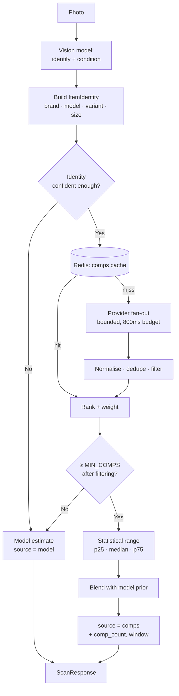

# Comparable sales pipeline — architecture

**Status:** design. The engine is built (`backend/comps/`, see `COMPS-ENGINE.md`)
but not called from `/scan`, and the seam is in place (`ScanResponse.valuation_source`).
**Purpose:** move SnapWorth from *AI estimates* to *evidence-backed valuations*.

> **No approved data source (2026-09-24).** No marketplace currently gives SnapWorth
> completed-sale prices it may use. eBay is not planned (#36, #42 closed), and
> Discogs and Reverb turned out to have no usable sold data (see
> [Provider assessment](#provider-assessment)). The engine therefore stays off,
> with `COMPS_ENABLED=false`, and no comps work proceeds until a provider grants
> sold-data access in writing. Everything below is the design that such a grant
> would be built on, not a description of what runs.

---

## Why this is the most important thing on the roadmap

Today a valuation is one vision-model call. The model is drawing on training data
about what items like this typically resell for — which is genuinely useful, and
also unfalsifiable. It cannot cite a sale. It cannot tell you the market moved
last month. It cannot distinguish "I have seen thousands of these" from "I am
pattern-matching from three."

That is also the reason `marketing/SCREENSHOT-COMPLIANCE.md` exists: the product
advertised comps it never had. This pipeline is how that claim gets *earned*
rather than retracted permanently.

The strategic point: once `valuation_source == "comps"` is real, SnapWorth makes
the strongest honest claim in the category, and no competitor built on a raw
vision model can follow without building the same thing.

---

## Design principles

1. **Never block a scan on comps.** Comps are an enhancement layer. A marketplace
   outage must degrade to a model estimate, not to an error. The user standing in
   a shop needs an answer in seconds.

2. **Label the source, always.** "Based on 38 sold listings (median $62)" and
   "AI estimate — no recent sales found" are different claims and must look
   different in the UI. This is the honesty invariant, enforced in the type
   system via `valuation_source`.

3. **Sold, never asking.** An asking price is a wish. Only completed sales count.
   This eliminates several sources outright — Facebook Marketplace and Etsy do
   not expose sold prices via API — and that is the right trade.

4. **Cache aggressively.** Comps for a normalised item identity change slowly.
   A 24h TTL gives a high hit rate at near-zero marginal cost and keeps us inside
   rate limits that are far tighter than our scan volume.

5. **The model still runs.** Identification is what makes a comps query possible.
   Comps replace the *pricing* step, not the vision step.

---

## Flow



---

## Provider abstraction

Every marketplace differs in auth, rate limit, taxonomy and whether it exposes
sold data at all. One interface contains that variance:

```python
class CompsProvider(Protocol):
    name: str
    categories: frozenset[str]      # which categories this provider is useful for
    supports_sold: bool             # False ⇒ excluded from pricing entirely

    async def search(
        self, identity: ItemIdentity, *, window_days: int = 90, limit: int = 50
    ) -> list[Comp]: ...

    async def health(self) -> ProviderHealth: ...
```

```python
@dataclass(frozen=True)
class Comp:
    provider: str
    external_id: str                # for dedupe and audit
    title: str
    sold_price_usd: Decimal         # normalised to USD at sale-date FX
    sold_at: datetime
    condition: str | None
    shipping_usd: Decimal | None
    url: str | None
    match_score: float = 0.0        # populated by the ranker
```

### Provider assessment

| Provider | Sold data | API | Categories | Priority | Notes |
|---|---|---|---|---|---|
| **eBay** | ❌ Marketplace Insights not granted | Official, approval required | All | **Not planned** | eBay declined our application (2026-09-03), and we did not pursue it further; #36 and #42 closed as not planned. Browse API is active listings only |
| **StockX** | ✅ Public bid/ask + last sale | Unofficial | Sneakers, streetwear | **P1** | Near-exact matching by SKU |
| **GOAT** | ✅ | Unofficial | Sneakers | P2 | Overlaps StockX |
| **Discogs** | ❌ No usable sold data | Official | Vinyl, music | **Blocked** | No endpoint returns sales; pricing is Restricted Data, no commercial use. See below |
| **Chrono24** | ⚠️ Asking, some sold | Partner only | Watches | P2 | High value per item — worth the integration cost |
| **Reverb** | ❌ No usable sold data | Official | Instruments | **Blocked** | Price guide endpoint withdrawn; public listings are asking prices. See below |
| **Mercari** | ⚠️ Limited | Unofficial | General | P3 | US-centric |
| **Grailed** | ⚠️ Sold shown, no API | None | Menswear | P3 | Scraping only — legal review first |
| **Vinted** | ❌ | None | Fashion | P4 | No sold prices exposed |
| **Facebook** | ❌ | None | General | ✗ | No sold data — excluded by principle 3 |
| **Etsy** | ❌ | Official but no sold | Handmade | ✗ | Same |

Phase 1 was to ship eBay alone, as the one official API covering most thrift
categories. That plan is void: eBay declined our application (2026-09-03), and
we did not pursue it further. The two official APIs expected to follow it turned out to offer
nothing usable. Checked against each provider's own documentation and terms on
2026-09-24:

- **Discogs.** No API endpoint returns other users' completed sales.
  `GET /marketplace/price_suggestions/{release_id}` returns a *suggested* price
  per grade (authenticated, seller settings required), and
  `GET /marketplace/stats/{release_id}` returns "the number of items currently
  for sale, lowest listed price of any item for sale". Separately, the
  [API Terms of Use](https://support.discogs.com/hc/en-us/articles/360009334593-API-Terms-of-Use)
  (updated 2025-05-27) define "Marketplace Data such as … pricing suggestions,
  including but not limited to: pricing … and sales history" as Restricted Data,
  and "with respect to all Restricted Data, You may not … Use Restricted Data for
  any commercial purposes." So even the suggestions are off limits to a paid
  app. Release metadata (barcodes, catalogue numbers) is CC0 and could help
  *identify* a record, not price it.
- **Reverb.** `GET https://api.reverb.com/api/priceguide` answers 403
  `"This endpoint is no longer publicly available."` The
  [official docs](https://www.reverb-api.com/docs) cover selling (listings,
  orders, refunds) and document no price-guide or sold-transaction endpoint.
  `GET /api/listings` returns live asking prices only; a `state=sold` parameter
  is ignored. The
  [API Terms](https://reverb.com/legal/reverbcom-api-terms-of-use) (effective
  2022-07-01) also bar using the API "to collect, scan, or otherwise request
  Reverb content for analytics, machine learning … unless expressly authorized."

Both would have to declare `supports_sold=False`, which the registry never
selects for pricing, so neither is built. Written permission from either
provider reopens this; nothing short of that does.

---

## Item identity and matching

The hard problem is not fetching comps — it is knowing that two listings describe
the same object.

```python
@dataclass(frozen=True)
class ItemIdentity:
    brand: str
    model: str | None
    variant: str | None
    size: str | None
    category: str
    era: str | None

    def cache_key(self) -> str:
        """Stable, normalised key. Case- and punctuation-insensitive so
        'Better Sweater 1/4 Zip' and 'better-sweater 1/4-zip' collide."""
```

Normalisation must fold: case, punctuation, whitespace, common abbreviations
(`1/4 zip` ≡ `quarter zip`), colour synonyms, and size notation (`M` ≡ `Medium`).

**Match scoring** combines:

| Signal | Weight | Rationale |
|---|---|---|
| Brand exact | 0.30 | Non-negotiable; a mismatch disqualifies |
| Model token overlap (Jaccard) | 0.30 | The main discriminator |
| Size match | 0.15 | Materially affects price in apparel/shoes |
| Condition proximity | 0.15 | A "new" comp misprices a "used" item |
| Recency | 0.10 | Exponential decay, 45-day half-life |

Comps below `MIN_MATCH_SCORE` (0.55) are discarded. **Too few good comps is a
better outcome than many bad ones** — a wrong comp is worse than no comp,
because it carries the authority of evidence.

---

## Deduplication

The same physical item appears repeatedly: relisted after a failed sale,
cross-posted across marketplaces, or scraped twice.

Three passes, cheapest first:

1. **Exact** — `(provider, external_id)`.
2. **Near-duplicate** — same provider, title similarity > 0.9, price within 2%,
   sold within 7 days ⇒ almost certainly a relist.
3. **Cross-provider** — same normalised title and price within 5% ⇒ keep the
   most authoritative provider (eBay > StockX > unofficial).

Skipping this materially skews the median, because relists cluster at the price
that *failed* to sell.

---

## Freshness and statistical treatment

* **Window:** 90 days default; 180 for low-liquidity categories (furniture,
  collectibles) where 90 days yields too few sales.
* **Decay:** each comp weighted `0.5 ** (age_days / 45)`. A sale from last week
  says more about today's market than one from ten weeks ago.
* **Outliers:** drop beyond 1.5 × IQR before computing statistics. Thrift comps
  contain data-entry errors ($1 "buy it now" for a $200 item) and bundle sales.
* **Statistics:** weighted p25 / median / p75 →
  `worst_case` / `expected` / `best_case`.

### Blending with the model prior

Comps do not simply override the model. With few comps, the model prior is more
reliable than a thin sample:

```
w_comps = min(1.0, effective_n / MIN_COMPS_FOR_FULL_WEIGHT)   # e.g. 12
expected = w_comps * comps_median + (1 - w_comps) * model_expected
```

with `effective_n` the *decay-weighted* count, so twelve stale comps do not carry
the weight of twelve fresh ones. Below `MIN_COMPS` (5) we do not claim comps at
all and `valuation_source` stays `"model"`.

---

## Confidence integration

`confidence.py` gains a signal, slotting into the existing weighted scheme:

| Signal | Weight | Value |
|---|---|---|
| `comps_support` | **0.30** (new, highest) | `min(1, effective_n / 12)` × mean match score |

Existing weights are rescaled proportionally. This is correct because evidence
of actual sales is strictly stronger than any inferential signal — and it means
a comps-backed valuation *automatically* reports higher confidence, without any
special-casing.

The existing `was_clamped` hard override stays.

---

## Caching and cost

```
comps:v1:{identity_hash}          → serialised comps    TTL 24h
comps:neg:v1:{identity_hash}      → negative cache      TTL  6h
comps:provider:{name}:health      → circuit state       TTL 60s
```

The **negative cache** matters as much as the positive one: obscure items are
exactly the ones that return nothing, and re-querying every provider on every
scan of an unidentifiable jumper is how a rate limit gets exhausted.

Expected hit rate is high — thrift inventory is dominated by a few thousand
common items (Patagonia fleeces, Levi's 501s, Pyrex bowls), so the head of the
distribution is small and highly cacheable.

**Budget:** an 800 ms fan-out budget with `asyncio.wait(timeout=)`. Whatever has
returned by then is used; stragglers are cancelled. Comps must never add a
visible second to a scan.

**Circuit breaker per provider:** 5 failures in 30 s opens for 60 s, half-open
probe on recovery. A degraded provider is skipped, not retried into the budget.

---

## API surface (additive)

`ScanResponse` already carries `valuation_source`. Phase 1 adds:

> **Decision (#49, 2026-09-03):** the retired `sold_listings_count` name is **not** reused. It was a literal zero behind a screenshot claim the product could not support, and old clients and analytics still know it as such. A real count from comps ships under a new name inside the `comps` object below (`sold_count`), so a genuine number can never be mistaken for the fabricated one. `tests/test_ai_pipeline.py::test_sold_listings_count_stays_retired` enforces the absence.


```json
{
  "valuation_source": "comps",
  "comps": {
    "count": 38,
    "effective_count": 22.4,
    "window_days": 90,
    "median_usd": 62.00,
    "p25_usd": 48.00,
    "p75_usd": 79.00,
    "providers": ["<marketplace>"],
    "newest_sale": "2026-07-21",
    "oldest_sale": "2026-04-24",
    "sample": [
      {"title": "Patagonia Better Sweater 1/4 Zip Mens M",
       "sold_price_usd": 64.00, "sold_at": "2026-07-21",
       "condition": "good", "url": "https://..."}
    ]
  }
}
```

`comps.sample` (3–5 entries) is what makes the valuation *auditable by the user*
— they can click through and verify. That is the entire trust proposition, and it
is why the field exists despite the payload cost.

All fields optional; clients that do not read them are unaffected.

---

## Legal and compliance

- **eBay:** Marketplace Insights requires application and has usage terms.
  eBay declined our application (2026-09-03), and we did not pursue it further
  (#36); not planned.
- **Discogs:** pricing, price suggestions and sales history are Restricted Data,
  barred from commercial use. Written permission required before any use.
- **Reverb:** price guide not publicly available; the analytics clause needs
  express authorisation. Written permission required before any use.
- **Unofficial endpoints (StockX, GOAT, Mercari):** these are not authorised APIs.
  Get legal review before shipping, and treat ToS as a hard constraint, not a
  risk to price in.
- **Scraping (Grailed):** do not ship without counsel. Reputational and legal
  exposure exceeds the marginal accuracy gain.
- **Attribution:** where a provider requires visible credit, the UI must show it.

Adding a provider is a **legal decision before an engineering one**.

---

## Rollout

| Phase | Scope | Exit criterion |
|---|---|---|
| 0 | Seam only — `valuation_source` field | ✅ **Done** |
| 1 | First approved provider, its categories, shadow mode (logged, not served) | Comps agree with model within 30% on ≥60% of scans |
| 2 | Serve comps-backed valuations, labelled, behind a flag | MdAPE improves ≥20% vs. model-only on the benchmark |
| 3 | Further providers; expand categories | Coverage >40% of scans |
| 4 | Update marketing claims — **only now** | Legal sign-off on the comps claim |

**Phase 1 is blocked**: it has no provider to start with (see
[Provider assessment](#provider-assessment)). It was written as "eBay, clothing +
shoes"; it now begins with whichever provider first grants sold-data access in
writing.

Shadow mode in phase 1 is non-negotiable: it measures the pipeline against the
benchmark without any user seeing a number derived from an untested source.

---

## What this does not solve

- **Condition is still model-judged.** Comps tell you what a "good" one sold for;
  deciding this one is "good" remains a vision problem.
- **Genuinely rare items.** No comps exist for a one-off. The model prior stays
  the only answer, and confidence should say so.
- **Regional pricing.** eBay US comps misprice for a UK seller. Needs
  storefront-aware querying and FX at sale date — deferred to phase 3.
- **Authenticity.** Comps assume genuine items. A replica priced against
  authentic comps is dangerously wrong, which is why
  `authenticity_assessment` must gate comps weighting.
