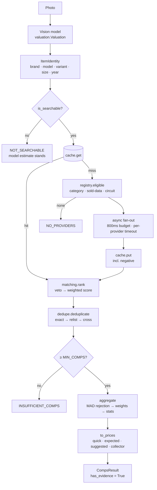

# Comparable-sales engine — implementation guide

Companion to `COMPS-ARCHITECTURE.md`, which covers the design. This documents
**what was built**, how to extend it, and the two evaluations the brief asked
for (RAG, and the ML roadmap).

**Status:** foundations complete and tested. No marketplace integration, no
scraping, no credentials. The engine is off by default and shadow-mode by
default when enabled.

---

## Module map

```
backend/comps/
├── models.py            data models — ItemIdentity, Comp, PriceEvidence, …
├── normalize.py         text/token typing, condition vocabularies, FX
├── matching.py          veto + weighted scoring
├── dedupe.py            exact / relist / cross-provider passes
├── aggregate.py         robust statistics, four price points, prior blending
├── cache.py             read-through cache over ResilientCache
├── catalog.py           knowledge base — brands, aliases, models, priors
├── search.py            SQLite FTS5 index over the catalog
├── flags.py             feature flags (off / shadow / live)
├── engine.py            orchestration + async fan-out
└── providers/
    ├── base.py          CompsProvider protocol, registry, circuit breaker
    └── stubs.py         credential-free stubs + FixtureProvider
```

---

## Pipeline



Stage ordering is load-bearing:

- **rank before dedupe** — dedupe needs match scores to choose which copy of a
  duplicate to keep.
- **dedupe before aggregate** — relists cluster at the price that *failed* to
  sell, so aggregating first biases the median upward.

---

## Adding a provider

1. Implement the `CompsProvider` protocol (`providers/base.py`).
2. Declare `ProviderCapabilities` honestly — especially `supports_sold`. A
   provider that only exposes asking prices must declare `False`; the registry
   will then never select it for pricing.
3. Normalise at the boundary: convert to USD via `normalize.to_usd`, fold the
   condition string via `normalize.condition`, and populate `seller_id` if the
   marketplace exposes one (it is load-bearing for dedupe — see below).
4. Register it, and gate rollout with `COMPS_PROVIDERS`.

```python
@dataclass
class EbayProvider:
    name = "ebay"
    capabilities = ProviderCapabilities(
        marketplace=Marketplace.EBAY,
        categories=frozenset(),          # all
        supports_sold=True,
        supports_currency=frozenset({"USD", "GBP", "EUR"}),
    )

    async def search(self, query: ProviderQuery) -> list[Comp]:
        ...   # raise ProviderError on failure; return [] for "no matches"

    async def health(self) -> ProviderHealth:
        ...
```

Never raise a bare exception from `search`. `[]` means "nothing matched" and is
a legitimate, cacheable answer; `ProviderError` means "I failed" and opens the
circuit breaker. Conflating them poisons the negative cache.

---

## Configuration

| Variable | Default | Notes |
|---|---|---|
| `COMPS_ENABLED` | `false` | Master switch |
| `COMPS_SHADOW_MODE` | `true` | Compute + measure, never influence output |
| `COMPS_PROVIDERS` | *(all)* | Comma-separated allowlist |
| `COMPS_CATEGORIES` | *(all)* | Phase 1 should be `clothing,shoes` |
| `COMPS_FANOUT_BUDGET_MS` | `800` | Whole fan-out deadline |
| `COMPS_PROVIDER_TIMEOUT_MS` | `700` | Per provider; must be below the budget |
| `COMPS_WINDOW_DAYS` | `90` | Sale window |
| `COMPS_LONG_WINDOW_DAYS` | `180` | Furniture, collectibles |
| `COMPS_CACHE_TTL` | `86400` | 24h |
| `COMPS_NEGATIVE_CACHE_TTL` | `21600` | 6h |

Going live requires **two** deliberate changes (`COMPS_ENABLED=true` *and*
`COMPS_SHADOW_MODE=false`). Enabling one alone cannot serve a comps-backed
claim, which is the point.

---

## Two bugs testing found

Recorded because both were subtle and both would have silently corrupted
valuations in production.

### Fungible-goods collapse in dedupe

Original relist detection was "same provider + similar title + similar price +
close in time". That correctly catches a seller re-posting an unsold item — and
also incorrectly merges **ten different sellers moving a common item at a
similar price in the same week**, which is precisely what thrift comps look
like. A 12-comp set collapsed to 4.

The missing discriminator was **seller identity**: a relist is the *same seller*
re-posting. `Comp.seller_id` now decides it. Where the provider exposes no
seller, the fallback demands near-exact price and title agreement, plus a safety
valve capping removal at 40% of a provider's results.

### Outliers escaping when MAD is zero

MAD-based rejection bailed out when the median absolute deviation was zero.
That happens whenever over half the comps share one price — routine on
fixed-price marketplaces — and it meant a $5,000 data-entry error survived
alongside nine $40 sales.

A tight middle makes an outlier *more* conspicuous, not less. Rejection now
falls back to an IQR fence, and finally to exact-equality when the IQR is
degenerate too.

---

## Phase 5 — internal search, and why scan search is on-device

`comps/search.py` implements an FTS5 index over the **catalog** (brands,
aliases, model lines) with `unicode61` tokenisation, prefix indexes for
typeahead, and BM25 ranking.

It deliberately does **not** index user scans.

`/privacy` states, and the App Store privacy disclosure repeats:

> Photos and scan results are processed in real time and are not retained on our
> servers. Scan history is stored locally on your device.

A server-side searchable index of previous scans would require retaining them
server-side, contradicting that commitment. It would also convert an anonymous,
device-keyed service into one holding per-user history — a materially different
GDPR posture needing a new lawful basis, retention schedule and DSAR handling,
none of which exists.

**Scan search therefore belongs on-device**, and that is the better product
answer anyway: the data is already local, so search is instant, works offline in
a shop basement, and costs no round-trip.

### On-device design (iOS, not implemented here)

SwiftData already stores every field the brief asks to search. Add:

```swift
@Model final class ScanResult {
    // Existing: itemName, brand, category, valueLow/High, confidence, timestamp…
    // For search, add:
    var searchBlob: String       // brand + model + material + colour + notes + tags
    var tags: [String]
    var colour: String?
    var material: String?
}
```

Then a `.searchable` list backed by a `#Predicate` over `searchBlob`, plus
faceted filters for category, price band, confidence band and date range.

Two notes:
- `#Index` on `timestamp`, `statusRaw` and `brand` needs iOS 18; the project
  targets 17.0, so raising the minimum is a prerequisite.
- For >5k scans, a `CSSearchableIndex` (Core Spotlight) entry per scan gives
  system-wide search and an acquisition surface, at the cost of an export step.

---

## Phase 7 — RAG evaluation

**Verdict: no. Not now, and not for comps matching.**

This is not a "later maybe" — retrieval-augmented generation is the wrong tool
for this specific problem, and adopting it would make the system worse.

### The argument

**1. Embeddings cannot express the veto, which is the whole job.**

The single most important behaviour in `matching.py` is rejecting Air Max 95 as
a comp for Air Max 97. Cosine similarity over any general text embedding rates
those two strings at ~0.97 — they differ by one character in one token. An
embedding-first retriever would surface the wrong shoe with high confidence, and
a re-ranker built on the same embeddings would agree with it.

The discriminative signal here is *symbolic* (`97` ≠ `95`), not semantic. Vector
search is built to be robust to exactly the small lexical differences that, in
this domain, carry all the meaning.

**2. The retrieval target is structured, not prose.**

RAG earns its keep when relevant knowledge is buried in unstructured text.
A comp is `{brand, model, variant, size, condition, price, sold_at, seller}` —
already structured. Provider APIs take structured queries. Deterministic scoring
over structured fields is more accurate, far cheaper, fully explainable, and
unit-testable. Embedding a database row to search it with cosine distance is
strictly worse than querying it.

**3. Explainability is a product requirement, not a nice-to-have.**

The trust proposition is "here are 38 sales, click through and check". Every
match must be attributable to a stated reason — `matching.MatchResult.reasons`
does that. "Cosine similarity 0.87" is not an explanation a reseller can audit.

**4. Cost and latency for negative value.**

Embedding every query and every candidate adds an inference call and a vector
store to a pipeline with an 800 ms budget, in exchange for worse precision.

### Where embeddings *do* belong

Two places, both Phase 8 rather than now:

- **Image similarity** (CLIP/SigLIP) for visual matching where text fails —
  unbranded vintage, pattern matching, "find comps that look like this". This is
  genuinely a vector problem because there is no symbolic key.
- **Catalog alias resolution** at scale. Once the catalog holds tens of
  thousands of model lines, an embedding index becomes a better fuzzy fallback
  than `difflib`. It remains a *fallback* behind exact and alias lookup, never
  the primary path.

Both are additive to the current architecture. Neither requires RAG as such.

---

## Phase 8 — ML roadmap

Ranked by value ÷ effort, with an explicit build/skip call.

| Capability | Value | Effort | Verdict |
|---|---|---|---|
| **OCR on tags/labels** (VisionKit on-device) | Very high | Low | **Build first.** Brand and size are printed on the item. Reading them turns an unidentifiable jumper into a searchable identity — directly raising `is_searchable` hit rate, which is the top of the comps funnel. Free, on-device, no inference cost. |
| **Image quality gating** | High | Done | ✅ Shipped in `imagequality.py`. |
| **Logo/brand detection** | High | Medium | **Build second.** A small detector over the ~200 catalog brands catches logos the LLM misses and cross-checks ones it claims — reducing the brand-mismatch hallucination the eval harness measures. |
| **Image embeddings + similarity search** (SigLIP) | High | High | **Build after comps ship.** The unlock for unbranded and vintage items where no text key exists. Needs an indexed corpus of scanned items with known outcomes, which only exists once comps are running. |
| **Condition estimation from pixels** | Medium | High | **Defer.** Condition is genuinely hard from one photo (wear is often invisible at capture resolution) and the current condition selector already lets the user correct it — a cheap fix for a hard problem. |
| **Damage detection + localisation** | Medium | High | **Defer.** Good demo, moderate real value, and false positives ("we found a stain") are actively harmful to trust. |
| **Counterfeit detection** | High value, **very high risk** | High | **Do not build.** A false "authentic" on a replica is legal exposure that cannot be insured, and a false "counterfeit" is defamatory toward a seller. `authenticity_assessment` deliberately tops out at "no obvious concerns" and should stay there. |
| **Fine-tuned valuation model** | Medium | Very high | **Do not build yet.** Fine-tuning needs the 500-item benchmark plus far more labelled outcome data than exists. Comps make the model less important, not more — spend the effort on evidence, not on a better guess. |
| **Demand/velocity forecasting** | Medium | Medium | **Free once comps ship.** Sales-per-week falls straight out of the comp set; no new model needed. |

**The through-line:** OCR and logo detection improve *identification*, which is
the input to comps. Everything downstream of a correct identity is already
handled by deterministic code. Spend ML effort at the top of the funnel.

---

## Known limits

- **Dedupe is O(n²) within a provider.** ~50 ms at n=1000. Bounded in practice
  by `COMPS_MAX_RESULTS` (50/provider), so real fan-outs are n ≤ 250 → <2 ms.
  Revisit with LSH banding only if per-provider limits rise substantially.
- **FX rates are static**, captured 2026-07-28. `FXRates.is_stale` makes the
  staleness observable and `set_provider` is the seam; a live feed needs
  credentials, which this milestone excludes.
- **Catalog is seeded, not exhaustive** — ~36 brands chosen for thrift-resale
  relevance. Growth should be deliberate: every entry is a claim about the
  market.
- **Condition is model-judged.** Comps tell you what a "good" one sold for;
  deciding *this* one is "good" remains a vision problem.
- **Regional pricing.** US comps misprice for a UK seller. Needs
  storefront-aware querying and sale-date FX.
