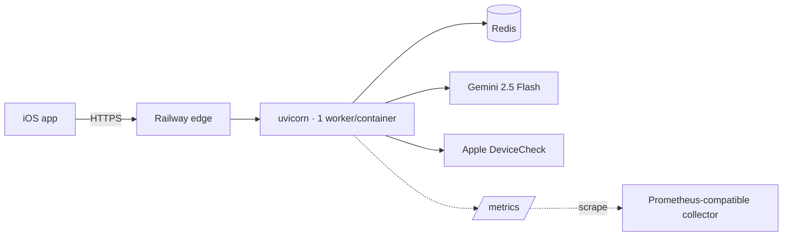

# SnapWorth production runbook

Operational reference for the backend at `api.snapworth.eu` (Railway, single
region, Docker).

**Every number in this document is labelled.** `[MEASURED]` comes from this
repository or a benchmark; `[ESTIMATED]` is modelled from public pricing and
stated assumptions; `[DESIGNED]` is implemented but never exercised in
production; `[NOT IMPLEMENTED]` is absent. Nothing here is drawn from
observed production traffic, because none has been observed.

---

## 1. Service topology

| Component | State |
|---|---|
| API container | `backend/Dockerfile`, python 3.13-slim, unprivileged uid 10001 |
| Process model | 1 uvicorn worker per container; scale horizontally |
| Durable state | Redis — quota, entitlements, rate limits, attestation |
| System of record | **None.** Redis is a cache; scan history lives on-device |
| Metrics | `/metrics`, Prometheus text format `[DESIGNED]` |
| Collector | `[NOT IMPLEMENTED]` — no scraper configured yet |

---

## 2. Endpoints and probes

| Path | Purpose | Failure semantics |
|---|---|---|
| `/health/live` | Liveness | Checks nothing external — see below |
| `/health/ready` | Readiness | 503 while starting, draining, or cache-unreachable |
| `/health` | Legacy | Retained for compatibility |
| `/metrics` | Prometheus scrape | Unauthenticated, aggregates only |

**Liveness deliberately checks no dependency.** A liveness probe that fails
during a Redis outage makes the orchestrator restart healthy containers, turning
a recoverable blip into a fleet-wide crash-loop. Dependency health belongs in
readiness, where the consequence is "route elsewhere" rather than "kill it".

---

## 3. Alerts

`[DESIGNED]` — thresholds below are starting points to be tuned against real
baselines. Alerting on an unmeasured system produces noise, so treat the first
fortnight as calibration.

### Page (wake someone)

| Alert | Condition | First action |
|---|---|---|
| **API down** | `up == 0` for 2 min | §5.1 |
| **5xx surge** | 5xx rate > 5% over 5 min | §5.2 |
| **Model unavailable** | `model_calls_total{outcome="exhausted"}` > 10/min | §5.3 |
| **Cache unreachable** | `cache_degraded == 1` for 3 min | §5.4 |
| **Latency collapse** | p95 `/scan` > 20s for 5 min | §5.5 |
| **Readiness flapping** | readiness toggles > 3× in 10 min | §5.1 |

### Ticket (do not page)

| Alert | Condition | Why not a page |
|---|---|---|
| 429 rate elevated | > 2% of requests | Rate limiting working as designed |
| Quota exhaustion spike | 3× 7-day baseline | Expected under growth |
| Entitlement failures | > 1% of `/auth/entitlement` | Often Apple-side, self-heals |
| Confidence collapse | median `confidence_score` drops > 20 pts day-on-day | Signals a model or prompt regression |
| Upload size drift | p50 `upload_bytes` > 1 MB | Client-side downscale regressed |
| Clamp rate rising | `valuation_clamped_total` > 5% of scans | Model producing implausible numbers |

**4xx never pages.** `observability.classify_status` marks `CLIENT`,
`CAPACITY` and `SECURITY` as non-paging: a scraper generating 404s, or rate
limiting doing its job, is the system working correctly. Only `DEPENDENCY` and
`INTERNAL` page.

---

## 4. Dashboards `[DESIGNED]`

**Golden signals**
Request rate by endpoint · error rate by class · p50/p95/p99 latency ·
in-flight requests.

**Model**
Call rate by outcome · duration p50/p95 · retry rate · tokens by kind ·
blocked-content rate.

**Quality** — the panel that catches a bad prompt deploy before the benchmark does
Confidence score distribution · clamp rate · upload size distribution.

**Capacity**
Cache hit ratio · rate-limit rejections · quota exhaustion · dependency errors.

---

## 5. Incident playbooks

### 5.1 API unreachable / restarting

1. `railway logs --service snapworth-backend`
2. Look for `RuntimeError: REQUIRE_APP_ATTEST is on but APPLE_TEAM_ID…` or
   `TOKEN_KEYS must be set in production` — both are deliberate startup refusals
   (`main._lifespan`, `tokens.signer_from_env`). Fix the variable; do not remove
   the guard.
3. Check `/health/ready`. A 503 with `"durable cache configured but unreachable"`
   means Redis, not the API → §5.4.
4. If the container is crash-looping with no startup error, roll back (§7).

### 5.2 Elevated 5xx

1. Split by class in `snapworth_http_requests_total{status_class="5xx"}`.
2. **502s** are almost always the model — check
   `model_calls_total{outcome="exhausted"}` → §5.3.
3. **500s** are ours. Find the request id in the log line and grep it; every log
   line carries one (`observability.RequestContextMiddleware`).
4. If 500s started with a deploy, roll back first and diagnose after.

### 5.3 Gemini unavailable

*Blast radius:* `/scan` and `/listing` fail. Auth, quota and entitlements are
unaffected — users keep their Pro status and their history.

1. Confirm at <https://status.cloud.google.com>.
2. Check the split: `outcome="blocked"` is content filtering (not an outage),
   `outcome="non_retryable"` usually means a bad API key.
3. If the key is the problem, rotate it (§8.2).
4. There is currently **no fallback provider** `[NOT IMPLEMENTED]`. A Gemini
   outage is a full scan outage. This is the largest single-point-of-failure in
   the system — see "Remaining risks".
5. Users see *"The AI service is temporarily unavailable"* — accurate, and the
   client does not burn quota on a failed scan (`consume_quota` runs only after
   success).

### 5.4 Redis unreachable

*Blast radius:* quota and entitlement checks **fail closed** by design — a 503,
never a free scan.

1. `/health/ready` returns 503 and the instance drains itself.
2. Check the Redis provider dashboard.
3. Do **not** "fix" this by unsetting `REDIS_URL`. That flips the service into
   single-instance mode where memory is treated as authoritative, silently
   disabling the quota across every replica (see `cache.ResilientCache`).
4. The client reconnects automatically once Redis returns; no deploy needed.
5. If the outage is prolonged and free-tier revenue leakage is preferable to a
   full outage, that is a **deliberate, logged decision** — set
   `FREE_SCANS_PER_DAY=0` to make everyone Pro-gated rather than erroring.

### 5.5 Latency collapse

1. Check `model_duration_seconds` p95 first — the model dominates scan latency.
2. Check `upload_bytes` p50. A jump above ~1 MB means the client-side downscale
   regressed (`ScanAPIClient.encodeForUpload`), and every scan is paying upload
   time it should not.
3. Check `http_in_flight`. Sustained growth means requests are arriving faster
   than they complete — add containers.

### 5.6 Apple outage (DeviceCheck / StoreKit)

*Blast radius:* smaller than it looks, by design.

- **DeviceCheck down** → reinstall protection degrades open. `quota.note_exhausted`
  and `starting_balance` both swallow failures deliberately: Apple's availability
  must not gate our service. No action needed.
- **App Store server down** → `/auth/entitlement` verification is *offline* (the
  JWS is verified against a pinned Apple root CA locally), so existing Pro users
  are unaffected. Only brand-new purchases are impacted, and the client retries
  on every status refresh.

### 5.7 Confidence collapse

A sudden drop in median `confidence_score` after a deploy means a prompt or
model change degraded identification. It is a **quality** incident, not an
availability one.

1. Compare `confidence_score` and `valuation_clamped_total` before and after.
2. Roll back the prompt without a redeploy: `SCAN_PROMPT_VERSION=v1`.
3. Run the benchmark before shipping a fix (`docs/EVALUATION.md`).

### 5.8 Quota abuse

1. Check `rate_limited_total` and `quota_exhausted_total`.
2. Device id is client-supplied and trivially rotated — the real backstop is the
   per-IP limit (`IP_RATE_MAX_REQUESTS`, default 60/hr).
3. Tighten via env; no deploy needed if the platform supports variable updates
   with a restart.
4. Sustained abuse from one IP range needs a platform-level block; there is no
   application-level IP blocklist `[NOT IMPLEMENTED]`.

---

## 6. Deployment

**Current:** `railway up --service snapworth-backend --detach` on push to main,
after tests pass (`.github/workflows/backend.yml`).

| Capability | State |
|---|---|
| Rolling deploy | Platform-provided |
| Graceful shutdown | `[DESIGNED]` — implemented, never exercised in production |
| Readiness gating | `[DESIGNED]` — `/health/ready` exists; must be configured as the platform's health path |
| Blue/green | `[NOT IMPLEMENTED]` |
| Canary | `[NOT IMPLEMENTED]` |
| Instant rollback | Railway redeploy of a previous build |
| Migrations | **None exist.** No relational database; Redis is a cache |
| Feature flags | Env-var based: `SCAN_PROMPT_VERSION`, `COMPS_ENABLED`, `COMPS_SHADOW_MODE`, `ALLOWED_STOREKIT_ENVIRONMENTS` |

### Shutdown sequence (implemented in `main._lifespan`)

1. SIGTERM reaches uvicorn as PID 1 — this only works because the Dockerfile
   uses `exec`; without it the shell swallows the signal.
2. Readiness flips to false → the load balancer stops sending new requests.
3. In-flight requests drain, up to `DRAIN_TIMEOUT_SECONDS` (default 15s).
4. DeviceCheck and Redis connections close.
5. `--timeout-graceful-shutdown 20` gives uvicorn room beyond the drain, and
   stays under Railway's 30s SIGKILL.

**Required platform configuration:** set the health-check path to
`/health/ready`. Without it the platform routes traffic to draining and
still-starting instances, and the graceful shutdown achieves nothing.

---

## 7. Rollback checklist

- [ ] Confirm the regression is deploy-correlated (compare against the previous
      release in `snapworth_build_info`)
- [ ] **Prompt-only regression?** Set `SCAN_PROMPT_VERSION=v1` — no redeploy
- [ ] **Comps-related?** Set `COMPS_ENABLED=false` — no redeploy
- [ ] Otherwise redeploy the previous Railway build
- [ ] Verify `/health/ready` returns 200
- [ ] Verify a real scan end-to-end
- [ ] No data migration to reverse — Redis is a cache and the client holds history

---

## 8. Secrets

| Secret | Rotation | Notes |
|---|---|---|
| `GEMINI_API_KEY` | On suspicion | §8.2 |
| `TOKEN_KEYS` | Quarterly | §8.1 — zero-downtime by design |
| `AUDIT_SALT` | Rarely | Rotating breaks historical correlation, deliberately |
| `DEVICECHECK_PRIVATE_KEY` | On suspicion | Apple Developer portal |
| TLS certificate | Automatic | Let's Encrypt, 90 days, platform-managed |

### 8.1 Token key rotation (zero downtime)

`tokens.TokenSigner` accepts every key for verification and signs with one, so
rotation needs no flag day:

1. `TOKEN_KEYS=old:secret1,new:secret2` — both valid, still signing with old
2. Wait one token lifetime (1 hour)
3. `TOKEN_CURRENT_KID=new` — now signing with new
4. Wait another hour, then drop `old`

### 8.2 Gemini key rotation

1. Mint a new key in Google AI Studio
2. Update `GEMINI_API_KEY`, restart
3. Verify `model_calls_total{outcome="success"}` recovers
4. Revoke the old key
5. CI already blocks committed keys (`.github/workflows/backend.yml`)

---

## 9. Disaster recovery

**RPO/RTO are shaped by an unusual property: there is no system of record.**
Scan history lives on-device, and StoreKit transactions are re-verifiable
offline. Redis holds only derived state.

| Failure | Impact | Recovery | RTO |
|---|---|---|---|
| Container loss | None — stateless | Platform restarts | seconds |
| Total Redis loss | Quota resets; Pro users re-sync on next status refresh | Provision new instance, set `REDIS_URL` | ~15 min `[ESTIMATED]` |
| Gemini outage | Scans fail; everything else works | Wait, or add a fallback provider | Provider-dependent |
| Region failure | Full outage | Redeploy to another region | ~1 hour `[ESTIMATED]` |
| Certificate expiry | Full outage | Platform auto-renews; pinning is report-only so a mismatch cannot brick clients | — |
| Key compromise | Sessions invalid | Rotate `TOKEN_KEYS`, drop old immediately | ~10 min |

**Acceptable RPO for Redis is effectively total loss.** Quota resets to today's
allowance (a small revenue leak, not a correctness failure) and entitlements
re-derive from the client's signed transaction. Document this rather than
engineering Redis persistence for it.

---

## 10. Cost model `[ESTIMATED]`

**Assumptions — these dominate the result and none is measured:**

- 30% of installs become monthly actives
- 4 scans/active/month (free tier is 3/day, most users scan far less)
- Gemini 2.5 Flash: ~$0.075/1M input, ~$0.30/1M output `[public pricing, 2026-07]`
- Per scan: ~260 image tokens + ~700 prompt = ~960 input, ~800 output
- 3% paid conversion at $39.99/yr blended

| Users | MAU | Scans/mo | Gemini/mo | Infra/mo | Total/mo | Revenue/mo | Margin |
|---|---|---|---|---|---|---|---|
| 10k | 3k | 12k | ~$4 | ~$25 | **~$29** | ~$1,000 | 97% |
| 100k | 30k | 120k | ~$40 | ~$120 | **~$160** | ~$10,000 | 98% |
| 1M | 300k | 1.2M | ~$400 | ~$800 | **~$1,200** | ~$100,000 | 99% |

Gemini Flash is cheap enough that **infrastructure dominates, not inference** —
which inverts the usual assumption for an AI product and means optimisation
effort belongs in container efficiency, not prompt golf.

### Optimisations, ranked by value

1. **Result caching by image hash** `[NOT IMPLEMENTED]` — users re-scan the same
   item. A 7-day cache on the image digest would cut both cost and latency, and
   is the single highest-value item here.
2. **Client-side downscale** `[MEASURED]` — already shipped; cut upload ~92%.
3. **Prompt length** — v2 is ~700 tokens. Trimming saves ~$40/mo at 1M users;
   not worth degrading output for.
4. **Retry discipline** `[MEASURED]` — non-retryable errors are no longer
   retried, halving the cost of a bad-key incident.
5. **`_retry_as_json` second call** — fires on unparseable output. Constrained
   JSON decoding made it rare; monitor `model_calls_total` before optimising.

---

## 11. Scaling audit

| Area | State | Note |
|---|---|---|
| Async correctness | ✅ | No blocking I/O on the event loop |
| Redis pooling | ✅ | `max_connections=50`, bounded timeouts |
| DeviceCheck pooling | ✅ Fixed | Was a new TLS handshake per call |
| Worker count | 1/container | Correct for I/O-bound work; scale by containers |
| Rate limiting | ✅ | Redis-backed, Lua-atomic; degrades to per-process |
| Cold start | ~2-3s `[ESTIMATED]` | Dominated by imports |
| Backpressure | ⚠️ Partial | Rate limits only; no queue-depth shedding |
| Autoscaling | Platform | Scale on **p95 latency, not CPU** — the service is I/O-bound, so CPU stays flat while requests queue |
| Thread safety | ✅ | Metrics under lock; no shared mutable state elsewhere |

---

## 12. Launch checklist

**Blocking**

- [ ] `REDIS_URL` set and reachable
- [ ] `TOKEN_KEYS` + `TOKEN_CURRENT_KID` set
- [ ] `ENVIRONMENT=production` (enables strict startup checks)
- [ ] `AUDIT_SALT` set to a real value
- [ ] `TRUSTED_PROXY=true` (else per-IP limits collapse to one bucket)
- [ ] `ALLOWED_STOREKIT_ENVIRONMENTS=Production`
- [ ] `LOG_FORMAT=json`
- [ ] Platform health-check path set to `/health/ready`
- [ ] **App Store screenshots corrected** — see `marketing/SCREENSHOT-COMPLIANCE.md`

**Should-have**

- [ ] Metrics collector scraping `/metrics`
- [ ] Alerts configured from §3
- [ ] On-call rota and escalation path
- [ ] Load test at 10× expected peak
- [ ] Gold dataset + recorded baseline (`docs/EVALUATION.md`)

---

## 13. On-call checklist

**Start of shift**
- [ ] `/health/ready` returns 200
- [ ] No firing alerts
- [ ] Last deploy is green

**During an incident**
- [ ] Note the request id from the first failing report
- [ ] Classify: dependency / internal / capacity (§3)
- [ ] If deploy-correlated, roll back before diagnosing
- [ ] Record the timeline as you go

**Security incident**
- [ ] Rotate the suspected credential first (§8)
- [ ] Pull the audit trail: `logger=snapworth.audit`, subjects pseudonymised
- [ ] Check `attest.failed`, `token.rejected`, `entitlement.rejected` rates
- [ ] Preserve logs before they age out
- [ ] Assess whether GDPR notification applies — no PII is stored, which
      substantially narrows the analysis
