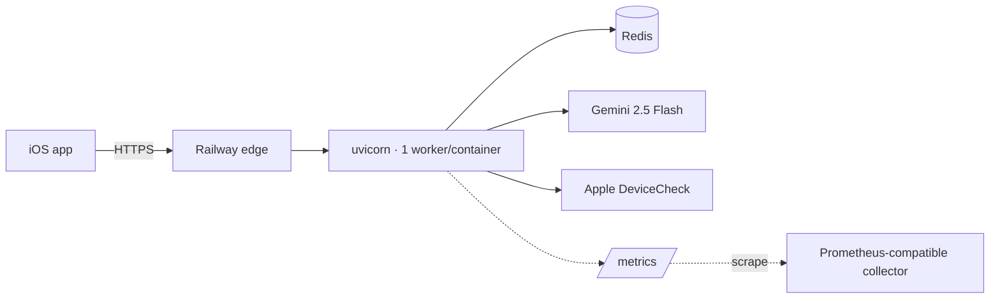

# SnapWorth production runbook

Operational reference for the backend at `api.snapworth.eu` (Railway, single
region, Docker).

**Every number in this document is labelled.** `[MEASURED]` comes from this
repository or a benchmark; `[ESTIMATED]` is modelled from public pricing and
stated assumptions; `[DESIGNED]` is implemented but never exercised in
production; `[NOT IMPLEMENTED]` is absent. A figure drawn from production
traffic says so and names its source and dates.

---

## 1. Service topology


```mermaid
flowchart LR
    A[iOS app] -->|HTTPS| B[Railway edge]
    B --> C[uvicorn · 1 worker/container]
    C --> D[(Redis)]
    C --> E[Gemini 2.5 Flash]
    C --> F[Apple DeviceCheck]
    C -.-> G[/metrics/]
    G -.scrape.-> H[Prometheus-compatible collector]
```

| Component | State |
|---|---|
| API container | `backend/Dockerfile`, python 3.13-slim, unprivileged uid 10001 |
| Process model | 1 uvicorn worker × 1 replica, by decision (§11) |
| Durable state | Redis — quota, entitlements and the signed proofs behind them, refund tombstones, App Attest keys, referral codes, the operator's indexes, TikTok tokens, the free-scan lever, rate limits |
| System of record | Scan history: none, it lives on-device. **Several Redis key families have no other copy** (§9), so Redis is their system of record and has to be persisted like one |
| Metrics | `/metrics`, Prometheus text format `[DESIGNED]` |
| Collector | `[NOT IMPLEMENTED]` — and **not planned**; see below |
| Monitoring surface | **The Telegram ops bot.** This is the real one |

---

## 1b. How this service is actually monitored

Read this before anything else in the file, because until 2026-09-09 the file
did not say it. `[NOT IMPLEMENTED]` against the metrics collector was true and
misleading at the same time: it implied nothing was watching, while §8 told the
reader to "Run 🩺 Checkup" without ever saying what that is or where to run it.
The word "Telegram" did not appear in this document.

**The ops bot is the monitoring surface.** It lives in `backend/notify.py`,
posts to the operator's Telegram chat, and is where every operational signal
actually arrives:

| You want | Command | What it does |
|---|---|---|
| Is anything broken right now | `🩺 Checkup` | Probes the model, Redis, DeviceCheck and the App Store build in one message |
| Current state | `/status` | Build, cache backend, auth enforcement, last deploy ping, today's counters |
| What it costs | `/costs` | Gemini spend by window, `$/scan`, a Pro block over 30 days (paying devices, Pro spend per device-month, net revenue per paying month, Pro scans per device-day p50/p90/max, the three heaviest devices by $/day, each with its n), the free tier's cost per active device-day, thinking tokens per scan call (today, 7 and 30 days) beside the live `GEMINI_THINKING_BUDGET` (#217), and the operator's own bot usage listed separately |
| Subscribers | `/subs` | Active, paid, comped, and MRR |
| Is the free-scan experiment working | `/experiment` | The whole window at once: limit hits against trial starts and paid (converted trials plus direct purchases), day by day, with a running total, and whether a new user gets a first-day welcome right now — as the quota resolves it, so `FREE_SCANS_FIRST_DAY=1` at a daily limit of 1 reads "lever not armed" |
| Keep the experiment's numbers | `/experiment export` (💾 under `/experiment`) | The same rows as CSV in a block to copy into `docs/`. The counters expire 35 days after each day, so the 2026-09-10 → 09-24 window starts disappearing on 2026-10-15. An expired day is exported empty, not as zeros, and an unreadable Redis exports nothing. The `#` lines above the header (the window, the welcome, any lever move) have no commas, so each parses as one CSV field, and a reader that skips `#` lines gets only the table |
| Which paywall sells | `/paywall` | The last 28 days: trial starts and direct purchases per paywall trigger (from 1.5.2, which sends the trigger on the sync after a purchase; anything else is "no trigger"), and trial → paid over the trials whose free period ended in the window, with its n. Counts, not significance. Per trigger is counts only: the trigger is never stored with the subscription, so trial → paid by trigger is not readable here (#218) |
| Start or stop the free-scan experiment | `/lever` | Arms or disarms the first-day allowance without a Railway change or a redeploy. Two taps, clamped, and `/experiment` footnotes any day it moved. It checks a value against the running quota's own daily limit and cap, and refuses to arm when it cannot ask |
| Which plan the paywall preselects | `/lever plan` | `yearly`, `monthly` or `default` (the app's own, yearly), two taps. Sent on every token as `paywall_default_plan`, so a 1.5.2+ device follows within the hour; older builds always preselect yearly. An experiment arm (#220): change it only at an arm boundary and log the date in the growth log. `paywall_viewed` and the `purchase_*` events carry `default_plan` |
| Make a bad or stranded build update | `/minbuild <n>` | /scan, /listing and /trends answer builds below `n` with a 422 telling them to update from the App Store; `/minbuild off` serves all again. Two taps. Set it only once build `n` is live. /scan and /listing show the message to builds 8 and up; builds 7 and older show fixed copy ("Something went wrong"). /trends is refused too, but the app drops that error silently and the Trending card disappears. /auth is never gated, and a request whose build is unreadable is served. A 422 is a non-paging 4xx: refusals are counted in `snapworth_outdated_build_refused_total`, by endpoint. The access log's `build` field (from the User-Agent) shows who is still on what |
| Yesterday | The daily digest | Sent automatically at `TELEGRAM_DIGEST_UTC_HOUR` (default 06:00 UTC); a weekly report on Mondays |

Unprompted alerts arrive the same way: a new subscription, a deploy ping per
commit, the AI provider or Redis going down and coming back, a quiet-hours
note when nothing has scanned during US daytime, a budget warning (off until
`GEMINI_DAILY_BUDGET_USD` is set — production must set it, §12, and
`🩺 Checkup` says so while it is not), and a device-paused alert after repeated
unanalysable photos. One alert comes from outside the backend, because the bot
cannot report its own container being gone: the Uptime workflow probes
`/health/ready` every 10 minutes (§3).

**The decision on `/metrics` (previously tracked as A-7, open and unrecorded
for five days): accept it as designed-but-unscraped.** One replica and a
single operator do not justify running Prometheus, and the bot already answers
the questions a dashboard would. `/metrics` stays because it costs nothing to
keep and is the right shape if a second replica ever appears. It is not
monitoring today, and this table is what is.

---

## 2. Endpoints and probes

| Path | Purpose | Failure semantics |
|---|---|---|
| `/health/live` | Liveness | Checks nothing external — see below |
| `/health/ready` | Readiness | 503 when the cache cannot take a write (unreachable, or full). It would also say 503 before startup completes and after shutdown begins, but uvicorn serves nothing then: it opens the listener after startup and closes it at SIGTERM, so a deploying instance refuses connections instead (§6) |
| `/health` | Legacy | Retained for compatibility |
| `/metrics` | Prometheus scrape | Requires `Authorization: Bearer $METRICS_TOKEN`; 404 without it |

**Liveness deliberately checks no dependency.** A liveness probe that fails
during a Redis outage makes the orchestrator restart healthy containers, turning
a recoverable blip into a fleet-wide crash-loop. Dependency health belongs in
readiness, where the consequence is "route elsewhere" rather than "kill it".

---

## 3. Alerts

What actually reaches the operator. Until 2026-09-26 this section listed
Prometheus rules — `up == 0`, `cache_degraded == 1` — as the pages for "API
down" and "Cache unreachable". Nothing evaluates Prometheus rules here (§1: no
collector, by decision), so neither condition reached anyone: a Redis outage
failed every free scan with a 503 and the next digest read like a quiet day.

### What alerts today

| Alert | Raised by | Fires when | Reaches you as | First action |
|---|---|---|---|---|
| **API not ready** | `.github/workflows/uptime.yml`, outside the backend | `/health/ready` is not 200 on three tries over a minute; checked every 10 min `[DESIGNED]` | Telegram, if `TELEGRAM_BOT_TOKEN` and `TELEGRAM_CHAT_ID` are set as **GitHub repository secrets** (not only in Railway); always GitHub's failed-run email | §5.1 — or §5.4 when the message says *cache* |
| **Redis unreachable** / recovered | `notify.cache_state_changed`, fed by `ResilientCache`'s own down/up transitions | cache calls have failed for 60 s straight (`CACHE_ALERT_SETTLE_SECONDS`); the all-clear after 60 s of success | Telegram, at most once per 30 min | §5.4 |
| **AI provider degraded** / recovered | `notify.model_unhealthy`, from `main._ModelHealth` | `MODEL_UNHEALTHY_AFTER` (2) consecutive terminal model failures; a quota stop on the first | Telegram, at most once per 30 min | §5.3 |
| **Quiet** | `notify._quiet_check`, every 15 min | no successful scan for 6 h during 13:00–03:59 UTC | Telegram, once per window | `🩺 Checkup` |
| **Over budget** | `notify._note_usage` | day's Gemini spend passes `GEMINI_DAILY_BUDGET_USD` — **off by default (0), and must be set in production (§12)**; `🩺 Checkup` reads *Spend alert: OFF ⚠️* until it is | Telegram, once per day | `/costs` |
| **Device paused** | `notify._announce_safety_pause` | repeated blocked photos from one device | Telegram, once per device per day | none needed |
| **Referral pool low** / empty | `notify.referral_pool_low`, from `referral.take_code` | a friend or reward pool reaches `REFERRAL_POOL_LOW_AT` (20) codes, and again at empty; only while referrals are on | Telegram, once per pool per state per UTC day | §18 |

**Why two layers.** The Telegram alerts run *inside* the backend, so they
cannot report the backend being gone: a crash-looping or unscheduled container
sends nothing. The uptime workflow runs on GitHub and covers that, and it
also catches a Redis that is full and refusing writes while still answering
`PING` and `GET`, because `/health/ready` probes with a write. The in-process
Redis alert is deliberately silent on that flapping state (§5.4c) and is
minutes faster than a 10-minute schedule on a plain outage.

**What the uptime check cannot promise.** GitHub starts scheduled runs late
under load, and disables a public repository's schedules after 60 days without
a commit. A free external monitor pointed at the same URL — UptimeRobot or
Better Stack, 5-minute interval, alerting on anything but 200 — removes both
gaps and is the cheapest upgrade here. It is an account only the owner can
create.

**Not alerted** `[NOT IMPLEMENTED]`: 5xx rate, latency, readiness flapping,
429 or quota spikes, confidence collapse, clamp rate. Each needs a collector
reading `/metrics`. The rules below are the design for if one ever exists;
until then they are **not** monitoring, and `🩺 Checkup` plus the daily digest
are how those questions get answered.

### If a collector is ever added `[DESIGNED]`

| Alert | Condition | First action |
|---|---|---|
| 5xx surge | 5xx rate > 5% over 5 min | §5.2 |
| Latency collapse | p95 `/scan` > 20s for 5 min | §5.5 |
| Readiness flapping | readiness toggles > 3× in 10 min | §5.1 |
| 429 rate elevated | > 2% of requests | ticket — rate limiting working as designed |
| Quota exhaustion spike | 3× 7-day baseline | ticket — expected under growth |
| Entitlement failures | > 1% of `/auth/entitlement` | ticket — often Apple-side, self-heals |
| Confidence collapse | median `confidence_score` drops > 20 pts day-on-day | ticket — model or prompt regression |
| Upload size drift | p50 `upload_bytes` > 1 MB | ticket — client downscale regressed |
| Clamp rate rising | `valuation_clamped_total` > 5% of scans | ticket — implausible model numbers |

**4xx never pages.** `observability.classify_status` marks `CLIENT`,
`CAPACITY` and `SECURITY` as non-paging: a scraper generating 404s, or rate
limiting doing its job, is the system working correctly. Only `DEPENDENCY` and
`INTERNAL` would page. That classifier has no production caller today — it is
part of the collector design above.

---

## 4. Dashboards `[DESIGNED]`

**Golden signals**
Request rate by endpoint · error rate by class · p50/p95/p99 latency ·
in-flight requests.

**Model**
Call rate by outcome · duration p50/p95 · retry rate · tokens by kind ·
blocked-content rate.

**Quality** — the panel that catches a bad prompt deploy before the benchmark does
Confidence score distribution · clamp rate · upload size distribution.

**Capacity**
Cache hit ratio · rate-limit rejections · quota exhaustion · dependency errors.

---

## 5. Incident playbooks

### 5.1 API unreachable / restarting

1. `railway logs --service snapworth-backend`
2. Look for `RuntimeError: REQUIRE_APP_ATTEST is on but APPLE_TEAM_ID…` or
   `TOKEN_KEYS must be set in production` — both are deliberate startup refusals
   (`main._lifespan`, `tokens.signer_from_env`). Fix the variable; do not remove
   the guard.
3. Check `/health/ready`. A 503 with `"durable cache configured but not
   accepting writes"` means Redis, not the API → §5.4, or §5.4c if Redis
   still answers.
4. If the container is crash-looping with no startup error, roll back (§7).

### 5.2 Elevated 5xx

1. Split by class in `snapworth_http_requests_total{status_class="5xx"}`.
2. **502s** are almost always the model — check
   `model_calls_total{outcome="exhausted"}` → §5.3. `outcome="deadline"` is
   the app's 33s budget running out (slow uploads, slow replies), not Gemini
   failing.
3. **500s** are ours. Find the request id in the log line and grep it; every log
   line carries one (`observability.RequestContextMiddleware`).
4. If 500s started with a deploy, roll back first and diagnose after.

### 5.3 Gemini unavailable

*Blast radius:* `/scan` and `/listing` fail. Auth, quota and entitlements are
unaffected — users keep their Pro status and their history.

1. **Check `/health` first — it now names this failure.** `model.healthy:
   false` with `last_failure_kind: "quota_exhausted"` means the Gemini
   account's prepaid credits are gone. Nothing in this repo fixes that: top up
   at <https://ai.studio/projects>, on the project whose key Railway holds.
   Service resumes within a minute or two of the balance landing, with no
   redeploy. Retrying and rolling back both do nothing.
2. Confirm at <https://status.cloud.google.com>.
3. Check the split: `outcome="blocked"` is content filtering (not an outage),
   `outcome="quota_exhausted"` is billing (above), `outcome="non_retryable"`
   usually means a bad API key, `outcome="no_price"` means the model answered
   but carried no usable valuation — see §5.9. `outcome="deadline"` is the
   client's deadline passing before or during the call; it is not counted
   against `/health` and is filed as "timed out", not "provider", in the
   digest.
4. If the key is the problem, rotate it (§8.2).
5. There is currently **no fallback provider** `[NOT IMPLEMENTED]`. A Gemini
   outage is a full scan outage. This is the largest single-point-of-failure in
   the system — see "Remaining risks".
6. Users see *"The AI service is temporarily unavailable"* — accurate, and the
   client does not burn quota on a failed scan (`consume_quota` runs only after
   success).

### 5.4 Redis unreachable

*Blast radius:* quota and entitlement checks **fail closed** by design — a 503,
never a free scan.

1. `/health/ready` returns 503 and the instance drains itself.
2. Check the Redis provider dashboard.
3. Do **not** "fix" this by unsetting `REDIS_URL`. That flips the service into
   single-instance mode where memory is treated as authoritative, silently
   disabling the quota across every replica (see `cache.ResilientCache`).
4. The client reconnects automatically once Redis returns; no deploy needed.
   A refund, revoke or refund-reversal notification that arrives during the
   outage is answered 503, and Apple redelivers it. The webhook marks a
   notification handled only after its change is stored, so a Redis that
   fails halfway through a request leaves the retry a real second attempt.
   There is nothing to replay by hand unless the outage outlasts Apple's three
   days of retries; then apply them by hand as §16 describes.
5. There is no variable that turns this 503 into something else. An earlier
   version of this step said `FREE_SCANS_PER_DAY=0` would show free users the
   paywall instead of an error. It did not: `ScanQuota.reserve` increments the
   Redis counter (`required=True`) *before* comparing it with the limit, so an
   unreachable Redis is a 503 at any limit. The 503 is also the honest answer,
   since those users have not used their scan and a paywall would say they had.
   **If you set `FREE_SCANS_PER_DAY=0` during an earlier outage, set it back**
   (the default is `1`). It is read at startup and nothing reverts it, and at
   `0` there is no daily free scan: every free user gets the paywall on their
   first scan of the day, unless an armed first-day welcome covers them.

### 5.4b Redis *misconfigured* (not unreachable)

Distinguish this from 5.4 before touching the provider. A malformed `REDIS_URL`
looks identical on the dashboards — `required` calls fail closed exactly as they
do in an outage — but no amount of waiting fixes it.

*Signature:* `/health` reports `"backend": "redis-unavailable"`,
`"failures": 0`. A real outage reports `"redis-degraded"` with a non-zero
failure count — `"redis-unavailable"` means no connection was ever *attempted*,
because the client could not be built at all. Verified against `cache.health()`:

| state | `backend` | `failures` |
|---|---|---|
| misconfigured URL | `redis-unavailable` | `0` |
| configured, server down | `redis-degraded` | ≥ 1 |
| no `REDIS_URL` at all | `memory` | `0` |

The startup log says which:

- `REDIS_URL could not be used (ValueError: ...) — starting degraded` — the URL
  is wrong. `redis.asyncio.from_url` rejects any scheme that is not
  `redis://`, `rediss://` or `unix://`, and any port that is not an integer.
  Fix the variable and redeploy.
- `REDIS_MAX_CONNECTIONS is not a number` — a tuning knob only. Redis is fine
  and running at the default pool size of 50; fix at leisure.
- `REDIS_URL is set but the redis package is not installed` — the image is
  wrong, not the config.

The process deliberately **starts** in all three cases rather than crash-looping,
because a degraded replica still serves `/scan` (quota goes per-process) while a
crash-looping one serves nothing. `configured` stays true throughout, so nobody
gets free Pro out of it.

### 5.4c Redis full (answers, but refuses writes)

*Signature:* `/health/ready` 503 with `"not accepting writes"` while
`redis-cli PING` still answers; logs carry `OOM command not allowed when used
memory > 'maxmemory'`; `🩺 Checkup`'s Redis line shows usage at or near
`maxmemory`. Under `noeviction` — the policy this service needs (§11) — that
is the designed failure: writes stop, nothing is silently dropped, free scans
503 and new sign-ins fail.

1. Raise `maxmemory` if the service has headroom (`CONFIG SET maxmemory …`
   takes effect at once — then make it stick wherever the Redis service's
   configuration lives, or a restart reverts it), or raise the service's
   memory and `maxmemory` with it. No backend deploy is needed.
2. Look for what grew. `redis-cli --bigkeys` and `INFO keyspace`; the
   400-day families in §9 are the expected bulk.
3. Do **not** switch to an evicting policy to get writes flowing. Every key
   family here is either a paid-resource gate or state nothing can rebuild
   (§9), and eviction drops them silently.

### 5.5 Latency collapse

1. Check `model_duration_seconds` p95 first — the model dominates scan latency.
2. Check `upload_bytes` p50. A jump above ~1 MB means the client-side downscale
   regressed (`ScanAPIClient.encodeForUpload`), and every scan is paying upload
   time it should not.
3. Check `http_in_flight`. Sustained growth means requests are arriving faster
   than they complete — add containers.

### 5.6 Apple outage (DeviceCheck / StoreKit)

*Blast radius:* smaller than it looks, by design.

- **DeviceCheck down** → reinstall protection degrades open. `quota.note_exhausted`
  and `starting_balance` both swallow failures deliberately: Apple's availability
  must not gate our service. No action needed. "Down" means unreachable or a
  5xx. A 4xx is Apple refusing the token or our key, which is not an outage:
  that install gets the daily limit and no first-day welcome.
- **App Store server down** → `/auth/entitlement` verification is *offline* (the
  JWS is verified against a pinned Apple root CA locally), so existing Pro users
  are unaffected. Only brand-new purchases are impacted, and the client retries
  on every status refresh.

### 5.7 Confidence collapse

A sudden drop in median `confidence_score` after a deploy means a prompt or
model change degraded identification. It is a **quality** incident, not an
availability one.

1. Compare `confidence_score` and `valuation_clamped_total` before and after.
2. Roll back the prompt without a code deploy: `SCAN_PROMPT_VERSION=v2` if
   v2.1 is serving, `v1` if v2 is (§6, *Changing the scan prompt*).
3. Run the benchmark before shipping a fix (`docs/EVALUATION.md`).

### 5.8 Quota abuse

1. Check `rate_limited_total` and `quota_exhausted_total`.
2. Device id is client-supplied and trivially rotated — the real backstop is the
   per-IP limit (`IP_RATE_MAX_REQUESTS`, default 60/hr).
   **It keys on the first `X-Forwarded-For` entry** (`ratelimit.client_ip`),
   because Railway's edge writes the whole header: it drops whatever the
   client sent and writes `client` or `client, edge`. Every line of the
   header is joined in order, as uvicorn does, so two lines of one entry
   each are two entries. An IPv4 address keys as itself. An IPv6 one keys
   as its /64 with any zone id dropped: a /64 is one line's allocation, and
   keyed per address one IPv6 line was 2^64 buckets. An IPv4-mapped IPv6
   address keys as the IPv4 one it carries. A first entry that is not an
   address keys as the one fixed value `unparseable`. With no header, or
   one with no entry in it, the key is the socket peer. For an IPv4 caller
   whose entry is a bare address, the key is the client address uvicorn's
   access log prints, which is what the owner probe below reads. uvicorn
   drops a port or IPv6 brackets before printing, and the key does not: an
   entry like `198.51.100.23:5678` prints as the address but keys
   `unparseable`, which the probe's second check catches.

   *Why, from 2026-09-27.* Until that day the key was the rightmost entry,
   and then #250's walk: from the right, past Fastly's published ranges and
   internal addresses, to the first hop that is neither. Both keyed on
   Railway's edge. With #250 deployed (20:23 UTC), a probe of `POST
   /auth/challenge` logged `carried 2 hop(s), skipped 0` with the key's hop
   in `95.173.0.0/16 (global)`, while uvicorn's access log, which prints
   the leftmost entry, showed the prober's own address. So the second entry
   is Railway's edge or POP address, not Fastly's, and every user served by
   that POP shared one 60/hr bucket, which a launch would trip.
   `95.173.0.0/16` is split among many holders (CDN77, Speedbone and
   others), so it cannot go on the proxy list either. Forged probes at
   18:39 and 20:35 UTC, a single `X-Forwarded-For: 203.0.113.7` and a
   multi-entry `198.51.100.9, 203.0.113.8` sent with `Forwarded:
   for=192.0.2.60` and `X-Real-IP: 192.0.2.61`, all arrived with the
   prober's real address leftmost; no forged value was ever leftmost. Every
   production request that day, from the app, Apple and bots, carried
   exactly two entries, and no 1- or 3-entry note was logged. The service's
   `*.up.railway.app` domain answers 404, so no public path skips the
   stripping edge. [Railway staff](https://station.railway.com/questions/which-header-should-i-rely-on-for-real-c-d78a6f96)
   give the same rule: take the first `X-Forwarded-For` entry. Not
   `X-Real-IP`: on the CDN path it holds the CDN's address.

   **The residual risk.** The first entry is the caller only while Railway
   strips. If Railway ever stops stripping while still sending exactly two
   entries, the first is whatever the caller wrote: a caller chooses its
   key, gets a fresh 60/hr bucket for every value, and nothing in the
   header tells that request from a real one. This limit then bounds
   nothing. What still applies is App Attest where `REQUIRE_APP_ATTEST` is
   on, and with it the per-device buckets (item 3), which an unattested
   caller escapes by rotating its device id; and the daily spend alert once
   `GEMINI_DAILY_BUDGET_USD` is set (§10). `/auth/challenge`, `/auth/attest`
   and `/auth/assert` have no other per-caller bound: a challenge key in
   Redis per call, and an x.509 chain walk per attest, unlimited. Stripping
   was observed for
   callers connecting directly. A request that reaches Railway's edge from
   another CDN's addresses, a Fastly service of one's own say, rests on the
   same assumption and has not been probed on its own.

   **The owner probe. Run it after any Railway networking change (domains,
   CDN, regions, a proxied DNS record) and monthly, and record the date and
   result here.** From outside Railway, on a network whose public address
   you know:

   ```sh
   curl -s -o /dev/null -w '%{http_code}\n' -X POST https://api.snapworth.eu/auth/challenge \
     -H 'X-Forwarded-For: 203.0.113.7'
   curl -s -o /dev/null -w '%{http_code}\n' -X POST https://api.snapworth.eu/auth/challenge \
     -H 'X-Forwarded-For: 198.51.100.9, 203.0.113.8' \
     -H 'Forwarded: for=192.0.2.60' -H 'X-Real-IP: 192.0.2.61'
   ```

   Then find those two `POST /auth/challenge` lines in uvicorn's access log,
   in Railway's deploy logs. The client address uvicorn prints is the
   leftmost entry. **It must be your own public address, the one you
   connected from, and never `203.0.113.7`, `198.51.100.9` or anything in
   `192.0.2.0/24`.** And the process's `x-forwarded-for carried …` INFO line
   must say *the per-IP key is the first entry*, never *a fixed one*, which
   would mean Railway started writing something that is not a bare address
   (a port, say) and every caller now shares `unparseable`. The two
   requests spend two of your address's 60 an hour.

   *The CDN-source case this probe cannot see.* It is sent straight from
   your network, so it says nothing about a request that reaches Railway's
   edge from a CDN's addresses, which Railway might trust by source. To
   check that once: put a CDN service of your own (a Fastly VCL or Compute
   service, say) in front of `api.snapworth.eu`, have it **set** a
   different `X-Forwarded-For` on every request, and send 61 `POST
   /auth/challenge` through it. A 429 on the 61st means Railway replaced
   the header; 61 answers of 200 mean a CDN customer can choose its key,
   which is this section's residual risk made real.

   Runs: 2026-09-27, 18:39 and 20:35 UTC, pass.

   *If a forged value is leftmost*, Railway has stopped stripping and the
   per-IP key is the caller's choice: treat it as an incident. The 3-entry
   warning below need not have fired, since stripping can fail with two
   entries. A shared bucket is better than one the caller picks: the first
   can trip on a busy hour, the second bounds nothing. Find the new shape
   without logging addresses here (a throwaway Railway service that echoes
   its request headers, never this one), key `client_ip` on the entry
   Railway itself writes, counted from the right, and ask Railway what
   changed. Not a bucket per edge on top: one was tried in #250 and removed
   before merge, because one caller with 100 addresses could fill it and
   lock everyone behind that edge out of every limited route for an hour.

   **The 3-entry warning.** A WARNING reading `x-forwarded-for carried <n>
   hop(s), more than the 2 Railway writes: its stripping failed or the
   topology changed. …` means Railway's shape broke. No caller can cause it
   while stripping holds, so it is never a scanner's noise. It is logged
   once per process, for the first such request, with counts and fixed
   words only. Those requests are keyed by #250's walk from the right,
   which skips Fastly's published ranges and internal addresses
   (`_FASTLY_EDGE_RANGES`, `_INTERNAL_RANGES` in `ratelimit.py`). Railway's
   edge is on neither list, so on Railway's current shape the walk keys on
   the edge: everyone on that path shares one 60/hr bucket, but no caller
   picks its key. What to do: run the owner probe at once. If it fails, the
   paragraph above. If it passes, something now adds an entry: a proxied
   DNS record, another CDN, or a Railway change. Remove it, or teach
   `client_ip` the new shape. Don't raise `_RAILWAY_MAX_HOPS` to quiet the
   warning: that keys on the leftmost of three, which may be the caller's
   own.

   **After a deploy, read the log.** Each process logs one INFO line per
   distinct (entry count, whether the first entry is an address), for the
   first request that has it, at most four: counts and fixed words, never
   an address. Production traffic should read

   `x-forwarded-for carried 2 hop(s); the per-IP key is the first entry (Railway strips client values)`

   `carried 1 hop(s)` with the same ending is the same rule on a path that
   adds no edge entry. App traffic usually logs the line before you do: a
   `POST /auth/challenge` of your own adds one only if its pair is still
   new to the process that served it. A line ending **`the per-IP key is a
   fixed one, as the first entry is not an address`** on app traffic means
   Railway changed the header's format and everyone shares the one
   `unparseable` bucket: teach `_parse_hop` the new format.

   **Before putting any other proxy in front of Railway** (a proxied DNS
   record, another CDN): Railway will see that proxy as the caller and
   write its address first, so everyone behind one of its POPs shares one
   bucket; or, if Railway keeps that proxy's header, the 3-entry warning
   fires. Change `client_ip` for the new shape first, then run the owner
   probe through the proxy.
3. The IP bucket is one for every route with a limit — `/scan`, `/listing`,
   `/trends`, `/auth/entitlement`, and the unauthenticated `/auth` routes and
   `/apple/notifications` — so from one address they stop together. The
   per-device buckets are one per route, per hour (`ratelimit.py`):

   | Route | Bucket (Redis key) | Default | Env |
   |---|---|---|---|
   | `/scan`, free | `rl:dev:<subject>` | 20 | `RATE_MAX_REQUESTS` |
   | `/scan`, Pro | `rl:dev:<subject>` | 60 — the fair-use ceiling on "Unlimited scans" | `PRO_SCAN_RATE_MAX_REQUESTS` |
   | `/listing` (Pro only) | `rl:listing:<subject>` | 60, the IP cap; never below it (below) | `LISTING_RATE_MAX_REQUESTS` |
   | `/trends` | `rl:trends:<subject>` | 60 — no model call; a loop-breaker | `TRENDS_RATE_MAX_REQUESTS` |
   | `/auth/entitlement` | `rl:ent:<subject>` | 60 | `ENTITLEMENT_RATE_MAX_REQUESTS` |

   `/scan`, `/listing` and `/trends` used to share `rl:dev:` at 20: a Pro
   reseller who scanned and drafted each item stopped after about ten, and
   each Trending card fetch spent a scan. By default the Pro scan cap and the
   listing cap both equal the IP cap. So a Pro user who also drafts or opens
   My Finds from the same address meets the IP cap first, and it refuses scans
   and drafts together. A reseller who drafts every item gets about thirty an
   hour. Raising `IP_RATE_MAX_REQUESTS` lifts that and loosens the
   unauthenticated routes with it; raise `LISTING_RATE_MAX_REQUESTS` with it.

   **Keep the listing cap at or above the IP cap.** Every build of the app
   says "You've hit the scan limit." for any 429, a draft's included
   (`AppError.rateLimitMessage`), and Haul pauses both of its queues on
   either one's 429 (`HaulSession`). That is true only when the address
   bucket refused. At 20, the size `/listing` had while it shared `rl:dev:`,
   a Pro user's 21st draft of the hour was refused with scans to spare. The
   Result screen said "scan limit", Haul stopped scanning for up to the rest
   of the hour, and Haul's confirm still said "Drafts use the same hourly
   limit as scans." Lowering `LISTING_RATE_MAX_REQUESTS`, or raising
   `IP_RATE_MAX_REQUESTS` past it, brings all of that back for every
   installed build, and the server cannot fix it there. Either fix needs a
   new binary. One is app copy for a draft's 429 (new App.json keys). The
   other is a response header naming the bucket that refused (additive;
   nothing sends one yet), so Haul could pause only the full queue. One case
   remains at 60: a device that changes address within the hour can fill its
   own draft bucket first. The cost is unchanged per address, since the IP
   cap bounds that at 60 requests an hour, whatever the mix. A device moving
   between addresses can reach 60 scans and 60 drafts.
4. Tighten via env; no deploy needed if the platform supports variable updates
   with a restart.
5. Sustained abuse from one IP range needs a platform-level block; there is no
   application-level IP blocklist `[NOT IMPLEMENTED]`.

---

### 5.9 Valuations are wrong, not missing

*Symptom:* scans succeed but the numbers are nonsense — the signature case was
every item coming back as **$1–5**.

*Blast radius:* worse than an outage. A visible failure costs a scan; a
confident wrong number is the product being wrong, and users act on it.

1. Check `snapworth_model_calls_total{outcome="no_price"}`. Anything above zero
   means the model returned a reply with no usable price. Since 87e62c5 that is
   a 502, not an invented number — if this counter is climbing, the model or the
   prompt has regressed, not the pricing code.
2. Grep for `model response hit max_output_tokens — output truncated`. Truncation
   is the known cause: gemini-2.5-flash spends **reasoning** tokens out of
   `max_output_tokens`, measured at 1138–1777 per scan against a ~700-token
   payload. If the ceiling is squeezed, JSON truncates before the price fields,
   which sit two-thirds down the v2 schema and lower still in v2.1's.
3. Do not lower `GEMINI_MAX_OUTPUT_TOKENS` below **4096** — 2048 shipped and
   produced exactly this bug. It is a cap, not a spend: unused headroom is not
   billed, while truncated answers are billed in full and thrown away.
4. Re-check after any model change. A model with a larger reasoning appetite
   needs a larger ceiling, and the failure is silent by default.

## 6. Deployment

**Current:** `railway up --service snapworth-backend --detach` on push to main,
after tests pass (`.github/workflows/backend.yml`).

| Capability | State |
|---|---|
| Rolling deploy | Platform-provided |
| Graceful shutdown | `[DESIGNED]` — idle shutdowns complete in production; none has yet caught a request in flight, and Railway still SIGKILLs at once (below) |
| Readiness gating | `[DESIGNED]` — `/health/ready` exists; must be configured as the platform's health path |
| Blue/green | `[NOT IMPLEMENTED]` |
| Canary | `[NOT IMPLEMENTED]` |
| Instant rollback | Railway redeploy of a previous build |
| Migrations | **None exist.** No relational database; Redis holds durable state (§9) but has no schema to migrate |
| Feature flags | Env-var based: `SCAN_PROMPT_VERSION`, `COMPS_ENABLED`, `COMPS_SHADOW_MODE`, `ALLOWED_STOREKIT_ENVIRONMENTS`, `SANDBOX_ENTITLEMENTS` |

### Merging

A merge to main is a deploy: `backend.yml` ships every push to main that
touches `backend/**`, and on 2026-09-27 ten merges redeployed production ten
times in 80 minutes (#209). So main takes changes through a pull request whose
checks have passed, and nothing else.

**What is required: two checks on the PR's head commit.**

| Check | Workflow | Why this one |
|---|---|---|
| `No secrets in source` | `secrets.yml` | No `paths:`; runs on every PR and every push |
| `All required checks` | `required.yml` | No `paths:`; passes only when every other check on the head commit passed or was skipped |

`backend.yml`, `ios.yml`, `website.yml` and `eval.yml` are path-filtered, and
a required check that never starts leaves a PR waiting forever (requiring
`Build & Test` would block every website-only PR). So none of their jobs is
required by name; `All required checks` stands in for whichever of them ran.
It ignores itself, `SwiftLint (report only)`, and anything skipped or neutral
(`Deploy → Railway` and `Accuracy regression gate` on a PR, `Production does
what vercel.json says` after a preview deployment). It does not read commit
statuses, so Vercel's preview status is not a gate. It fails as soon as any
other check fails, is cancelled, times out or waits for approval, or a
workflow fails to start, and names it. It passes once `No secrets in source`
has passed and nothing has been queued or running for 60 s `[DESIGNED]`,
which is what gives a path-filtered workflow time to register. It gives up
after 27 min `[DESIGNED]`; `Build & Test` took 5–13 min across 12 runs on
2026-09-27, not counting any wait for a macOS runner `[MEASURED]`. Its log,
and its run's summary page, end with a table of every check it saw and the
verdict on each.

The ruleset that makes the two required is the owner's (#209, step 3):
ruleset **main** on the default branch, restrict deletions, block force
pushes, require a pull request with 0 approvals, require both checks (with
GitHub Actions as their source, so no other app's check of the same name
counts), no bypass actors. **Until it exists nothing is enforced**, and this
section is a convention. `gh api repos/hsilviu05/SnapWorth/rulesets` says
whether it does. "Require branches to be up to date" stays off: with bursts
of parallel PRs it forces a serial rebase of each one.

**How to merge.**

```bash
gh pr merge <n> --merge --auto
```

`--auto` queues the merge and GitHub makes it when the ruleset's required
checks pass, so nobody has to sit and wait for them. Two things have to be
true first, both the owner's:

- **Allow auto-merge** is on (Settings → General → Pull Requests). It was
  off on 2026-09-27, and until it is on `--auto` is refused.
- The ruleset exists. `--auto` waits for what the ruleset requires and
  nothing else, so without one there is nothing to wait for.

Until both are true, watch the checks and merge by hand:

```bash
gh pr checks <n> --watch --fail-fast
gh pr merge <n> --merge        # only once both checks are green
```

Claude sessions that merge PRs use `--auto` and never merge around a red or
pending check. A release bump (`chore: <version>, build <n>`) goes through a
PR like anything else; some past bumps, e.g. `a84d1d9`, were pushed straight
to main, which the ruleset refuses.

**A check failed and was re-run green, and `All required checks` is still
red.** It decides once, so re-run it as well: *Re-run failed jobs* on its run
in the PR's Checks tab, or

```bash
gh run list --workflow required.yml --branch <branch> --limit 1   # the run id
gh run rerun <run-id> --failed
```

The newest run of each check is the one it counts, so the re-run's pass
replaces the failure it saw. Do the same when it gave up at 27 min because a
macOS runner was slow to start. A workflow that failed to start (`no job
started` in its table) has nothing to re-run: its run in the Actions tab says
why, usually the workflow file itself, and the fix is a new commit.

A pull request runs its own copy of `required.yml`, so a PR that edits it is
judged by its edit. Read that diff before merging it.

**In a genuine emergency**, disable the ruleset: production is down and the
fix cannot wait for the PR's checks (up to ~13 min when the change runs the
iOS job), or a required check cannot pass for a reason outside the
repository (GitHub Actions or the gitleaks download is down). Don't delete
the ruleset: a disabled one keeps its configuration.

1. Settings → Rules → Rulesets → **main** → Enforcement status **Disabled** →
   Save. Or from a terminal:
   ```bash
   gh api repos/hsilviu05/SnapWorth/rulesets --jq '.[] | [.id, .name, .enforcement] | @tsv'
   gh api -X PUT repos/hsilviu05/SnapWorth/rulesets/<id> -f enforcement=disabled
   ```
2. Land the fix, and **say so in its commit message**: that the ruleset was
   disabled, why, and which checks did not run, so the reason sits in
   `git log` beside the change it let through.
3. Re-enable it at once, on the same screen or with `-f enforcement=active`,
   and confirm with
   `gh api repos/hsilviu05/SnapWorth/rulesets/<id> --jq '{enforcement, rules: [.rules[].type]}'`
   that it is `active` and still lists its rules.
4. The workflows also run on the push to main; read them, and fix what the
   skipped PR checks would have caught.

Disabling the ruleset does not skip the backend's own deploy gate: on the push
to main, `Deploy → Railway` still waits for `Test`, `Container builds` and
`No known-vulnerable dependencies`. With GitHub Actions down nothing reaches
Railway at all, and the way back is §7's redeploy of a previous build, not a
merge. A flaky test is not an emergency (re-run it), and neither is a slow
macOS runner (wait, or re-run).

### After every deploy

Tests passing is not the same as production working: on 2026-09-27 ten
deploys went out green and nothing exercised them from a phone until the
smoke test that evening (#206). After each backend deploy reaches Railway:

1. **Confirm it is the build you meant.** The Telegram deploy ping names the
   commit as it goes live; `GET /health` reports the running `commit`.
2. **🩺 Checkup** in the bot: no ⚠️, `FAILED`, `NOT` or `REJECTED` on any
   line. A line that was already amber before the deploy and is tracked in an
   issue is not new; anything else is.
3. **One real scan** from a phone on the current App Store build. It returns
   a result, and `/costs` counts it.

Anything red: §7, redeploy the previous build first and diagnose second.
Several merges in a burst need one pass after the last of them goes live,
not one per merge.

### Changing the scan prompt

`SCAN_PROMPT_VERSION` picks the valuation prompt: `v1`, `v2` (the default) or
`v2.1`. v2.1 is v2 with the multiple-items rule restored, the evidence asked
for before the prices, the market named (US resale value, in USD), and the v1
low/high pair left to the server; `backend/prompts.py` gives the reasons. The
response has the same fields and types under all three.

1. Compare on real photos first. It needs `GEMINI_API_KEY`, and costs one
   vision call per photo, per arm, per repeat:
   ```bash
   cd backend && python -m eval.runner --photos <folder of real scans> \
     --repeats 3 --compare v2 v2.1 --json-out runs/v2.1.json
   ```
   Without sale prices this says how far v2.1 moves prices, and its
   consistency, latency and tokens, not whether it is more accurate
   (`docs/EVALUATION.md`, *Without labels*).
2. Set `SCAN_PROMPT_VERSION=v2.1` on the Railway service. It is read at
   startup, so it applies once the service restarts with it.
3. Send the Telegram bot a photo. The last line of its reply starts
   `Prompt v2.1`. An unrecognised value serves the default without
   complaint, so this is the check that the change took.
4. To go back, set `v2` or remove the variable.

### Shutdown sequence (uvicorn, then `main._lifespan`)

What a deploy does to the old container, in order.
`tests/test_graceful_shutdown.py` runs it against the Dockerfile's own
command line.

1. **SIGTERM** reaches uvicorn as PID 1. This only works because the
   Dockerfile uses `exec`; without it the shell swallows the signal.
2. **uvicorn drains the requests in flight.** It closes the listener and idle
   keep-alive connections, waits up to `--timeout-graceful-shutdown 40` for
   requests in flight to finish, then cancels any still running.
3. **Then the lifespan shutdown** (`main._lifespan`). Readiness flips, which
   nothing reads by now: the listener is closed, and Railway asks the health
   path only while a new deployment starts. It waits up to
   `DRAIN_TIMEOUT_SECONDS=5` for the requests uvicorn cancelled to run their
   cleanup (a cancelled scan hands its free scan back through Redis), then
   closes the ops bot, DeviceCheck, App Store and Redis clients.
4. **SIGKILL**, `RAILWAY_DEPLOYMENT_DRAINING_SECONDS` after SIGTERM.

Steps 2 and 3 run one after the other, not side by side (`uvicorn.Server.shutdown`
sends the lifespan its shutdown only after its own wait), so SIGKILL has to
come after their sum: 40 + 5, plus under a second to close, so
**`RAILWAY_DEPLOYMENT_DRAINING_SECONDS=50`**. Until 2026-09-27 this section and
the Dockerfile described the drain as running inside uvicorn's window, and
assumed a 30 s Railway grace that is really 0.

That budget assumes a healthy Redis, where the refund and the close each take
well under a second. Against a Redis that has stopped answering, one call
takes 4-8 s (`cache.build_redis_client`: a 2 s connect and a 2 s read, retried
on timeout, behind a health-check PING). The refund then fails however long
the drain is, and the close, where `notify.aclose` hands back the Telegram
poll lock through the same Redis, can still be running when SIGKILL lands.
That is harmless: the refund was lost either way, and the poll lock expires
on its TTL (`POLL_LOCK_TTL`). The numbers are not sized for a hung Redis.

**Why 40 s.** It outlasts every request someone is still waiting for. The app
stops waiting on the model 33 s after a request arrives
(`CLIENT_DEADLINE_SECONDS`), and the phone gives up at 35 s. Measured
`[MEASURED — production, Railway HTTP logs, 2026-09-20 19:01 → 09-27 18:58 UTC,
30 deployments]`, edge to edge (`totalDuration`, upload included):

| Route | Requests | p50 | p95 | max | Over 20 s |
|---|---|---|---|---|---|
| `POST /scan`, all statuses | 48 | 13.5 s | 18.9 s | 21.6 s | 2 |
| `POST /scan`, 200 only | 37 | 14.5 s | 19.8 s | 21.6 s | 2 |
| `POST /listing` | 6 | 4.6 s | 5.5 s | 5.7 s | 0 |

The old window, 20 s, was already shorter than 2 of the 48 scans. At most 2
scans were in flight at once. The sample is small: five days of the seven had
fewer than five scans, and 09-26 alone had 25. Re-measure when §11's triggers
are reviewed.

**Railway settings — owner, dashboard (#207)**

| Setting | Now | Needed |
|---|---|---|
| Draining (SIGTERM → SIGKILL) | unset, so Railway's default: **0 s** | **TODO(owner):** `RAILWAY_DEPLOYMENT_DRAINING_SECONDS=50`, as a service variable or the service's Teardown setting |
| Overlap | unset, so the default: 0 s | Leave at 0. With no overlap, the old deployment gets SIGTERM when the new one goes Active. Overlap would only delay that SIGTERM, and the draining above already covers the longest request in flight |
| Health-check path | unset | **TODO(owner):** `/health/ready` (#207) |
| Replicas | 1, region `sfo` | 1 (§11) |
| `DRAIN_TIMEOUT_SECONDS` | not read here | **TODO(owner):** unset, so the default 5 applies. The startup line prints the value in force: `startup complete — accepting traffic (replica …, shutdown drain 5s)` |

"Now" is from the current deployment's service manifest (`railway deployment
list --json`, 2026-09-27: `drainingSeconds`, `overlapSeconds` and
`healthcheckPath` null, `numReplicas` 1). The defaults are Railway's
documented ones (docs.railway.com/variables/reference: "its default value is
0" for both; /deployments/reference: "By default, it is given 0 seconds to
gracefully shutdown before being forcefully stopped with a SIGKILL"). There is
no `railway.toml` or `railway.json`, and none should be added for this:
Railway has deprecated config-as-code, which works for existing services
until 2026-12-01.

**Until draining is set, a deploy is no worse than before.** At 0 s SIGKILL
follows SIGTERM whatever the app's windows are, so a request in flight is cut
off now exactly as it was under 15/20. In the 7 days above, 28 of 29 replaced
deployments logged a complete shutdown, each in under half a second, and none
logged `Waiting for connections to close`: no deploy caught a request in
flight, so what 0 s does to one has not been observed. After the owner sets
it, the next deploy that does catch one logs `Waiting for connections to
close`, then `shutdown complete` with no `still in flight` warning.

**Required platform configuration:** set the health-check path to
`/health/ready` (#207). Railway calls it only while a new deployment starts,
and makes that deployment Active, and the old one inactive, once it answers
2xx. Without it the new container is Active as soon as it starts, before
uvicorn listens. It is not polled afterwards, so it does not take a draining
or degraded instance out of rotation.

---

## 7. Rollback checklist

- [ ] Confirm the regression is deploy-correlated: the Telegram deploy ping
      names each commit as it goes live, `/status` shows the last one, and
      `GET /health` reports the running `commit`. (`snapworth_build_info` has
      the same fact, but nothing scrapes `/metrics` — §3.)
- [ ] **Prompt-only regression?** Set `SCAN_PROMPT_VERSION` back one version
      (`v2.1` → `v2`, `v2` → `v1`) — no code deploy
- [ ] **Comps-related?** Set `COMPS_ENABLED=false` — no redeploy
- [ ] Otherwise redeploy the previous Railway build
- [ ] Verify `/health/ready` returns 200
- [ ] Verify a real scan end-to-end
- [ ] No data migration to reverse. A rollback never touches Redis — do not
      flush it as part of one; much of what it holds has no other copy (§9)

---

## 8. Secrets

| Secret | Rotation | Notes |
|---|---|---|
| `GEMINI_API_KEY` | On suspicion | §8.2 |
| `TOKEN_KEYS` | Quarterly | §8.1 — zero-downtime by design |
| `AUDIT_SALT` | Rarely | §8.5 — rotating breaks historical correlation, deliberately |
| `DEVICECHECK_PRIVATE_KEY` | On suspicion | Apple Developer portal |
| `TELEGRAM_BOT_TOKEN` | On suspicion | §8.6 — was in production's logs until 2026-09-27 |
| TLS certificate | Automatic | Let's Encrypt, 90 days, platform-managed |

### 8.1 Token key rotation (zero downtime)

`tokens.TokenSigner` accepts every key for verification and signs with one, so
rotation needs no flag day:

1. `TOKEN_KEYS=old:secret1,new:secret2` — both valid, still signing with old
2. Wait one token lifetime (1 hour)
3. `TOKEN_CURRENT_KID=new` — now signing with new
4. Wait another hour, then drop `old`

### 8.2 Gemini key rotation

1. Mint a new key in Google AI Studio
2. Update `GEMINI_API_KEY`, restart
3. Verify `model_calls_total{outcome="success"}` recovers
4. Revoke the old key
5. CI does **not** block a committed key — it finds one after the push, when
   the repository is public and the key is already published.
   `.github/workflows/secrets.yml` scans the tree and every commit in history
   with gitleaks, on every push to any branch and every pull request; only
   GitHub push protection (Settings → Code security)
   refuses the push itself. A key that reached a commit is compromised
   whether or not a later commit deleted it: rotate it, then excuse the old
   hit by fingerprint in `.gitleaksignore`

### 8.3 Provisioning DeviceCheck

DeviceCheck is what stops a reinstall from resetting the free-scan allowance.
Unset, the service runs fine and every reinstall gets a fresh allowance —
`🩺 Checkup` says so.

**In the Apple Developer portal** (Certificates, Identifiers & Profiles → Keys):

1. **+**, name it (e.g. `SnapWorth DeviceCheck`), tick **DeviceCheck**, Continue → Register.
2. **Download the `.p8`. Apple lets you download it once**, and it cannot be
   re-issued — only revoked and replaced.
3. Note the **Key ID** on that page, and the **Team ID** from Membership.

**In Railway** — three variables, not two:

| Variable | Value |
|---|---|
| `APPLE_TEAM_ID` | Team ID (already set if App Attest is enforcing) |
| `DEVICECHECK_KEY_ID` | the Key ID from step 3 |
| `DEVICECHECK_PRIVATE_KEY` | the whole `.p8` file, `BEGIN`/`END` lines included |

The private key may be pasted with literal `\n` instead of newlines; the client
converts them (`devicecheck.py`, `__init__`). All three must be non-empty or
`is_configured` stays False and the checks are skipped.

**The newlines are what usually breaks.** A panel that flattens the `.p8` to one
line produces the same bare `ValueError` from `cryptography` as a truncated or
body-only key, so the checkup names the shape instead:

| Checkup says | Fix |
|---|---|
| `…is on a single line — its newlines were lost` | re-paste with real line breaks, or with a literal `\n` between them |
| `…has no BEGIN/END lines` | paste the whole file, not just the base64 body |
| `private key unreadable — …` | the envelope is right but the contents are not a P-256 key; check it is the unencrypted `.p8` Apple issued |
| `Apple unreachable just now (…)` | a timeout, a connection failure or a 5xx — not credentials. Nothing to change; run the checkup again |
| `probe could not be sent (…)` | the request failed before any answer from Apple was read, for a reason that is not the network: a client or code fault, not the key. Look in the server log for `devicecheck probe could not be sent` and its traceback, not in the developer portal |

**Then verify — do not trust "configured".** `is_configured` only means the
three variables are non-empty, and a wrong key cannot recognise a reinstall, so
a typo'd key silently hands every reinstall a fresh daily allowance. It also
withholds the first-day welcome from every new install, since Apple refusing
the key is not an outage (§5.6).
Run `🩺 Checkup`:

- `DeviceCheck: configured ✅ — credentials accepted by Apple` — Apple signed off.
- `DeviceCheck: configured but REJECTED — key rejected …` — one of the three
  variables is wrong, or the key lacks the DeviceCheck capability.
- `DeviceCheck: configured · Apple unreachable just now (…)` — Apple did not
  answer, so nothing is known about the key yet. Run it again. While it lasts,
  reinstalls get a fresh allowance, as in any Apple outage (§5.6).
- `DeviceCheck: configured · probe could not be sent (…)` — not a verdict on
  the key either, but not transient: see the table above. Scans send the same
  request, so until it is fixed reinstalls get a fresh allowance and new
  installs no welcome, as with a rejected key.

The probe sends a deliberately fake device token: Apple reads the
Authorization header first, so a `400` about the token proves the key signs
while a `401` proves it does not. No device is involved.

**`DEVICECHECK_SANDBOX`**: leave unset. Device tokens from an Xcode-run debug
build belong to Apple's development environment and will be refused by the
production host. That is expected and harmless: the install still gets the daily
limit, and only misses the first-day welcome. Set it
only if you ever point a build at the sandbox deliberately; a stale `true` would
break DeviceCheck for real App Store users, silently.

### 8.4 DeviceCheck key rotation

**Add, verify, revoke — in that order.** Revoking first leaves DeviceCheck
failing for as long as it takes to paste the replacement, and while it fails no
reinstall is recognised: every reinstall in that window gets a fresh daily
allowance, silently, and no new install gets the first-day welcome.

1. Portal → Keys → **+**, tick **DeviceCheck**, Register, download the `.p8`.
2. Railway: set `DEVICECHECK_KEY_ID` and `DEVICECHECK_PRIVATE_KEY` to the new
   pair **together**. A half-swap — new key id, old key — is the mismatch that
   produces `Unable to verify authorization token`.
3. `🩺 Checkup` → `DeviceCheck: configured ✅ — credentials accepted by Apple`.
   Do not proceed on anything else; the rejection line names the team and key
   it signed with, which is what a half-swap looks like.
4. Only now: portal → the old key → **Revoke**.

**The stored bits survive.** DeviceCheck's two bits are held per device against
the *team*, not the key that wrote them, so a new key under the same
`APPLE_TEAM_ID` reads exactly what the old one wrote. Rotation costs no
reinstall protection — devices already marked stay marked.

Rotate when the key may have been exposed. The blast radius is small by
construction — a DeviceCheck key can read and write two bits per device and
nothing else, no user data and no App Store Connect access — so this is
housekeeping, not an incident, and step 3 matters more than speed.

### 8.5 AUDIT_SALT

The salt keys two things, and each is private only while the salt is secret:

- **Audit pseudonyms** (`auditlog.pseudonymise`): the subject of every audit
  record, the ids in `/users` and `/subs` rows, the device id `/user` takes,
  and the support id the app puts in a support mail.
- **The /trends device tags** (`auditlog.keyed_tag`, since #190), kept beside
  the categories, brands and finds each device scanned, for as long as the day
  document (35 days).

Unset, it falls back to `snapworth-audit-v1`, a literal in `auditlog.py`, and
`.env.example` suggests `change-me-in-production`. Both are in this public
repository, so with either one, anyone holding a device's key id can recompute
its pseudonym and its trends tag.

**How it is reported.** In production (`ENVIRONMENT=production`) startup logs
one ERROR, *AUDIT_SALT is unset or a placeholder this repository publishes…*.
`🩺 Checkup` reads *Audit salt: ⚠️ placeholder — pseudonyms and trends tags can
be recomputed (RUNBOOK §8)* until the value is real, then *Audit salt: set ✅*.
Neither shows the value or anything derived from it. The API still boots on a
placeholder, unlike a missing `TOKEN_KEYS`: if production runs on the default,
a refusal would take it down at the next deploy, and changing the salt is a
decision with costs.

**Setting it: once, deliberately, at a quiet hour.**

1. Generate one: `python3 -c "import secrets;print(secrets.token_urlsafe(32))"`.
   Paste it straight into Railway's `AUDIT_SALT`, and nowhere else: not a file,
   a commit or a chat.
2. After the redeploy, `🩺 Checkup` → *Audit salt: set ✅*, and the startup log
   has no `AUDIT_SALT` ERROR.

**What changing it costs**, now or at any later rotation:

- Every pseudonym changes. `/users` and `/subs` keep the old ids, and a device
  appears under its new one the next time it is seen or syncs, so `/users`
  counts a device active on both sides twice until its old row leaves the
  30-day window. `/sub` still finds a subscriber by transaction id, but a
  support id quoted from before the change matches nothing.
- /trends counts a device that scans on both sides of the change as two, until
  its week-long window moves past the change.
- Audit-log correlation across the change breaks, by design.
- State kept per pseudonym starts over. A device paused for repeated blocked
  photos (`safety:blocks:*`) is unpaused, and `/user`'s last-sync line is
  empty until the device syncs again.

### 8.6 Telegram bot token rotation

The Bot API puts the token in every request URL, so anything that logs a URL
can leak it. Until 2026-09-27 httpx did exactly that on every `getUpdates`
poll, and `RedactionFilter` passed the URL through because it was not a `str`
(`observability.RedactionFilter.filter`). Whoever could read the Railway logs,
or a drain fed from them, could read the token. Rotate once that fix is
deployed — before it, the new token would be written to the logs too.

Telegram keeps one token per bot, so this is revoke-then-paste, and alerts are
down for the minutes in between:

1. Telegram → @BotFather → `/mybots` → the bot → **API Token** →
   **Revoke current token**. The old token stops working immediately.
2. Railway: set `TELEGRAM_BOT_TOKEN` to the new value (the API redeploys).
3. GitHub → Settings → Secrets → Actions: set `TELEGRAM_BOT_TOKEN`, the Uptime
   workflow's copy (§3) — if it has been added yet (#209); otherwise add the
   new value there, never the old one.
4. `🩺 Checkup` answers, and a `workflow_dispatch` Uptime run posts to the
   chat. `TELEGRAM_CHAT_ID` does not change.

Nothing else holds the token: no webhook is registered (the bot polls), and
the app never sees it.

---

## 9. Disaster recovery

**Redis is not a cache.** This section used to say it was: "Redis holds only
derived state", an acceptable RPO of "effectively total loss", and "document
this rather than engineering Redis persistence". That was true when written
(b189302, July). Since then state with no other copy has moved in — refund
tombstones (90b16f5), stored entitlement proofs (541e552), the free-scan lever
and its change log (20abdb1), TikTok tokens (567f695), the referral pools and
their ledger (f772c5c) — while App Attest keys were there all along. A fresh
Redis is no longer a recovery. It is a different service that re-grants free
scans, forgets refunds and forgets who is signed in.

Scan history still lives on-device, and nothing here can lose it.

### What Redis holds, and what losing it costs

| Keys | Holds | TTL | Other copy? | Losing it |
|---|---|---|---|---|
| `attest:{keyId}` | each device's App Attest public key and counter | 400 d | **None** | Every device's next token refresh answers 401 "unknown key"; the app discards its key, attests again and comes back as a **new subject** — a re-attestation wave, and a fresh free allowance for every device DeviceCheck does not recognise (its bits live at Apple and survive) |
| `quota:{subject}:{day}` | today's free scans used | 30 h | None | Everyone's allowance resets for today |
| `quota:seen:*`, `quota:welcome:*` | first sighting; welcome granted or refused | 400 d | None | Every subject looks new: DeviceCheck is re-queried for the whole base, and with the first-day lever armed, devices it does not recognise get the welcome allowance again |
| `entproof:{subject}` | Apple's signed transaction behind a Pro tier | to the term's end | On the device | Pro users read as free until the app re-syncs (`/auth/entitlement`, on the next status refresh) |
| `ent:{subject}` | derived entitlement | 15 min / 24 h | Derived | Nothing lasting |
| `entrevoked:{otid}` | refund and revoke tombstones | 400 d | Apple's notification history | A refunded purchase's transaction grants Pro again until that term expires (§16) |
| `txn:{otid}` | devices bound to one subscription | 400 d | None | The six-device sharing cap starts counting from zero |
| `apns2:{uuid}` | App Store notifications already handled | 5 d | None | A redelivered notification is processed twice (a conversion counted twice) |
| `opsstate:levers` | the free-scan lever and its change log | none | **None** | The lever silently reverts to `FREE_SCANS_FIRST_DAY`, switching the experiment's arm mid-window, and `/experiment` loses the footnotes saying when it moved |
| `opsidx:subs`, `opsidx:users` | the operator's subscriber and device tables | 400 d | Rebuilt slowly | `/subs` and `/users` start empty and refill as each subscriber syncs or Apple notifies — up to a year for yearly plans |
| `opssocial:tiktok:tokens` | TikTok OAuth tokens | 400 d | **None** | `/social` loses TikTok until re-authorised |
| `refpool:*`, `refpool:seen:*` | offer-code pools, cursor, and the loader's ledger of every code ever loaded | none | **None** | Every batch is burned: which of its codes were handed out is known only here. Reloading an old CSV — or a restore that rewinds the cursor — hands out codes friends were already given, which Apple refuses |
| `ref:*` | referral links, device bindings, claims, reward and redemption markers, earned and parked reward codes | 400 d | **None** (the app log has each issued slot, `referral code issued`, never the code) | Referrers lose rewards they earned and have not redeemed; a reward can be issued twice for one purchase |
| `outcome:*`, `outcome-slot:*`, `outcome-by:*`, `outcome-seq` | opt-in shared sale outcomes (#224): one record per sold flip, keyed by its contribution id, with the counters behind the export and per-install deletion | 400 d | **None** | The field-outcomes measurement starts again from zero. Users who shared can no longer delete records that no longer exist, so nothing is owed to them |
| `dct:{keyId}` | DeviceCheck token from attestation | 400 d | Next attest | Reinstall marking waits for the device's next attestation |
| `opsstats:*`, `opsstate:*` (other), `chal:*`, rate limits, `comps:*`, `safety:*` | counters, digests, challenges, limits, caches | ≤ 400 d | — | Digest history and today's limits; disposable |

**RPO for Redis is therefore not "total loss is fine".** Target: no more than
one second of writes (`appendonly yes`, `appendfsync everysec`) on a volume
that survives a restart and a redeploy of the Redis service.
`[NOT VERIFIED]` — nobody has checked what Railway's Redis does today. To
check, against the production instance:

```
redis-cli CONFIG GET appendonly     # want: yes
redis-cli CONFIG GET appendfsync    # want: everysec
redis-cli CONFIG GET save           # RDB snapshots as well are fine
redis-cli INFO persistence          # aof_last_write_status:ok, rdb_last_bgsave_status:ok
```

and confirm in Railway that the Redis service has a volume attached.
`🩺 Checkup`'s Redis line shows AOF and the last snapshot, and warns when a
restart would lose everything.

| Failure | Impact | Recovery | RTO |
|---|---|---|---|
| Container loss | None — the API container is stateless | Platform restarts | seconds |
| Redis restart, persistence on | ≤ 1 s of writes | Automatic replay of the AOF | ~1 min `[ESTIMATED]` |
| Redis data lost | Every row of the table above | Restore the volume or a snapshot first; only then the rebuild checklist below | Restore: ~15 min `[ESTIMATED]`; rebuild: weeks for `/subs` |
| Gemini outage | Scans fail; everything else works | Wait, or add a fallback provider | Provider-dependent |
| Region failure | Full outage | Redeploy to another region, **with Redis's data** | ~1 hour `[ESTIMATED]` |
| Certificate expiry | Full outage | Platform auto-renews; pinning is report-only so a mismatch cannot brick clients | — |
| Key compromise | Sessions invalid | Rotate `TOKEN_KEYS`, drop old immediately | ~10 min |

### If Redis's data is gone

Restoring the volume, or any snapshot, comes first — a day-old snapshot loses
a day; a fresh instance loses everything. **A restore still burns every
referral batch:** the cursor goes back to the snapshot, and the codes handed
out since would be handed out again. After any restore, run
`load_referral_codes.py --retire friend` and `--retire reward`, then load a
newly generated batch into each (§18). Only if there is nothing to restore:

- [ ] **Refund tombstones.** Pull REFUND and REVOKE notifications from the App
      Store Server API's *Get Notification History* for as far back as Apple
      keeps them, and write each tombstone by hand (§16 step 4).
- [ ] **Referral codes.** Do **not** reload an old code CSV: the ledger that
      stopped a code being loaded twice is gone, so already-issued codes would
      be issued again. Load only a newly generated batch (§18).
- [ ] **Free-scan lever.** Re-arm it with `/lever` if it was armed, and note
      the date — `/experiment` no longer knows when it moved.
- [ ] **TikTok.** Re-authorise from `/social`.
- [ ] **Expect, and do not chase:** a wave of re-attestations as every
      device's next refresh answers 401; free allowances re-granted to devices
      DeviceCheck does not recognise; Pro users shown as free until their app
      re-syncs; `/subs` refilling over a renewal cycle.
- [ ] Nothing on-device is lost, and nothing needs announcing to users.

---

## 10. Cost model `[ESTIMATED]`

> **Free tier, decided 2026-10-06 (#212):** 1 scan a day, plus a 3-scan first
> day (`FREE_SCANS_FIRST_DAY=3` on Railway; the code default is 0). Kept on
> cost and product grounds, because the window's data couldn't decide it
> (`docs/experiments/free-scans-2026-09.md`). Leave it unchanged during
> another experiment's window. The `/lever` buttons override it from chat and
> `/experiment` footnotes any move.

> **Corrected 2026-09-09.** The previous version of this section was ~19×
> too low per scan and its headline conclusion was backwards. Two errors:
> it used $0.075/1M input and $0.30/1M output, against the $0.30/$2.50 this
> codebase actually bills at (`notify.py:88-89`), and it omitted **thinking
> tokens entirely** — which are billed as output and are the single largest
> line item. It also said the free tier was 3/day; it has been 1/day since
> `quota.py:33`. Nothing has been decided on the strength of the old numbers,
> but anyone planning pricing or a free-tier change from them would have been
> badly misled.

**Assumptions — these dominate the result and none is measured:**

- 30% of installs become monthly actives
- 4 scans/active/month (free tier is 1/day; most users scan far less)
- Gemini 2.5 Flash: **~$0.30/1M input, ~$2.50/1M output**, matching
  `GEMINI_PRICE_INPUT_PER_M` / `GEMINI_PRICE_OUTPUT_PER_M` `[2026-09]`
- Per scan: ~260 image + ~700 prompt = ~960 input; ~800 answer **plus
  ~1,450 thinking tokens** (measured 1,138–1,777) = ~2,250 output
- **~$0.0059/scan**, which agrees with `quota.py:33`'s own ~$0.0060 figure and
  with today's observed $0.02–0.06/day across 1–4 scans
- 3% paid conversion at $39.99/yr blended

| Users | MAU | Scans/mo | Gemini/mo | Infra/mo | Total/mo | Revenue/mo | Margin |
|---|---|---|---|---|---|---|---|
| 10k | 3k | 12k | ~$71 | ~$25 | **~$96** | ~$1,000 | 90% |
| 100k | 30k | 120k | ~$710 | ~$120 | **~$830** | ~$10,000 | 92% |
| 1M | 300k | 1.2M | ~$7,100 | ~$800 | **~$7,900** | ~$100,000 | 92% |

**Inference dominates, not infrastructure** — the opposite of what this section
used to say. Gemini is roughly 3× the container bill at 10k users and ~9× at
1M, and **~61% of the model spend is thinking tokens, not the answer** — 64%
of the output tokens, which at $2.50/M output against $0.30/M input is where
the money goes. (This read 75% when the section was rewritten on 09-09. That
figure did not follow from the assumptions directly above it: 1,450 thinking
tokens at $2.50/M is $0.0036 of a $0.0059 scan. Corrected 09-10.)
Optimisation effort belongs in what the model is asked to reason about, not in
container efficiency. Margins stay healthy either way; the ranking of what to
work on does not.

### A Pro subscriber used hard

The table above is an average, and averages hide the one case where a user
costs more than they pay. Pro is sold as unlimited scans; what a day of it can
cost, at the same ~$0.0059 a scan and assuming Apple's 15% commission (30%
lowers both break-evens):

| Plan | Net per day | Scans a day it pays for |
|---|---|---|
| Yearly, $39.99 | ~$0.093 | ~16 |
| Monthly, $4.99 | ~$0.139 | ~24 |

A reseller scanning 40 items a day costs ~$0.24 against ~$0.09 — a loss, not
an outage. Drafts add to it: a listing is a text-only call and now runs
without thinking (below), so it should cost well under a scan — unmeasured.
The per-hour fair-use cap (§5.8, 60 scans) bounds a burst, not a day: a full
hour costs ~$0.35. From one address, scans and drafts share 60 requests an
hour, so drafts take the place of scans under that ceiling rather than adding
to it. What watches a heavy *day* is the over-budget alert, which is why
`GEMINI_DAILY_BUDGET_USD` is on the launch checklist (§12). The table above
is an estimate. `/costs`' Pro block (#219) measures it: spend split by tier,
Pro scans per device-day and the three heaviest devices, with net revenue at
`APPLE_COMMISSION` (default 0.15). A measured row belongs here once it has
weeks of production data behind it.

### Optimisations, ranked by value

1. **Result caching by image hash** `[NOT IMPLEMENTED]` — users re-scan the same
   item. A 7-day cache on the image digest would cut both cost and latency, and
   is the single highest-value item here.
2. **Client-side downscale** `[MEASURED]` — already shipped; cut upload ~92%.
3. **Thinking budget** `[KNOB ADDED, UNSET]` — `GEMINI_THINKING_BUDGET` caps
   the reasoning tokens that are ~61% of model spend. Deliberately unset, so
   today's behaviour is unchanged: capping reasoning on a valuation model is a
   quality decision and belongs to `backend/eval/runner.py`, run at a candidate
   budget and compared, not to a number picked here. This is the highest-value
   *cost* lever in the list and the one most able to damage the product.
   Measure it on prompt v2.1 and set it only while v2.1 serves: the cap applies
   to every scan whatever the prompt, and v2 asks for the prices before the
   evidence (`docs/EVALUATION.md`, *Without labels*).
   It is the scan's budget only. `/listing` and the reformat retry below run
   with thinking off (`GEMINI_TEXT_THINKING_BUDGET`, default 0): neither
   produces a valuation, so they are not that quality decision. Set it to
   `-1` before pointing `GEMINI_MODEL` at a model that cannot run without
   thinking — 2.5 Pro refuses 0, which would fail every listing.
4. **Prompt length** — v2 is ~700 tokens of the ~960 input. Input is ~5% of
   per-scan cost, so trimming saves ~$85/mo at 1M users; not worth degrading
   output for. (The old model put this at ~$40/mo on prices 4× too low.)
5. **Retry discipline** `[MEASURED]` — non-retryable errors are no longer
   retried, halving the cost of a bad-key incident.
6. **`_retry_as_json` second call** — fires on unparseable output. Constrained
   JSON decoding made it rare; monitor `model_calls_total` before optimising.
   It now goes through `_generate_with_retry` like every other call, so a
   provider outage during it is classified as one rather than reported to the
   user as an unreadable reply.

---

## 11. Scaling audit

### Decision: one worker, one replica (2026-09-27, #211)

One uvicorn worker (`backend/Dockerfile`, `--workers 1`) in one Railway
replica (`numReplicas: 1`, from the deployment manifest, §6). Traffic is
nowhere near needing more: 48 scans in 7 days, at most 2 at once
`[MEASURED]` (§6). A scan spends its time waiting on the model, and one event
loop waits on any number at once. A second replica would add nothing, and
would bring the per-process state listed below into play.

Revisit on one of these, not before. The thresholds are judgements
`[ESTIMATED]`, not measurements:

| Trigger | Where to read it | Threshold |
|---|---|---|
| Requests queue | `duration_ms` on `/scan` in the access log (printed with `LOG_FORMAT=json`), or `totalDuration` in Railway's HTTP logs (`railway logs --http`) | p95 above 25 s over a day. Rule out the model first: a slow provider makes every scan slow, and a replica does not help with that |
| CPU or memory | Railway's service metrics | CPU at the replica's limit, or memory above 75% of it, for 15 minutes |
| Requests in flight | `snapworth_http_in_flight` on `/metrics` (needs `METRICS_TOKEN`; nothing scrapes it, §1b) | Above 20 whenever it is sampled during busy hours. Each in-flight `/scan` can hold a 20 MB body |

Do not add a replica to absorb Haul bursts: the rate-limit bucket, not
concurrency, is what limits a haul (#187, *Known limits*).

A second **worker** (`--workers 2`) is a second process in the same
container. Everything in the checklist below applies to it exactly as to a
second replica, and Railway cannot see it.

| Area | State | Note |
|---|---|---|
| Async correctness | ✅ | No blocking I/O on the event loop |
| Redis pooling | ✅ | `max_connections=50` per process, bounded timeouts |
| Redis memory | ⚠️ Unverified | Needs `maxmemory` at ~75% of the Redis service's memory and `maxmemory-policy noeviction`. Neither value is recorded anywhere or known to be set on Railway — check with `CONFIG GET maxmemory*`. `🩺 Checkup` prints usage, policy, evictions and persistence, and warns on each unsafe value. Growth ~50 MB per 10k users `[ESTIMATED]` |
| DeviceCheck pooling | ✅ Fixed | Was a new TLS handshake per call |
| Worker count | 1 worker × 1 replica | By decision, above |
| Rate limiting | ✅ | Redis-backed, Lua-atomic; degrades to per-process |
| Cold start | ~2-3s `[ESTIMATED]` | Dominated by imports |
| Backpressure | ⚠️ Partial | Rate limits only; no queue-depth shedding |
| Autoscaling | None, by decision | Railway runs the replica count it is given; nothing scales it. A second replica is a manual change, made after a trigger above and the checklist below. When it is made, watch **p95 latency, not CPU**: the service is I/O-bound, so CPU stays flat while requests queue |
| Thread safety | ✅ | Metrics under lock. Other module state is touched only from the one event loop. It is per-process, which is the checklist below |

### Before a second replica or worker

Line numbers are at the commit that wrote this list; the symbol names are what
to search for after they drift.

**Already safe with two:**

- **Durable state fails closed.** A `required` cache call on a configured
  Redis that is failing raises rather than trust this process's memory
  (`ResilientCache._call`, `cache.py:230-242`), so no replica grants quota or
  entitlements from its own copy.
- **Tokens verify anywhere.** Production refuses to start without
  `TOKEN_KEYS` (`tokens.py:170-178`), so a token one replica signs, another
  accepts.
- **Rate limits are shared.** A Redis sliding window whose members carry a
  per-instance nonce (`RedisRateLimiter`, `ratelimit.py:248`, `:257`), so two
  replicas cannot overwrite each other's entries. `/health` reports
  `rate_limiter.distributed`.
- **One Telegram poller.** An NX lock, `opslock:tgpoll`, TTL 90 s
  (`notify.py:163-168`), taken and renewed by `_hold_poll_lock`
  (`notify.py:2077`) before each poll (`notify.py:2227`), and released at
  shutdown (`_release_poll_lock`, `notify.py:2091`). Checkup says whether this
  replica holds it (`notify.py:5379`).
- **Once-a-day messages go once.** Digest, weekly report, budget alert and
  quiet note each claim a cache key with `add` before sending
  (`notify.py:1727`, `:2978`, `:3482`, `:5419`). Every replica runs the digest
  and watch loops (`notify.py:1841`, `:5449`); the claim is what stops the
  second.
- **Counters add up.** The daily tallies behind `/status`, `/costs` and the
  digest are Redis `incr`s (`_bump`, `notify.py:891`), as is the safety-block
  count (`_safety_key`, `main.py:378`).

**Per-process, and what to do about each:**

| Item | Code | With two | Decision |
|---|---|---|---|
| Model health | `_ModelHealth`, `main.py:2716-2778`; read by `/health` (`main.py:1461`) and `/status`/Checkup via `_status_snapshot` (`main.py:512`) | Each replica knows only the scans it served. `/health` depends on which replica answers, and `/status` shows the poller's | **Accept.** Both call the same provider, so both go degraded within `MODEL_UNHEALTHY_AFTER` (2) failures of a real outage, and Checkup probes Gemini live. `/status` and Checkup name the replica (`REPLICA_ID`, `main.py:185`) |
| Alert throttle | `_alert_last_sent`, `_alert_awaiting_recovery`, `notify.py:724-728` | Each replica alerts once: one message per replica | **Accept.** Chosen there, to keep a cache round trip off the failure path |
| Redis down/up announcements | `_cache_state_generation`, `cache_state_changed`, `notify.py:1650-1667` | Each replica announces its own view | **Accept**, for the same reason |
| Rate-limit fallback | `_device_memory`, `_ip_memory`, `main.py:869-870`, wired in `_init_rate_limiters` (`main.py:886`); `ResilientRateLimiter` degrades at `ratelimit.py:271-306` | While Redis is down each replica keeps its own window: N× the limit | **Accept.** Bounded, logged at ERROR, and `/health` reads degraded. New buckets must be Redis-backed like these, or a second replica silently doubles them |
| Cache fallback for non-`required` calls | `ResilientCache._call` falls through to the in-process store, `cache.py:247` | While Redis is down, dedupe claims and counters split per replica: a digest can go twice | **Accept.** Only during an outage, which is announced |
| Poll lock under cache errors | `_hold_poll_lock` returns True on an exception, `notify.py:2087-2088` | While Redis is down both replicas poll; Telegram answers each with a share of the updates | **Accept.** Chosen there: a duplicated reply beats a bot that never answers |
| Metrics | `metrics.registry`, `metrics.py:283`, including `http_in_flight` (`metrics.py:312`) | Each scrape reads one replica | **Accept.** Nothing scrapes it (§1b). Read the in-flight trigger on each replica |
| Background tasks | `notify._tasks` (`notify.py:690`: alert sends, counter bumps), `auth._background` (`auth.py:605`, the DeviceCheck exhausted mark), `quota._background` (`quota.py:40`, the welcome mark) | Per-process by nature. None is in `http_in_flight`, so the shutdown drain does not wait for them, and `notify.aclose` cancels its own (`notify.py:781`). The comps shadow, off in production, gets its own 1 s drain (`comps/shadow.py:188`) | **Accept.** A per-deploy loss, not a per-replica one: a deploy landing inside one loses that write, each a round trip of under a second |
| Redis connections | `DEFAULT_REDIS_MAX_CONNECTIONS = 50` for the cache (`cache.py:306`), plus a client per rate limiter with redis-py's default pool (`ratelimit.py:331`; two limiters, `main.py:886`) | Three pools per process | **Accept.** Check Redis's `maxclients` against processes × pools when the count changes |
| Outbound HTTP clients | DeviceCheck (`devicecheck.py:307`), App Store status (`appstorestatus.py:617`), Gemini (`aiconfig.py:258`) | A pool each per process | **Accept** |
| Request bodies | `MAX_REQUEST_BYTES`, 20 MB, `main.py:626` | Held in the process serving the request | **Accept.** Size memory per process; it is the memory trigger above |
| Log-once set | `_HOP_COUNTS_SEEN`, `ratelimit.py:71` | Each replica logs its own first sighting | **Accept** |
| Readiness | `_ready`, `main.py:352` | Per process by nature | Nothing to do |

Nothing in the list has to move to a cache key first. Each per-process item
either duplicates a message or is bounded while Redis is down, and none of
them grants anything.

---

## 12. Launch checklist

**Blocking**

- [ ] `REDIS_URL` set and reachable
- [ ] Redis persists to disk and survives a restart: `appendonly yes`,
      `appendfsync everysec`, a volume attached (§9)
- [ ] Redis `maxmemory-policy noeviction` with `maxmemory` set (§11); `🩺
      Checkup` shows no ⚠️ on its Redis line
- [ ] `TOKEN_KEYS` + `TOKEN_CURRENT_KID` set
- [ ] `ENVIRONMENT=production` — two effects, both wanted: strict startup
      checks (refuses to boot without `TOKEN_KEYS`), and **no `/openapi.json`,
      `/docs` or `/redoc`**. Unset, the schema is anonymous and complete: it
      lists `/metrics` with its `authorization` parameter and the docstring
      explaining that it fails closed, which is precisely the existence the
      404-not-401 design below is hiding. Also publishes the
      `/apple/notifications` trust model and every request body's constraints.
- [ ] `AUDIT_SALT` set to a real value — **unset or a placeholder, pseudonyms
      and /trends device tags can be recomputed** by anyone with a key id
      (§8.5). Production still boots, with one ERROR in the startup log, and
      `🩺 Checkup` reads *Audit salt: ⚠️ placeholder — pseudonyms and trends
      tags can be recomputed (RUNBOOK §8)* until it is set, then *Audit salt:
      set ✅*. Read §8.5 before changing it: it has costs
- [ ] `GEMINI_DAILY_BUDGET_USD` set — **unset, the over-budget alert is off**
      (0 disables it), and it is the only thing that notices a heavy day: Pro
      is sold as unlimited scans and capped only per hour (§5.8, §10). Size it
      at a few times a normal day's spend on `/costs`; crossing it sends one
      💸 message and changes nothing else. `🩺 Checkup` reads *Spend alert:
      OFF ⚠️* until it is set
- [x] ~~`TRUSTED_PROXY=true`~~ — **no longer read.** `_client_ip` always reads
      `X-Forwarded-For` the same way (§5.8), so the per-IP limit no longer depends on this
      variable being remembered. The old note here was also wrong about the failure:
      unset did not collapse everyone into one bucket, it gave each caller a bucket of
      their own choosing (uvicorn runs with `--forwarded-allow-ips='*'`, which makes
      `request.client.host` the client-supplied hop). Safe to delete from Railway.
- [ ] `ALLOWED_STOREKIT_ENVIRONMENTS=Production` — the environments trusted
      *fully*. Still Production only: listing Sandbox here would make every
      TestFlight tester a customer with a 400-day proof and six devices
- [ ] `SANDBOX_ENTITLEMENTS` unset or `bounded` — **not** Production-only any
      more. App Review buys in Sandbox, and refusing it is the "purchased
      content not delivered" rejection. Bounded Sandbox is attested callers
      only, 24h at most, no proof, one device, never in revenue figures (§17).
      It is also every TestFlight tester, not just App Review: anyone who can
      install a TestFlight build is Pro in production, with unlimited scans,
      for as long as they keep a Sandbox subscription. Keep TestFlight to
      internal testers and small invite-only external groups, and never
      enable a public TestFlight link while this is `bounded`. `off` restores
      the old refusal
- [ ] App Store Connect *Sandbox Server URL* set to
      `https://api.snapworth.eu/apple/notifications/sandbox` (§14), so a
      Sandbox refund withdraws the bounded grant
- [ ] `LOG_FORMAT=json` — still wanted, but **no longer load-bearing for log
      injection**. The plain formatter is a bare `%(message)s`, so a newline in
      an interpolated value reads as a second log record; every caller-supplied
      value interpolated into a log line now goes through
      `observability.log_safe` (bounded, printable, one line) regardless of
      format. `notification_type` on the unauthenticated
      `/apple/notifications` path was the one that did not.
- [ ] Platform health-check path set to `/health/ready`
- [ ] **App Store screenshots corrected** — see `marketing/SCREENSHOT-COMPLIANCE.md`

**Should-have**

- [ ] `METRICS_TOKEN` set in the production environment — **`/metrics` fails
      closed and returns 404 until it is**, so set it before or with the deploy
      that ships the guard, or observability goes dark
- [ ] Metrics collector scraping `/metrics` — must send
      `Authorization: Bearer $METRICS_TOKEN`
- [ ] `TELEGRAM_BOT_TOKEN` and `TELEGRAM_CHAT_ID` added as GitHub repository
      secrets, so the Uptime workflow's alert reaches Telegram and not only
      email (§3)
- [ ] An external uptime monitor on `/health/ready` (§3)
- [ ] On-call rota and escalation path
- [ ] Load test at 10× expected peak
- [ ] Gold dataset + recorded baseline (`docs/EVALUATION.md`)

---

## 13. On-call checklist

**Start of shift**
- [ ] `/health/ready` returns 200
- [ ] No unresolved 🔴 in the ops chat, and the last Uptime run is green
- [ ] Last deploy is green

**During an incident**
- [ ] Note the request id from the first failing report
- [ ] Classify: dependency / internal / capacity (§3)
- [ ] If deploy-correlated, roll back before diagnosing
- [ ] Record the timeline as you go

**Security incident**
- [ ] Rotate the suspected credential first (§8)
- [ ] Pull the audit trail: `logger=snapworth.audit`, subjects pseudonymised
- [ ] Check `attest.failed`, `token.rejected`, `entitlement.rejected` rates
- [ ] Preserve logs before they age out
- [ ] Assess whether GDPR notification applies — no PII is stored, which
      substantially narrows the analysis

---

## 14. App Store Server Notifications

**This does nothing until the URL is pasted into App Store Connect.** The
endpoint ships inert; Apple has to be told where to send.

App Store Connect → your app → **App Information** → *App Store Server
Notifications* → Production Server URL:

```
https://api.snapworth.eu/apple/notifications
```

Set **Version 2** notifications. The version is chosen in the *Set Up URL*
flow and is **not shown or editable afterwards** — the Edit dialog carries only
the URL field. To change it, clear the Production Server URL, save, then set it
up again and pick Version 2.

A V1 configuration posts an entirely different body with no `signedPayload`.
The server recognises that shape and logs it at ERROR naming the remedy, rather
than letting it read as an integration that silently does not work while Apple
retries for three days.

Set the **Sandbox Server URL**, also Version 2, to the Sandbox route:

```
https://api.snapworth.eu/apple/notifications/sandbox
```

Never to `/apple/notifications`. A Sandbox notification is signed by the same
Apple chain as a production one, and that route keeps refusing it (400,
`wrong environment`) because everything it does feeds the revenue view. The
Sandbox route does one thing: a `REFUND` or `REVOKE` withdraws the bounded
Sandbox grant (§17). Every other type is answered 200 and ignored — no row, no
alert, no count — and a Production notification sent there is refused. With
`SANDBOX_ENTITLEMENTS=off` it answers 404; clear the URL if you turn it off, or
Apple retries each notification for three days.

`appstore_test_notification.py --sandbox` proves it the same way as step 2
below: the Telegram message says `(Sandbox)` and that nothing from Sandbox is
counted.

### Why it exists

The subscription index used to be written from one place: the client POSTing
`/auth/entitlement`, which only fires when the app runs. That was wrong in two
directions at once, and both were live on 2026-09-11:

- A 3-day trial converted to a paid yearly on 10 Sep. The device had last
  synced on the 7th, so the index still held the trial transaction — expiry now
  past — and `/subs` reported the customer as **churned**. A converted trial is
  the person least likely to relaunch the app.
- A monthly subscriber had never synced at all and did not exist in the index.

Apple reports renewals, expiries, refunds and cancellations whether or not
anyone opens the app.

### What it does and does not do

It writes the operator's subscription index and pushes Telegram alerts:
trial converted, new payer, refund, revoke, subscription ended, auto-renew
turned off, renewal payment failed.

**It grants no access.** Entitlement stays verified per request against the
signed transaction the client presents. The endpoint is unauthenticated —
Apple has no bearer token — and safe because the body is a JWS verified
against Apple's pinned root CA with our bundle ID checked on both the envelope
and the transaction inside it. A caller who forged a valid Apple signature
could tell us about a purchase, not create one.

### Proving it works

**1. The endpoint is reachable and rejects what it should** (10 seconds, no
credentials):

```
curl -sS -o /dev/null -w '%{http_code}\n' -X POST \
  https://api.snapworth.eu/apple/notifications \
  -H 'Content-Type: application/json' -d '{"signedPayload":"garbage"}'
```

`400` means deployed and refusing an unsigned payload. `404` means not
deployed. `422` means the request never reached the handler.

**2. Ask Apple to deliver a real one.** The only end-to-end proof:

```
python3 backend/tools/appstore_test_notification.py \
    --key-id ABC123DEFG \
    --issuer-id 12345678-1234-1234-1234-123456789012 \
    --key ~/Downloads/SubscriptionKey_ABC123DEFG.p8
```

Needs an **In-App Purchase** key (App Store Connect → Users and Access →
Integrations → **In-App Purchase**, not the App Store Connect API tab — they
are different key families and the wrong one 401s). The Issuer ID is above the
key list.

Apple reports a `sendAttemptResult`, not an HTTP status: **`SUCCESS`** means it
reached us and got a 2xx. `UNSUCCESSFUL_HTTP_RESPONSE_CODE` means it reached us
and we refused — check the logs for `rejected App Store notification` or the
Version 1 warning. `NO_RESPONSE` means nothing answered at that URL.

A success also sends **a Telegram message** saying App Store Server
Notifications are connected. A `TEST` notification carries no
transaction — there is no purchase behind it — so it is recognised before
anything reads `signedTransactionInfo`; it is still verified against Apple's
chain, our bundle and the environment gate.

### Checking it in normal operation

- `/subs` in the bot. A row's `seen` should move without anyone opening the
  app, and `renews` should read `refund` after a refund rather than a date.
- Apple retries a notification until it gets a 2xx. Repeated deliveries of the
  same `notificationUUID` are answered `{"status": "duplicate"}` and change
  nothing, so a retry storm cannot double-count a conversion.
- A type we do not act on is verified, answered 200, and ignored — never
  written as a guessed row.
- Rejections log at WARNING as `rejected App Store notification`. A burst of
  those means either the wrong bundle is configured in App Store Connect or
  someone is probing the endpoint; neither can write anything.

---

## 15. Changing the introductory offer

The offer lives in **App Store Connect**, not in this repository. Changing it
there takes effect for users immediately, with no build and no deploy — so
anything here that *names* the offer goes stale silently.

Two surfaces read the live offer from StoreKit and need nothing:

- the **paywall** — headline, subheadline, plan card and CTA all branch on
  `IntroOffer.kind`, and an unrecognised payment mode renders nothing rather
  than guessing (`PaywallCopy`, `StoreKitPurchaseService.introOffer`)
- the **"trial ends tomorrow" reminder** — suppressed unless the product's
  offer is genuinely `freeTrial`

These surfaces deliberately state the *rule* rather than the offer ("a free
trial; its length is shown before you subscribe"), so the trial length is
purely an App Store Connect setting:

- in-app Terms of Service (`TermsCopy.subscriptions`) and `GET /terms`
  (`backend/main.py`), guarded by tests that fail if a duration reappears
- `website/index.html` (plan cadence, Pro list, the FAQ and its JSON-LD copy)
  and `website/support.html`, duration-free since #220
- `marketing/app_store_listing*.md`, duration-free since the 1.5.1 listing work

So a change of **length** needs nothing here. A change of **kind** still does:
if the new offer is **paid** (`payUpFront` or `payAsYouGo`), every "free
trial" below is wrong, and is yours to update the same day:

- [ ] `website/index.html` and `website/support.html`
- [ ] `marketing/app_store_listing*.md` and the App Store Connect description

Check with:

```
grep -rn "free trial" website/ marketing/
```

If the new offer is **paid** (`payUpFront` or `payAsYouGo`), the word "free"
must not survive anywhere in that grep.

## 16. Revoking Pro after a refund

Apple sends `REFUND` (a user got their money back) and `REVOKE` (family
sharing withdrawn). Since the audit of 2026-09-12 the server acts on both:
`POST /apple/notifications` calls `EntitlementService.revoke`, which writes a
tombstone and makes the access path deny the refunded term.

**Why a tombstone and not a delete.** A notification has no App Attest
subject — `notify` only ever stores a one-way pseudonym — so the refunded
user's `entproof:{subject}` key cannot be found from the notification. The
tombstone is keyed on `originalTransactionId`, which the notification does
carry, and the access path consults it after verifying a proof.

### Keys

| Key | Holds | TTL |
|---|---|---|
| `ent:{subject}` | the derived entitlement | 24h Pro / shorter free |
| `entproof:{subject}` | Apple's signed transaction | to the term's expiry + 1h |
| `entrevoked:{originalTransactionId}` | `{revoked_at, expires_at}` | 400 days |
| `entrevoked:sandbox:{originalTransactionId}` | the same, for a Sandbox term (§17) | 400 days |
| `entsandbox:{originalTransactionId}` | the one device holding a bounded Sandbox grant | ≤ 24h |

`expires_at` in the tombstone is the **revoked term's** expiry, not the
revocation date. `originalTransactionId` is stable across renewals *and*
re-subscriptions, so a tombstone keyed on the id alone would permanently deny
someone who later paid again. A later term always expires later, so the access
path treats a proof as dead only when its expiry is at or before the
tombstone's.

### If a refunded user still has Pro

1. Confirm the notification arrived: the operator Telegram gets `↩️ Refund`.
   No message means Apple never delivered it — check §14.
2. Confirm the tombstone exists:
   `redis-cli GET entrevoked:{originalTransactionId}`. The id is in the
   refund alert.
3. If it is missing, the webhook answered 503 and Apple should have retried.
   The `apns2:{uuid}` idempotency key is written only after the tombstone is
   stored, so a 503 leaves no key behind and the redelivery gets a real second
   attempt rather than landing on the duplicate branch. Check the logs for
   `could not apply REFUND to the entitlement`.
   A Redis outage is a 503 too, because the tombstone is written with Redis
   required. Before that it was not: the write fell back to one replica's
   memory and Apple got a 200, so a refund that arrived during an earlier
   outage may have no tombstone and no retry coming. Use step 4 for it.
4. To revoke by hand, write the tombstone yourself:
   `redis-cli SET entrevoked:{otid} '{"revoked_at":<epoch>,"expires_at":<term expiry epoch>}' EX 34560000`
5. Access goes away at the user's next request, or immediately if you also
   `DEL ent:{subject}` — which needs the subject, so usually it is the former.

### If Apple reverses a refund

Apple sends `REFUND_REVERSED` when it takes a refund back after a dispute the
customer raised, and the term is paid for again. The webhook lifts the
tombstone for that term (`EntitlementService.reinstate`) and clears the `refund`
mark on the `/subs` row. The operator Telegram gets `↪️ Refund reversed by
Apple`, saying whether a block was lifted. Pro comes back at the app's next
sync. A store failure is a 503 here too, and Apple redelivers.

A reversal lifts a tombstone only when the tombstone is for the same term,
meaning the same expiry. Apple keeps the renewal date when it reverses a
refund. A tombstone for any other term is a different refund, and it stays.
If the kept tombstone ends later than the reversed term, it still denies that
term, and the alert says so and names the `/sub` command to run. That is what
a reversal whose expiry is not the refunded term's would look like.

**If a customer whose refund was reversed still reads as free**, run
`/sub <originalTransactionId>`. It shows any refund block next to Apple's live
answer, and the lookup clears a stale `refund` mark on the `/subs` row. When
Apple shows the term not refunded, it offers **🔓 Lift refund block**. That
takes two taps, and the second asks Apple again: it refuses while Apple still
shows the refund, since lifting it then would let the stored pre-refund proof
re-derive Pro. No `redis-cli` needed.

### What this does not do

Nothing here refunds anyone or changes what Apple charged. It only stops the
server treating a taken-back term as paid. A user who re-subscribes is
unaffected, and there is a test for that
(`test_re_subscribing_after_a_refund_works`).

## 17. Sandbox purchases (App Review, TestFlight)

App Review buys in **Sandbox**, and so does every TestFlight build, against the
same backend as the App Store app (`Config.swift`). Until the fix for the
2026-09-26 audit, production accepted Production only, so a reviewer who bought
Pro got a 400 from `/auth/entitlement`, then the paywall again, a 402 on
`/listing` and an empty "Why this price" — Guideline 2.1 / 3.1.1, *purchased
content not delivered* (`docs/AUDIT-2026-09-26.md`). It had not happened only
because no reviewer had bought.

Production now honours Sandbox, **bounded**. Two separate settings:

| Variable | Means | Production value |
|---|---|---|
| `ALLOWED_STOREKIT_ENVIRONMENTS` | environments trusted fully, like a customer | `Production` |
| `SANDBOX_ENTITLEMENTS` | how Sandbox is treated when not trusted fully | `bounded` (default) |

### The bounds

- **App Attest only.** Granted only to a caller with a token minted after App
  Attest. The legacy unauthenticated path still gets the 400.
- **Short.** The shorter of 24h and the transaction's own expiry plus the
  usual one-hour grace. Sandbox renews a monthly plan every few minutes, so
  the expiry is usually what ends it, and the client's re-sync on each
  renewal is what extends it.
- **No proof.** `entproof:` is never written, so nothing re-derives a Sandbox
  grant once `ent:{subject}` lapses. The device has to present a live
  transaction again.
- **One device per `originalTransactionId`.** The newest device to present it
  takes it over (`entsandbox:{otid}` names it), and every other device reads as
  free from its next request. Replace rather than refuse: a reviewer moving
  from iPhone to iPad on one Sandbox account is the case this exists for. A
  reinstall on the same phone (same `device_id`) takes it over silently. Each
  move logs `sandbox entitlement moved to another device`.
- **Not a customer.** No `/subs` row, no MRR, no trial-start or paid count in
  the digest or `/status`, no "New Pro" / trial / "Subscription ended" alert, no
  referral reward. It shows in the logs instead: the audit event
  `entitlement.recorded` with `environment=Sandbox`, and `sandbox entitlement
  recorded on bounded terms`. Usage figures — scans, active users, the Pro
  scan count, `/users`'s Pro devices — do include testers, because their scans
  cost the same as anyone's.
- **Fails closed.** The one-device claim is read and written with Redis
  required. If Redis is unreachable, the Sandbox sync answers 503 rather than
  granting without the claim. On other requests, `require_auth` normally
  falls back to the tier in the caller's token during an outage, for up to
  the token's hour. A token minted from a bounded grant carries
  `"bounded": true`, and that fallback reads it as free, because the claim
  it depends on is in the store that is down. So reviewers and testers are
  free for the outage, and customers keep Pro. Production's device binding
  still fails open.
- **Refunds.** A Sandbox `REFUND`/`REVOKE` to the Sandbox route (§14) writes
  `entrevoked:sandbox:{otid}` and drops the claim, so access goes at the
  holder's next request. Sandbox tombstones have their own namespace, so a
  tester's refund can never deny a Production subscriber whose id is the
  same.
- **TestFlight's audience is the gate.** Nothing above tells App Review apart
  from any other Sandbox buyer, and there is no allowlist. Every TestFlight
  build passes App Attest, and its Sandbox purchases are free and can be
  bought again whenever one ends. So anyone who can install a TestFlight
  build is Pro in production, with unlimited scans that each cost real AI
  money, for as long as they keep a Sandbox subscription going. The one-device
  rule stops a transaction being shared. It does not stop a tester using
  their own. The number of people who can install TestFlight builds
  (internal testers, every external group, any public link) is therefore the
  only limit on free production Pro. Keep TestFlight to internal testers and
  small invite-only external groups. Never enable a public TestFlight link
  while this is `bounded`. If one is ever needed, set
  `SANDBOX_ENTITLEMENTS=off` for as long as it is live, and not while a build
  is with App Review, which needs `bounded`.

### Turning it off

`SANDBOX_ENTITLEMENTS=off`, then redeploy: the value is read at startup.
Sandbox is refused with a 400 again, the Sandbox notification route
answers 404, and any Sandbox grant already cached reads as free from its next
request. An unrecognised value is read as `off` and logged at WARNING, so a
typo can only narrow access.

### Checking it

- A TestFlight purchase unlocks Pro: scan, then draft a listing (no 402) and
  open "Why this price".
- `/subs` does not change, and there is no "New Pro subscription" alert.
- Logs: `sandbox entitlement recorded on bounded terms`.
- `redis-cli GET entsandbox:{otid}` names the subject that holds it.

---

## 18. Referrals (#97) — before switching them on

Off in production: `REFERRALS_ENABLED` is unset, and the feature is inert
until `REFERRAL_FRIEND_OFFER` names the friend offer too. `backend/referral.py`
has the design; this is what the operator does.

### The hardening, and the decision it leaves open

The 2026-09-26 audit found the routes would have taken any `device_id` from
anyone once switched on, so a script could farm Apple codes until both pools
ran dry. Now:

- While on, both routes refuse a caller without an App Attest token (401).
  The app always sends one; nothing else should be calling. Off, `/status`
  still answers `enabled: false` to anyone and writes nothing.
- A device answers to the first attested subject that presented it, and a
  subject speaks for only the first device it presented (`ref:owner:*`,
  `ref:subjdev:*`, 400 days). Anything else is a 403.
- A reward is once per friend device **and** once per Apple
  `originalTransactionId` (`ref:rewardedtxn:*`), so one redemption synced from
  several devices pays once.
- Limits: `REFERRAL_RATE_MAX_REQUESTS` (60/h per subject) and
  `REFERRAL_IP_RATE_MAX_REQUESTS` (120/h per IP), with a pair of buckets per
  route — `ref:`/`ref-ip:` for `/status`, `ref-claim:`/`ref-claim-ip:` for
  `/claim`. Apart from the scan route's, so the app's status poll on every
  foreground cannot spend anyone's scan allowance; apart from each other, so
  it cannot spend a friend's claim either, which every installed build words
  "Too many tries today. Try again tomorrow." A `/status` 429 hides the
  referral surfaces for up to an hour (the app reads it as off); if that
  happens to users behind one shared address, raise
  `REFERRAL_IP_RATE_MAX_REQUESTS`.
- Pool reads and the cursor increment require Redis: an outage is a 503
  ("Invites are paused"), never a code served from process memory.
- A claim's and a reward's markers are written for 10 minutes
  (`PENDING_TTL`) and kept for 400 days only once the code is handed out or
  parked. An outage that cuts an attempt off usually takes its undo with it;
  what it left then expires in those 10 minutes, where it used to stay for
  400 days — a friend refused as "already used an invite" without ever
  getting a code, a referrer's week lost.

- [ ] **Decide the reinstall trade-off.** An App Attest key is per install, so
  a reinstall is a new subject presenting a device the old install owns, and
  the binding refuses it for 400 days: that user's invite surfaces disappear,
  and weeks their friends earn them are parked where they cannot collect
  them. The alternative is to let a subject that has never presented any
  device take over a bound device. That keeps reinstalls whole and still caps
  one install to one device; what it gives up is protection against someone
  who has learned another person's `device_id`, which the server never
  discloses. Choose before enabling. The change is in `referral._bind`.

### Switching on

- [ ] **Not while installs still run a build without the app half.** 1.5.0
      (build 20) already carries the referral UI — #97 (`6d133a5`) is an
      ancestor of `435cba6` "chore: 1.5.0, build 20" — and none of `0074d2a`
      or `4f1c591`. On those installs the referrer's "You earned a week"
      alert and earned weeks say nothing about the week renewing, a referral
      week gets no "trial ends tomorrow" reminder, and the events keep their
      old names. They light up the moment `REFERRALS_ENABLED` does. Find the
      first build whose archive holds `4f1c591` by its **Organizer archive
      date** — the `chore:` bump is only a lower bound (CLAUDE.md) — and
      switch on once the access log's `build` field shows installs have moved
      to it. The alternative, `/referral/status` answering `enabled: false`
      to older builds read from the User-Agent as `/minbuild` does, is an
      additive server change and an owner decision not yet taken. (Unlike the
      rest, `0074d2a`'s trial-reminder rule is live in that build whether
      referrals are on or not: from iOS 17.2 any free promotional or
      offer-code period gets the reminder.)
- [ ] **Count both names of each event while 1.5.0 is installed.**
      `referral_shared` is `referral_share_opened`; `referral_redeemed` is
      `referral_code_accepted` — the server accepting a code, before Apple's
      sheet, not a redemption; `referral_rewarded` is
      `referral_reward_opened`. Conversions are the digest's server counters.
- [ ] Two offers in App Store Connect, both 7 days free on the yearly plan,
      one-time-use codes: the friend offer (eligibility: new subscribers) and
      the reward offer.
- [ ] Load both pools (below) and check `🩺 Checkup`'s Referrals line.
- [ ] `REFERRAL_FRIEND_OFFER` = the friend offer's **reference name**, exactly;
      `REFERRALS_ENABLED=1`. Read at startup: redeploy.
- [ ] The website's `/i/<code>` page is live — every share link points
      there. `python3 website/seo/check_live.py https://www.snapworth.eu`
      must pass; on 2026-09-27 it did not (`/i/TEST1` answered 404).
- [ ] **Check the privacy policy against what is kept.** Both copies say "If
      you use Invite a friend, our server keeps the invite code made for your
      device". But the app asks `/referral/status` on every return to the
      foreground, and that mints a code — and now a device binding — for
      every user on their first foreground once referrals are on, whether or
      not they open Invite a friend. Reward and redemption markers are keyed
      on Apple's `originalTransactionId`, which the policy lists under the
      subscription record rather than under referrals. Either reword the
      policy or have the app stop minting from the background poll; both are
      owner decisions.

### Loading codes

```
railway run python3 backend/tools/load_referral_codes.py friend codes.csv
railway run python3 backend/tools/load_referral_codes.py reward codes.csv
railway run python3 backend/tools/load_referral_codes.py --status
```

Loading appends and skips any code already loaded into either pool, so
re-running a file against the same Redis is harmless. **After any loss of
Redis's data — a fresh instance or a restore — every batch loaded before it is
burned.** Nothing left can say which of its codes were handed out, and a code
handed out twice is refused by Apple for the second friend, who cannot claim
again. After a restore, `--retire friend` and `--retire reward` mark what is
left as used; after a fresh instance there is nothing to retire. Then generate
new batches and load only those. Reward codes earned but not yet redeemed live
only in Redis and cannot be recovered; the app log records each issued slot
(`referral code issued`, pool and slot, never the code) as the record of how
far each batch had got.

### What the operator sees

- **Digest:** `Referrals: N claimed · N redeemed at Apple · N rewarded · N paid
  after the free week`, on days with any. *Claimed* is a friend given an Apple
  code; *redeemed* is the friend offer's transaction reaching the server;
  *rewarded* is a week parked for a referrer; *paid* is that subscription's
  first paid period, from the app's sync or Apple's renewal notice, whichever
  comes first. The app's own events (`referral_share_opened`,
  `referral_code_accepted`, `referral_reward_opened`) are taps, not
  conversions.
- **Checkup:** `Referrals: on · friend codes N of M left · reward codes N of M
  left`, with ⚠️ at or below `REFERRAL_POOL_LOW_AT`. `pools unreadable
  (CacheUnavailable)` is Redis not answering — the pools are not empty, and
  there is nothing to load.
- **Alert:** a pool reaching `REFERRAL_POOL_LOW_AT`, and again empty (§3). An
  empty friend pool answers every claim "Invites are paused"; an empty reward
  pool leaves the referrer owed a week, retried at the friend's next sync
  once refilled.
- **A week lost to an outage.** A reward that Redis cut off is retried at
  the friend's next sync of the same purchase — at once if the undo reached
  Redis, otherwise once its markers expire. That sync has to come during the
  free week: after it, the subscription's transaction no longer carries the
  friend offer, and nothing is retried. The reward's log lines (`referral
  reward not issued`, `referral marker left to expire`, `referral reward
  count not given back`) carry `purchase` and `referrer`:
  `auditlog.pseudonymise` of the friend's `originalTransactionId` and of the
  referrer's device id. A later `referral reward parked` with the same
  `purchase` means the retry worked. If none came, reissue by hand: the
  referrer's device is the `ref:mine:<device>` key whose pseudonym is
  `referrer` (under `railway run`, which has `AUDIT_SALT`); take a code with
  `referral.take_code("reward")`, so the pool's cursor moves, and append
  `{"code": …, "earned_at": <unix time>}` to the JSON list at
  `ref:rewards:<device>`. `referral claim not confirmed`, with `referrer`, is
  a friend who got a code whose claim was not kept: a redemption synced more
  than 10 minutes later finds no claim and rewards nobody, so if no
  `referral reward parked` for that `referrer` follows, reissue the same way.
  `referral reward marker not confirmed` is the opposite — the week was
  parked, a later sync may park a second one, counted against the referrer's
  yearly cap — and needs nothing.
